# Setup Giotto Environment

Ensure that the Giotto Suite is correctly installed and configured. 

```{reval = FALSE}
# Verify that the Giotto Suite is installed.
if(!"Giotto" %in% installed.packages()) {
  pak::pkg_install("drieslab/Giotto")
}

# check if the Python environment for Giotto has been installed.
genv_exists <- Giotto::checkGiottoEnvironment()
if(!genv_exists){
  # The following command need only be run once to install the Giotto environment.
  Giotto::installGiottoEnvironment()
}
```

# Giotto global instructions and preparations

Set up the working directory and optionally specify a custom Python executable path if not using the default Giotto environment.

```{r, eval=FALSE}
library(Giotto)

# 1. set working directory
results_folder <- "/path/to/results/"

python_path <- NULL # alternatively, "/local/python/path/python" if desired.
```

Create instructions for Giotto analysis, specifying the saving directory, whether to save plots, and the Python executable path if needed. 

```{r, eval=FALSE}
## create instructions
instructions <- createGiottoInstructions(save_dir = results_folder, 
                                         save_plot = TRUE, 
                                         show_plot = FALSE, 
                                         return_plot = FALSE, 
                                         python_path = python_path)

## provide path to visium folder
data_path <- "/path/to/data/"
```

### 2. Create Giotto object & process data

To create a Giotto object, you can either use visiumHD reader function `importVisiumHD()` or use `createGiottoVisiumHDObject()`. Here, we use the reader function to create a Giotto visium HD object. 

```{r eval=FALSE}
readerHD <- importVisiumHD()

readerHD$data_path <- data_path

## directly from visium folder
visiumHD <- readerHD$create_gobject(
    data_path = data_path,
    png_name = "tissue_lowres_image.png",
    gene_column_index = 2)

## check metadata
pDataDT(visiumHD, 
        spat_unit = "hex40")

# check available image names
showGiottoImageNames(visiumHD) # "image" is the default name
```

# Processing Giotto

Perform data processing including filtering, normalization, and adding optional statistics.

```{r eval=FALSE}
visiumHD <- filterGiotto(gobject = visiumHD,
                         expression_threshold = 1,
                         feat_det_in_min_cells = 40,
                         min_det_feats_per_cell = 50,
                         expression_values = "raw",
                         feat_type = "rna",
                         verbose = TRUE)

visiumHD <- normalizeGiotto(gobject = visiumHD, 
                            scalefactor = 6000, 
                            feat_type = "rna", 
                            verbose = TRUE)

visiumHD <- addStatistics(gobject = visiumHD, 
                          feat_type = "rna")
```

# Dimension reduction 

Calculate highly variable features and perform PCA, displaying the results with a screeplot.

```{r, eval=FALSE}
visiumHD <- calculateHVF(gobject = visiumHD, 
                         spat_unit = "hexagon400",
                         feat_type = "rna",
                         show_plot = TRUE)
```

Perform PCA on the `visiumHD` and display a scree plot for the first 30 principal components.

```{r, eval=FALSE}
visiumHD <- runPCA(gobject = visiumHD,
                   feat_type = "rna")

screePlot(visiumHD, 
          ncp = 30, 
          feat_type = "rna")
```

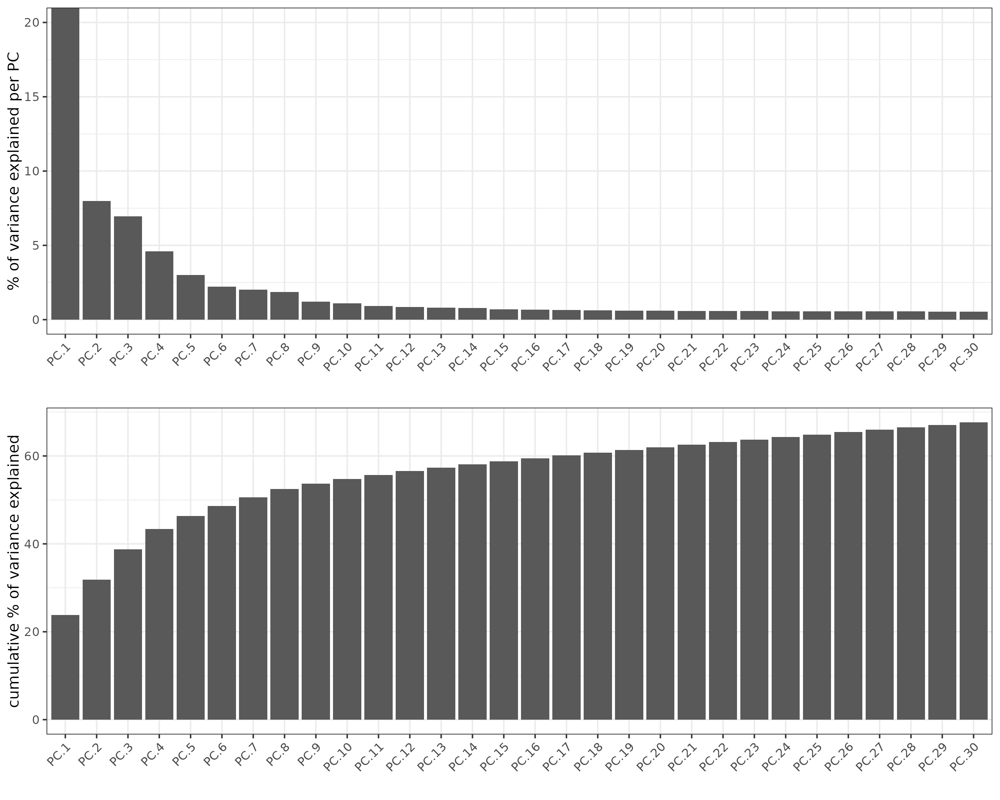

To visiulize PCA we use the function `plotPCA`

```{r, eval=FALSE}
plotPCA(gobject = visiumHD,
        feat_type = "rna")
```

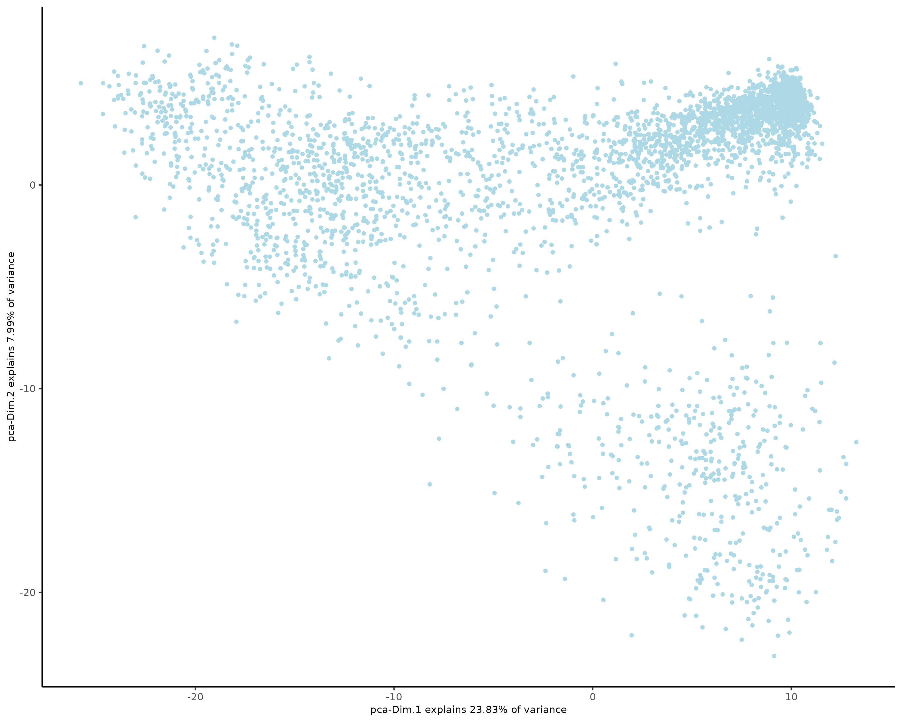

Run UMAP using the first 10 dimensions and visualize the results.

```{r eval=FALSE}
visiumHD <- runUMAP(visiumHD, 
                    dimensions_to_use = 1:10,
                    feat_type = "rna")

plotUMAP(gobject = visiumHD,
         feat_type = "rna")
```

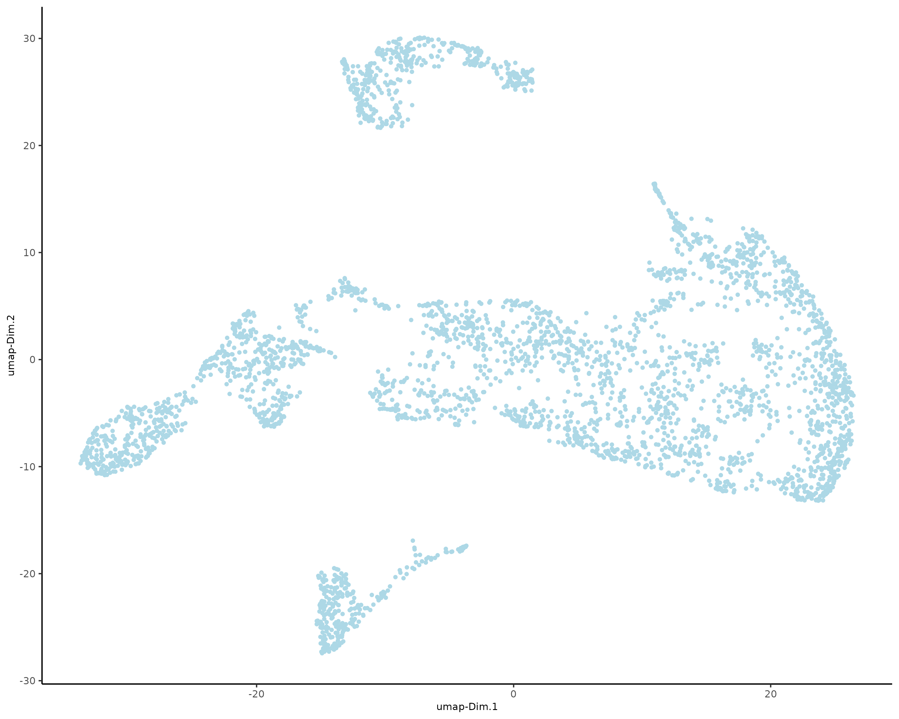

# Clustering

Create a shared (default) nearest network in PCA space (or directly on matrix).
Cluster on nearest network with Leiden or Louvain (k-means and hclust are alternatives).

```{r eval=FALSE}
# Create shared nearest network (SNN) and perform leiden clustering
visiumHD <- createNearestNetwork(gobject = visiumHD, 
                                 dimensions_to_use = 1:10, 
                                 k = 30,
                                 feat_type = "rna")

visiumHD <- doLeidenCluster(gobject = visiumHD,
                            feat_type = "rna",
                            resolution = 1, 
                            n_iterations = 10)

# visualize UMAP cluster results
plotUMAP(gobject = visiumHD,
         cell_color = "leiden_clus",
         feat_type = "rna",
         show_NN_network = TRUE,
         point_size = 2)
```

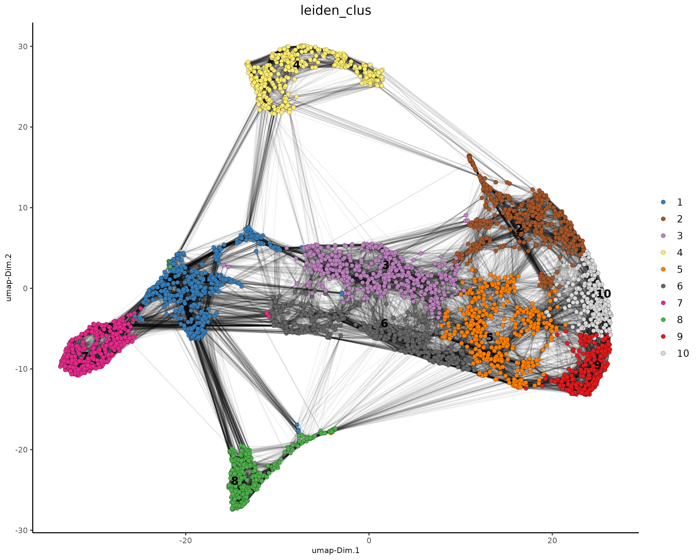

Spat plot for hex400 bin colored by leiden clusters.

```{r, eval=FALSE}
spatInSituPlotPoints(visiumHD,
                     show_image = FALSE,
                     feats = NULL,
                     show_legend = FALSE,
                     point_size = 0.25,
                     show_polygon = TRUE,
                     use_overlap = FALSE,
                     polygon_feat_type = "hexagon400",
                     polygon_fill_as_factor = TRUE,
                     polygon_fill = "leiden_clus",
                     polygon_color = "black",
                     polygon_line_size = 0.3)
```

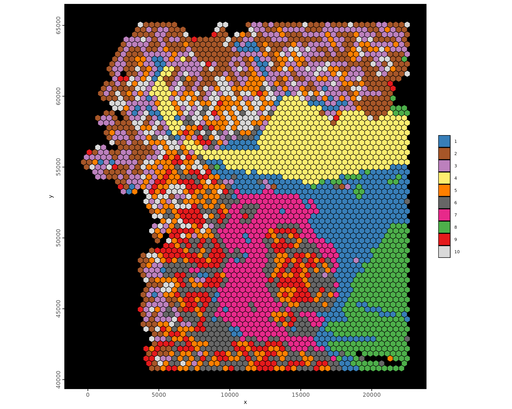

# Spatial expression patterns

## Identifying Individual Genes

In this section, we will use the binSpect method to quickly rank genes based on their potential for exhibiting spatially coherent expression patterns.

```{r eval=FALSE}
featData <- fDataDT(visiumHD)
hvf_genes <- featData[hvf == "yes"]$feat_ID

visiumHD <- createSpatialNetwork(visiumHD,
                                 name = "kNN_network",
                                 method = "kNN",
                                 k = 8)

ranktest <- binSpect(visiumHD,
                     subset_feats = hvf_genes,
                     bin_method = "rank",
                     calc_hub = FALSE,
                     do_fisher_test = TRUE,
                     spatial_network_name = "kNN_network")
```

Visualize the top ranked spatial genes for different expression bins.

```{r eval=FALSE}
set0 <- ranktest[high_expr < 50][1:2]$feats
set1 <- ranktest[high_expr > 50 & high_expr < 100][1:2]$feats
set2 <- ranktest[high_expr > 100 & high_expr < 200][1:2]$feats
set3 <- ranktest[high_expr > 200 & high_expr < 400][1:2]$feats
set4 <- ranktest[high_expr > 400 & high_expr < 1000][1:2]$feats
set5 <- ranktest[high_expr > 1000][1:2]$feats

spatFeatPlot2D(visiumHD,
               expression_values = "scaled",
               feats = c(set0, set1, set2),
               gradient_style = "sequential",
               cell_color_gradient = c("blue", "white", "yellow", "orange", "red", "darkred"),
               cow_n_col = 2, 
               point_size = 1)

```

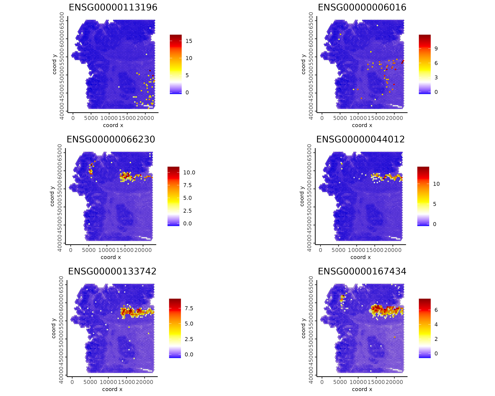

```{r eval=FALSE}

spatFeatPlot2D(visiumHD,
               expression_values = "scaled",
               feats = c(set3, set4, set5),
               gradient_style = "sequential",
               cell_color_gradient = c("blue", "white", "yellow", "orange", "red", "darkred"),
               cow_n_col = 2, 
               point_size = 1)

```

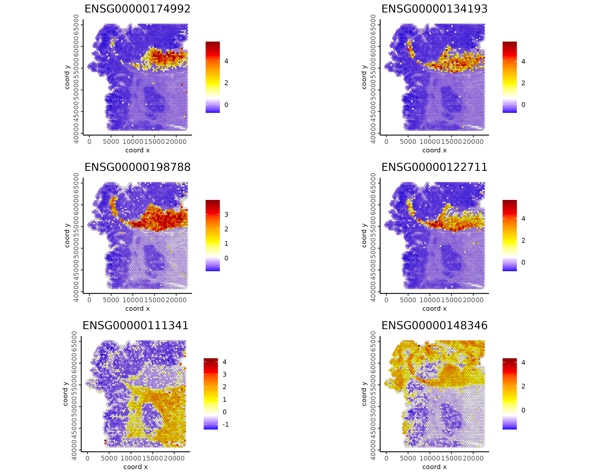


# Spatial co-expression modules

While investigating individual genes is a valuable initial step, our goal here is to uncover recurring spatial expression patterns linked to spatial co-expression modules. These modules could indicate spatially organized biological processes.

```{r eval=FALSE}
ext_spatial_genes <- ranktest[adj.p.value < 0.001]$feats

spat_cor_netw_DT <- detectSpatialCorFeats(visiumHD,
                                          method = "network",
                                          spatial_network_name = "kNN_network",
                                          subset_feats = ext_spatial_genes)

# cluster spatial genes
spat_cor_netw_DT <- clusterSpatialCorFeats(spat_cor_netw_DT, 
                                           name = "spat_netw_clus", 
                                           k = 16)

# visualize clusters
heatmSpatialCorFeats(visiumHD,
                     spatCorObject = spat_cor_netw_DT,
                     use_clus_name = "spat_netw_clus",
                     heatmap_legend_param = list(title = NULL))
```

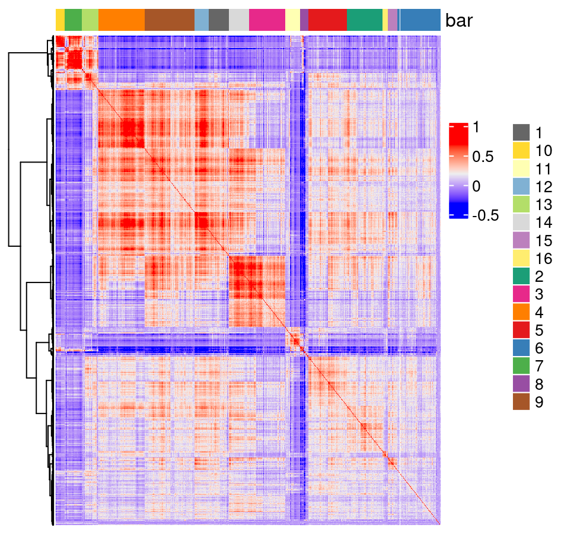

```{r eval=FALSE}
# create metagene enrichment score for clusters
cluster_genes_DT <- showSpatialCorFeats(spat_cor_netw_DT, 
                                        use_clus_name = "spat_netw_clus", 
                                        show_top_feats = 1)

cluster_genes <- cluster_genes_DT$clus 
names(cluster_genes) <- cluster_genes_DT$feat_ID

visiumHD <- createMetafeats(visiumHD,
                            expression_values = "normalized",
                            feat_clusters = cluster_genes,
                            name = "cluster_metagene")

showGiottoSpatEnrichments(visiumHD)
```

```{r eval=FALSE}
spatCellPlot(visiumHD,
             spat_enr_names = "cluster_metagene",
             gradient_style = "sequential",
             cell_color_gradient = c("blue", "white", "yellow", "orange", "red", "darkred"),
             cell_annotation_values = as.character(c(1:4)),
             point_size = 2, 
             cow_n_col = 2)
```

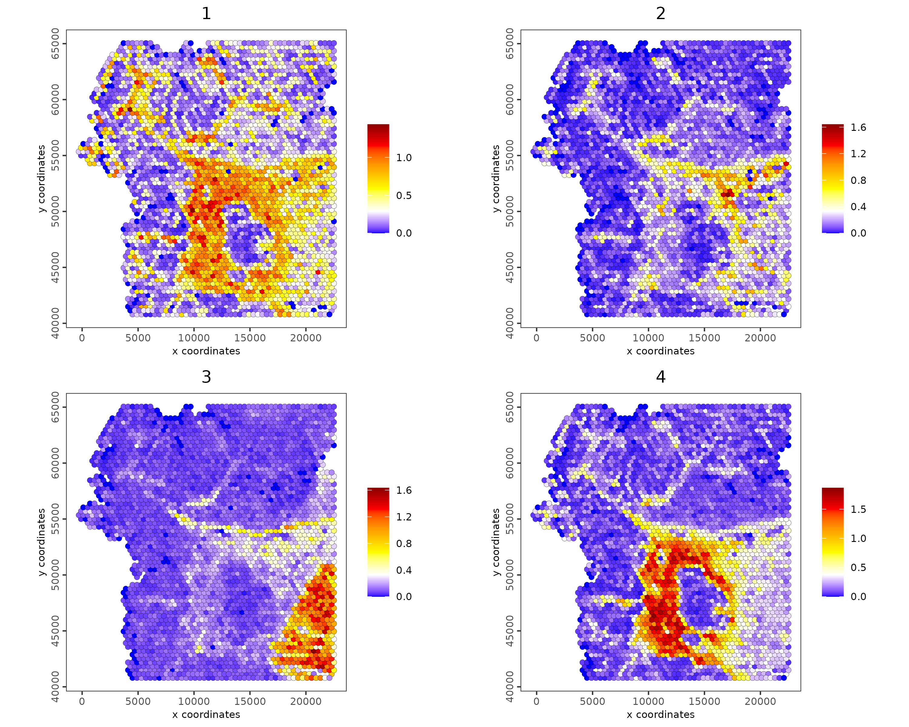

```{r eval=FALSE}
spatCellPlot(visiumHD,
             spat_enr_names = "cluster_metagene",
             gradient_style = "sequential",
             cell_color_gradient = c("blue", "white", "yellow", "orange", "red", "darkred"),
             cell_annotation_values = as.character(c(5:8)),
             point_size = 1, 
             cow_n_col = 2)
```

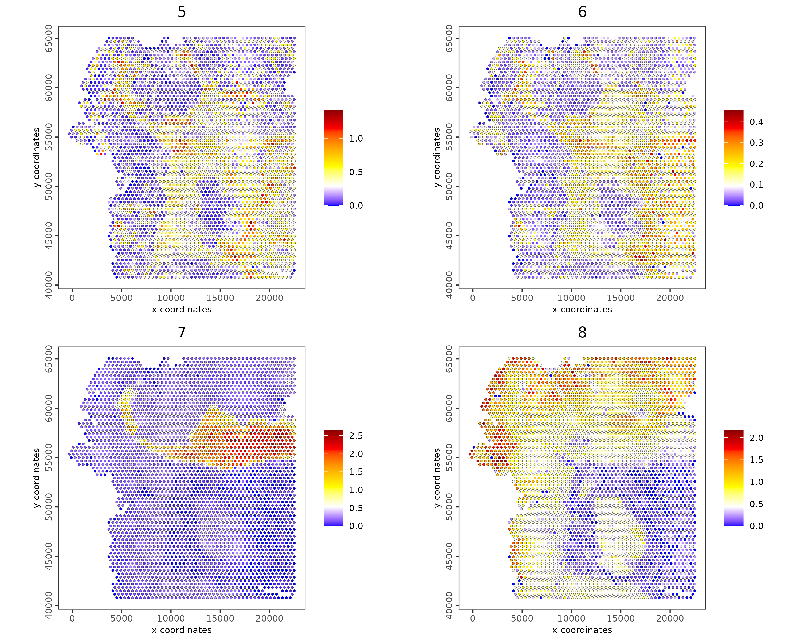

```{r eval=FALSE}
spatCellPlot(visiumHD,
             spat_enr_names = "cluster_metagene",
             gradient_style = "sequential",
             cell_color_gradient = c("blue", "white", "yellow", "orange", "red", "darkred"),
             cell_annotation_values = as.character(c(9:12)),
             point_size = 1, 
             cow_n_col = 2)
```

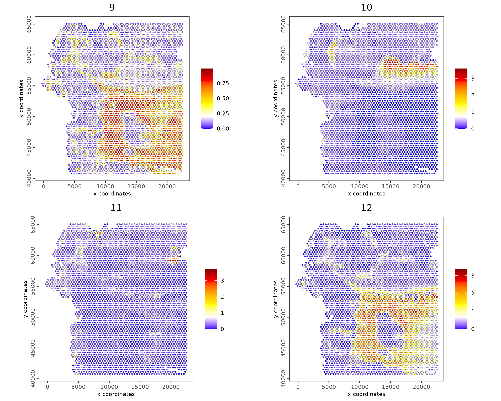

```{r eval=FALSE}
spatCellPlot(visiumHD,
             spat_enr_names = "cluster_metagene",
             gradient_style = "sequential",
             cell_color_gradient = c("blue", "white", "yellow", "orange", "red", "darkred"),
             cell_annotation_values = as.character(c(13:16)),
             point_size = 1, 
             cow_n_col = 2)
```

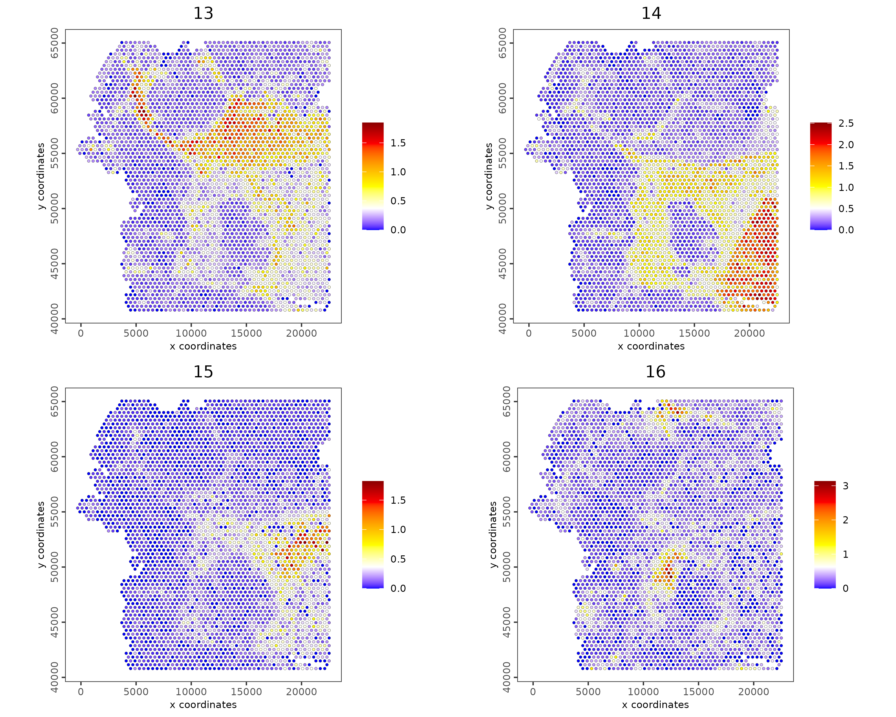

# Plot spatial gene groups

Rather than focusing solely on individual spatial gene expression patterns, we'll mirror a common approach by choosing a balanced set of genes for each spatial co-expression module and assigning them a consistent color in the spatInSituPlotPoints function.

```{r eval=FALSE}
balanced_genes <- getBalancedSpatCoexpressionFeats(spatCorObject = spat_cor_netw_DT, 
                                                   maximum = 5)
selected_feats <- names(balanced_genes)

# give genes from same cluster same color
giotto_colors <- getDistinctColors(n = 20)
names(giotto_colors) <- 1:20

my_colors <- giotto_colors[balanced_genes]
names(my_colors) <- names(balanced_genes)

spatInSituPlotPoints(visiumHD,
                     show_image = FALSE,
                     feats = list("rna" = selected_feats), 
                     feats_color_code = my_colors,
                     show_legend = FALSE,
                     point_size = 0.20,
                     show_polygon = FALSE,
                     use_overlap = FALSE,
                     polygon_feat_type = "hexagon400",
                     polygon_bg_color = NA,
                     polygon_color = "white",
                     polygon_line_size = 0.01,
                     jitter = c(25,25))
```


# Session info

```{r eval=FALSE}
sessionInfo()
```

```{r eval=FALSE}
R version 4.4.0 (2024-04-24)
Platform: x86_64-pc-linux-gnu
Running under: AlmaLinux 8.10 (Cerulean Leopard)

Matrix products: default
BLAS/LAPACK: FlexiBLAS NETLIB;  LAPACK version 3.11.0

locale:
 [1] LC_CTYPE=en_US.UTF-8       LC_NUMERIC=C               LC_TIME=en_US.UTF-8       
 [4] LC_COLLATE=en_US.UTF-8     LC_MONETARY=en_US.UTF-8    LC_MESSAGES=en_US.UTF-8   
 [7] LC_PAPER=en_US.UTF-8       LC_NAME=C                  LC_ADDRESS=C              
[10] LC_TELEPHONE=C             LC_MEASUREMENT=en_US.UTF-8 LC_IDENTIFICATION=C       

time zone: America/New_York
tzcode source: system (glibc)

attached base packages:
[1] stats     graphics  grDevices utils     datasets  methods   base     

other attached packages:
[1] ggplot2_3.5.1     Giotto_4.1.0      GiottoClass_0.3.4

loaded via a namespace (and not attached):
  [1] RColorBrewer_1.1-3          rstudioapi_0.16.0           jsonlite_1.8.8             
  [4] shape_1.4.6.1               magrittr_2.0.3              magick_2.8.4               
  [7] farver_2.1.2                rmarkdown_2.26              GlobalOptions_0.1.2        
 [10] zlibbioc_1.50.0             vctrs_0.6.5                 Cairo_1.6-2                
 [13] GiottoUtils_0.1.11          terra_1.7-78                htmltools_0.5.8.1          
 [16] S4Arrays_1.4.1              SparseArray_1.4.8           parallelly_1.37.1          
 [19] htmlwidgets_1.6.4           plyr_1.8.9                  plotly_4.10.4              
 [22] igraph_2.0.3                lifecycle_1.0.4             iterators_1.0.14           
 [25] pkgconfig_2.0.3             rsvd_1.0.5                  Matrix_1.7-0               
 [28] R6_2.5.1                    fastmap_1.1.1               GenomeInfoDbData_1.2.12    
 [31] MatrixGenerics_1.16.0       future_1.33.2               clue_0.3-65                
 [34] digest_0.6.35               colorspace_2.1-1            S4Vectors_0.42.1           
 [37] irlba_2.3.5.1               GenomicRanges_1.56.0        beachmat_2.20.0            
 [40] labeling_0.4.3              progressr_0.14.0            fansi_1.0.6                
 [43] httr_1.4.7                  abind_1.4-5                 compiler_4.4.0             
 [46] bit64_4.0.5                 withr_3.0.1                 doParallel_1.0.17          
 [49] backports_1.5.0             BiocParallel_1.38.0         DBI_1.2.2                  
 [52] R.utils_2.12.3              rappdirs_0.3.3              DelayedArray_0.30.1        
 [55] rjson_0.2.21                gtools_3.9.5                GiottoVisuals_0.2.4        
 [58] tools_4.4.0                 future.apply_1.11.2         R.oo_1.26.0                
 [61] glue_1.7.0                  dbscan_1.2-0                grid_4.4.0                 
 [64] checkmate_2.3.2             cluster_2.1.6               reshape2_1.4.4             
 [67] generics_0.1.3              gtable_0.3.5                R.methodsS3_1.8.2          
 [70] tidyr_1.3.1                 data.table_1.15.4           BiocSingular_1.20.0        
 [73] ScaledMatrix_1.12.0         sp_2.1-4                    utf8_1.2.4                 
 [76] XVector_0.44.0              BiocGenerics_0.50.0         ggrepel_0.9.5              
 [79] foreach_1.5.2               pillar_1.9.0                stringr_1.5.1              
 [82] circlize_0.4.16             dplyr_1.1.4                 lattice_0.22-6             
 [85] FNN_1.1.4                   bit_4.0.5                   deldir_2.0-4               
 [88] tidyselect_1.2.1            ComplexHeatmap_2.20.0       SingleCellExperiment_1.26.0
 [91] Biostrings_2.72.0           knitr_1.46                  IRanges_2.38.1             
 [94] SummarizedExperiment_1.34.0 scattermore_1.2             stats4_4.4.0               
 [97] xfun_0.43                   Biobase_2.64.0              matrixStats_1.3.0          
[100] stringi_1.8.4               UCSC.utils_1.0.0            lazyeval_0.2.2             
[103] yaml_2.3.10                 evaluate_0.23               codetools_0.2-20           
[106] tibble_3.2.1                colorRamp2_0.1.0            cli_3.6.2                  
[109] uwot_0.2.2                  arrow_15.0.1                reticulate_1.36.1          
[112] munsell_0.5.1               Rcpp_1.0.12                 GenomeInfoDb_1.40.0        
[115] globals_0.16.3              dbplyr_2.5.0                png_0.1-8                  
[118] parallel_4.4.0              assertthat_0.2.1            listenv_0.9.1              
[121] SpatialExperiment_1.14.0    viridisLite_0.4.2           scales_1.3.0               
[124] purrr_1.0.2                 crayon_1.5.3                GetoptLong_1.0.5           
[127] rlang_1.1.3                 cowplot_1.1.3              

```


