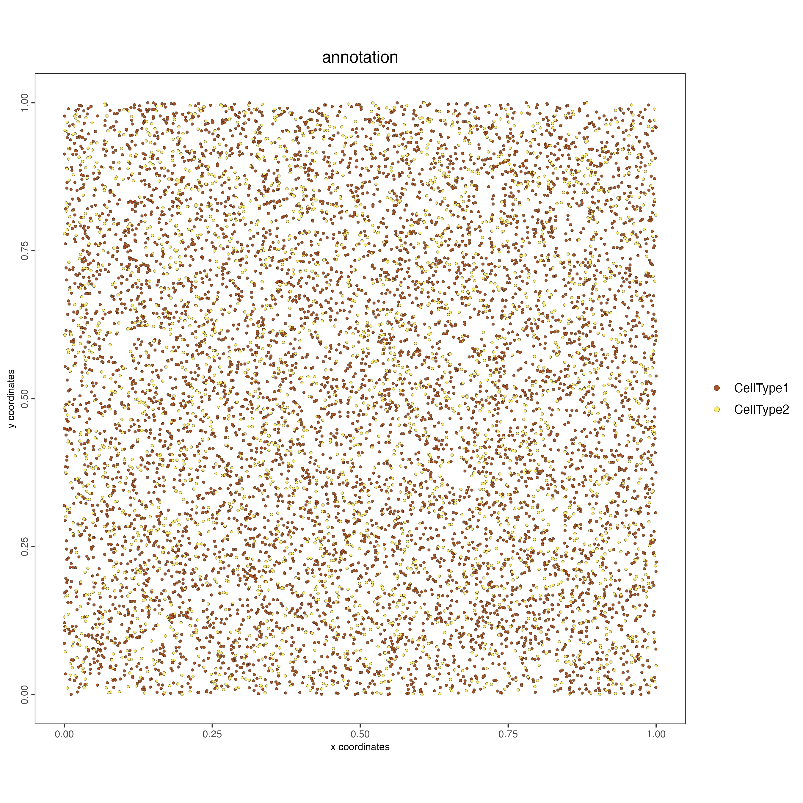

# Set up Giotto Environment

```{r, eval=FALSE}
# Ensure Giotto Suite is installed.
if(!"Giotto" %in% installed.packages()) {
  pak::pkg_install("drieslab/Giotto")
}

# Ensure the Python environment for Giotto has been installed.
genv_exists <- Giotto::checkGiottoEnvironment()
if(!genv_exists){
  # The following command need only be run once to install the Giotto environment.
  Giotto::installGiottoEnvironment()
}
```

# Install the sCCIgen package

```{r, eval=FALSE}
remotes::install_github("songxiaoyu/sCCIgen")
```

# Load the sCCIgen package

```{r, eval=FALSE}
library(sCCIgen)
```

# Run the interactive app

```{r, eval=FALSE}
run_interactive_sCCIgen()
```

## Select the reference dataset to use

The simulator requires to learn the expression and/or spatial patterns from a previous dataset. Select the dataset to use as reference. If you haven't downloaded the dataset, files you can download them in this first step.


```{r, echo=FALSE, out.width="100%", fig.align="center"}

```

## Create the parameter file

Navigate through the questions to select the properties of the simulated dataset.

```{r, echo=FALSE, out.width="100%", fig.align="center"}

```

## Run the simulation

Choose what output you desire to obtain. By default, the simulator will create a directory with the expression and spatial information. Optionally, you can also create a local Giotto object. To follow this tutorial select the option to create a Giotto object.

```{r, echo=FALSE, out.width="100%", fig.align="center"}

```

# Import the simulated data to Giotto

## Read the expression matrix

```{r, eval=FALSE}
expression <- data.table::fread("output_files/output_count_1.tsv")
expression_matrix <- as.matrix(expression[,-1])
rownames(expression_matrix) <- expression$GeneName
```

## Read the metadata and spatial locations

```{r, eval=FALSE}
metadata <- data.table::fread("output_files/output_meta_1.tsv")
spatial_locs <- metadata[, c("x.loc", "y.loc", "Cell")]
colnames(spatial_locs) <- c("sdimx", "sdimy", "cell_ID")
```

## Create the Giotto instructions 

```{r, eval=FALSE}
library(Giotto)

results_folder <- "path/to/results"
python_path <- NULL

instructions <- createGiottoInstructions(save_dir = results_folder,
                                         save_plot = TRUE,
                                         show_plot = FALSE,
                                         return_plot = FALSE,
                                         python_path = python_path)
```

## Create the Giotto object

```{r, eval=FALSE}
giotto_object <- createGiottoObject(expression = expression_matrix,
                                    spatial_locs = spatial_locs,
                                    instructions = instructions)
```

## Add metadata

```{r, eval=FALSE}
annotation <- metadata$annotation
region <- metadata$region

giotto_object <- addCellMetadata(giotto_object,
                                 new_metadata = annotation)

giotto_object <- addCellMetadata(giotto_object,
                                 new_metadata = region)
```

## Plot the object

```{r, eval=FALSE}
spatPlot2D(giotto_object,
           cell_color = "annotation",
           point_size = 1)
```

```{r, echo=FALSE, out.width="80%", fig.align="center"}

```

```{r, eval=FALSE}
spatPlot2D(giotto_object,
           cell_color = "region",
           point_size = 1)
```

```{r, echo=FALSE, out.width="80%", fig.align="center"}

```

```{r, eval=FALSE}
giotto_object <- addStatistics(giotto_object,
                               expression_values = "raw")

spatPlot2D(giotto_object,
           cell_color = "nr_feats",
           point_size = 2,
           color_as_factor = FALSE)
```

```{r, echo=FALSE, out.width="80%", fig.align="center"}

```

# Session Info

```{r, eval=FALSE}
sessionInfo()
```

```{r, eval=FALSE}
R version 4.4.1 (2024-06-14)
Platform: x86_64-apple-darwin20
Running under: macOS 15.0

Matrix products: default
BLAS:   /System/Library/Frameworks/Accelerate.framework/Versions/A/Frameworks/vecLib.framework/Versions/A/libBLAS.dylib 
LAPACK: /Library/Frameworks/R.framework/Versions/4.4-x86_64/Resources/lib/libRlapack.dylib;  LAPACK version 3.12.0

locale:
[1] en_US.UTF-8/en_US.UTF-8/en_US.UTF-8/C/en_US.UTF-8/en_US.UTF-8

time zone: America/New_York
tzcode source: internal

attached base packages:
[1] stats     graphics  grDevices utils     datasets  methods   base     

other attached packages:
[1] Giotto_4.1.3      GiottoClass_0.4.0 shiny_1.9.1       sCCIgen_1.0      

loaded via a namespace (and not attached):
  [1] RColorBrewer_1.1-3          rstudioapi_0.16.0          
  [3] jsonlite_1.8.9              magrittr_2.0.3             
  [5] spatstat.utils_3.1-0        magick_2.8.5               
  [7] farver_2.1.2                rmarkdown_2.28             
  [9] ragg_1.3.3                  fs_1.6.4                   
 [11] zlibbioc_1.50.0             vctrs_0.6.5                
 [13] memoise_2.0.1               spatstat.explore_3.3-2     
 [15] GiottoUtils_0.1.12          terra_1.7-78               
 [17] htmltools_0.5.8.1           S4Arrays_1.4.1             
 [19] raster_3.6-26               SparseArray_1.4.8          
 [21] sass_0.4.9                  shinyFiles_0.9.3           
 [23] KernSmooth_2.23-24          bslib_0.8.0                
 [25] htmlwidgets_1.6.4           fontawesome_0.5.2          
 [27] plotly_4.10.4               cachem_1.1.0               
 [29] igraph_2.0.3                mime_0.12                  
 [31] lifecycle_1.0.4             iterators_1.0.14           
 [33] pkgconfig_2.0.3             Matrix_1.7-0               
 [35] R6_2.5.1                    fastmap_1.2.0              
 [37] GenomeInfoDbData_1.2.12     MatrixGenerics_1.16.0      
 [39] digest_0.6.37               colorspace_2.1-1           
 [41] S4Vectors_0.42.1            tensor_1.5                 
 [43] textshaping_0.4.0           GenomicRanges_1.56.1       
 [45] spatstat.linnet_3.2-2       labeling_0.4.3             
 [47] fansi_1.0.6                 spatstat.sparse_3.1-0      
 [49] httr_1.4.7                  polyclip_1.10-7            
 [51] abind_1.4-8                 mgcv_1.9-1                 
 [53] compiler_4.4.1              proxy_0.4-27               
 [55] withr_3.0.1                 bit64_4.5.2                
 [57] doParallel_1.0.17           backports_1.5.0            
 [59] DBI_1.2.3                   spatstat.model_3.3-2       
 [61] R.utils_2.12.3              DelayedArray_0.30.1        
 [63] classInt_0.4-10             rjson_0.2.23               
 [65] gtools_3.9.5                units_0.8-5                
 [67] GiottoVisuals_0.2.5         tools_4.4.1                
 [69] httpuv_1.6.15               goftest_1.2-3              
 [71] R.oo_1.26.0                 glue_1.7.0                 
 [73] dbscan_1.2-0                nlme_3.1-166               
 [75] promises_1.3.0              sf_1.0-17                  
 [77] grid_4.4.1                  checkmate_2.3.2            
 [79] generics_0.1.3              gtable_0.3.5               
 [81] spatstat.data_3.1-2         tzdb_0.4.0                 
 [83] class_7.3-22                R.methodsS3_1.8.2          
 [85] tidyr_1.3.1                 data.table_1.16.0          
 [87] hms_1.1.3                   sp_2.1-4                   
 [89] utf8_1.2.4                  XVector_0.44.0             
 [91] BiocGenerics_0.50.0         spatstat.geom_3.3-3        
 [93] ggrepel_0.9.6               foreach_1.5.2              
 [95] pillar_1.9.0                vroom_1.6.5                
 [97] later_1.3.2                 splines_4.4.1              
 [99] dplyr_1.1.4                 lattice_0.22-6             
[101] bit_4.5.0                   deldir_2.0-4               
[103] tidyselect_1.2.1            SingleCellExperiment_1.26.0
[105] miniUI_0.1.1.1              knitr_1.48                 
[107] IRanges_2.38.1              SummarizedExperiment_1.34.0
[109] scattermore_1.2             stats4_4.4.1               
[111] xfun_0.47                   Biobase_2.64.0             
[113] matrixStats_1.4.1           UCSC.utils_1.0.0           
[115] lazyeval_0.2.2              yaml_2.3.10                
[117] evaluate_1.0.0              codetools_0.2-20           
[119] spatstat_3.2-1              tibble_3.2.1               
[121] colorRamp2_0.1.0            cli_3.6.3                  
[123] rpart_4.1.23                systemfonts_1.1.0          
[125] xtable_1.8-4                reticulate_1.39.0          
[127] munsell_0.5.1               jquerylib_0.1.4            
[129] Rcpp_1.0.13                 GenomeInfoDb_1.40.1        
[131] spatstat.random_3.3-2       png_0.1-8                  
[133] spatstat.univar_3.0-1       parallel_4.4.1             
[135] ggplot2_3.5.1               readr_2.1.5                
[137] SpatialExperiment_1.14.0    viridisLite_0.4.2          
[139] e1071_1.7-16                scales_1.3.0               
[141] purrr_1.0.2                 crayon_1.5.3               
[143] rlang_1.1.4                 cowplot_1.1.3  
```
