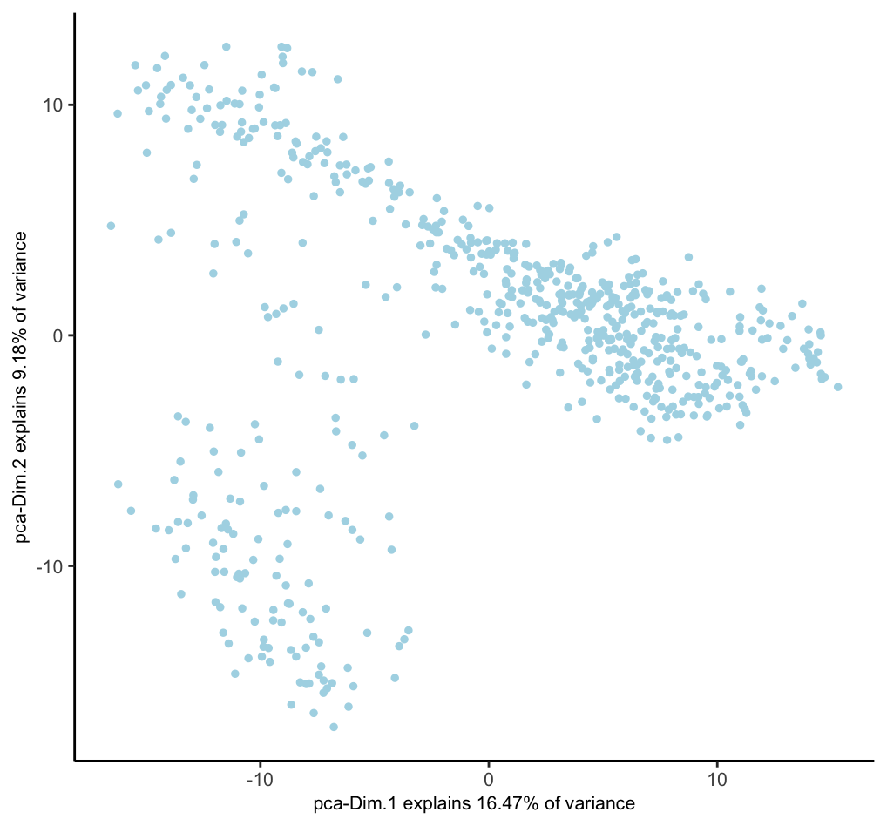
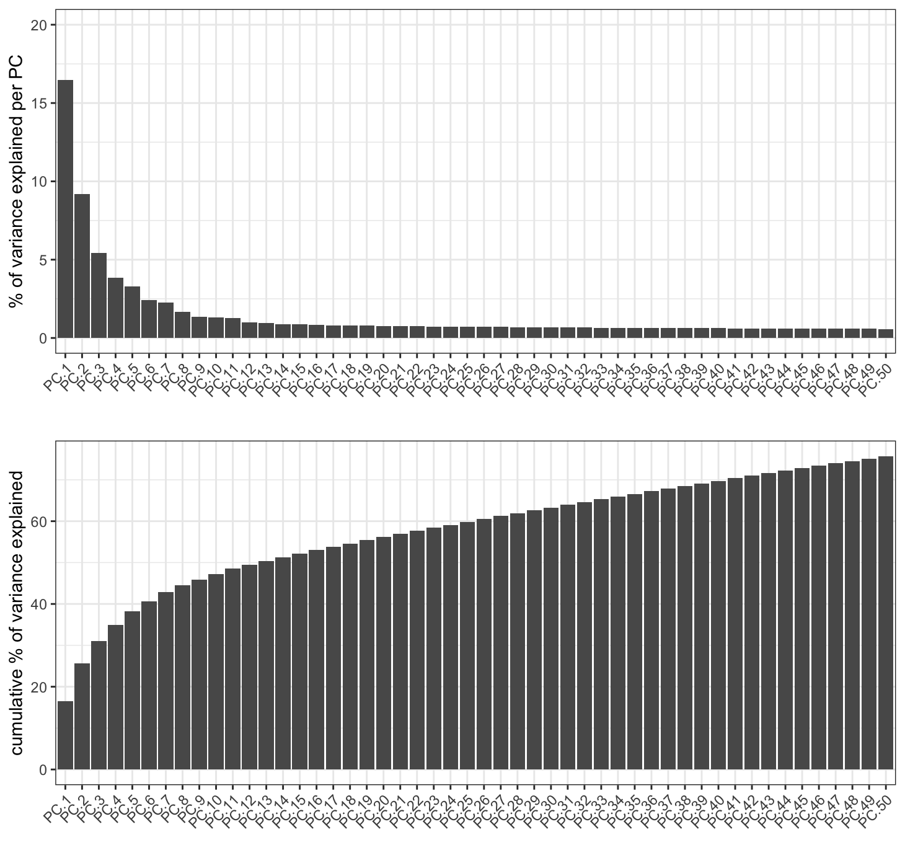
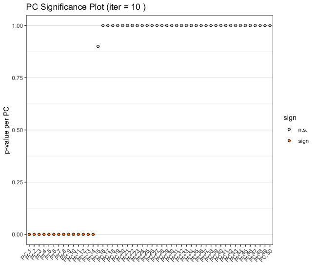
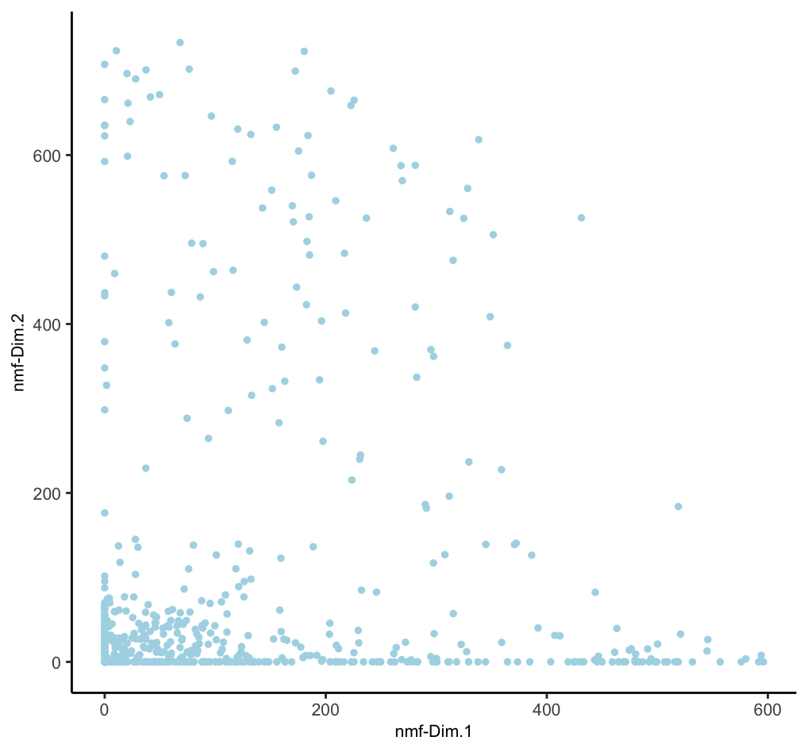
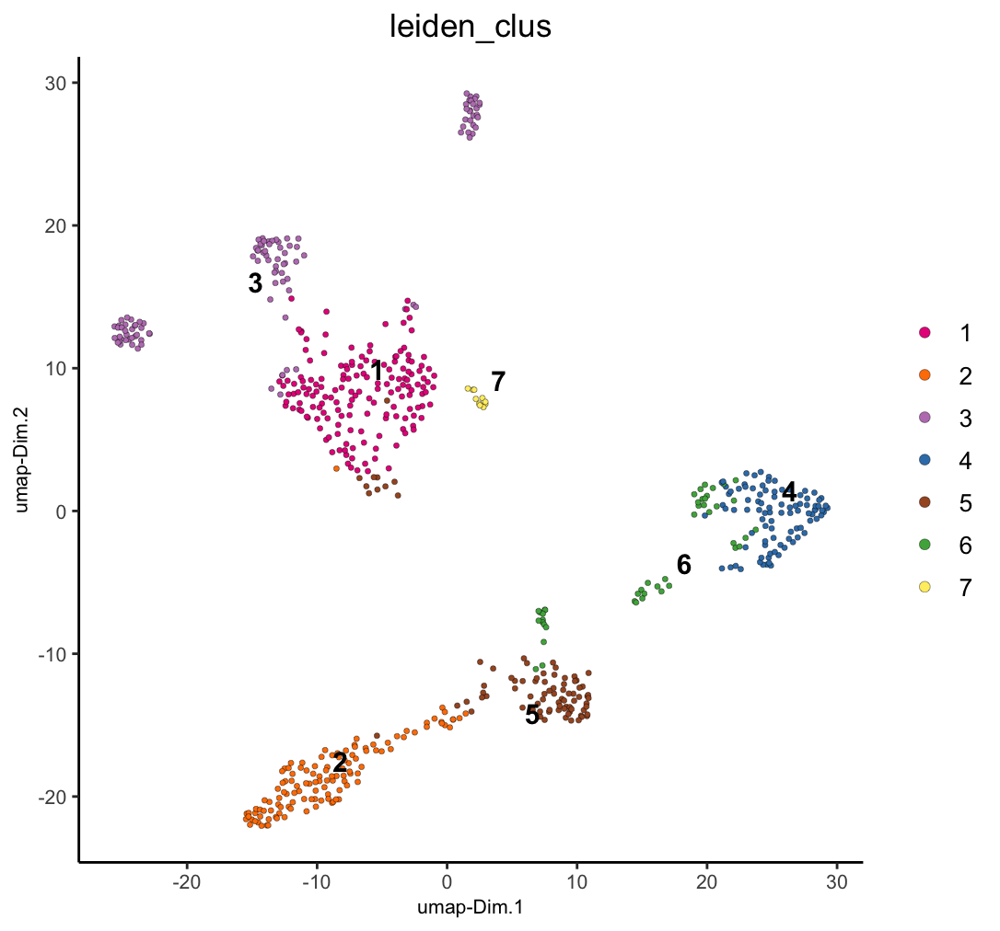
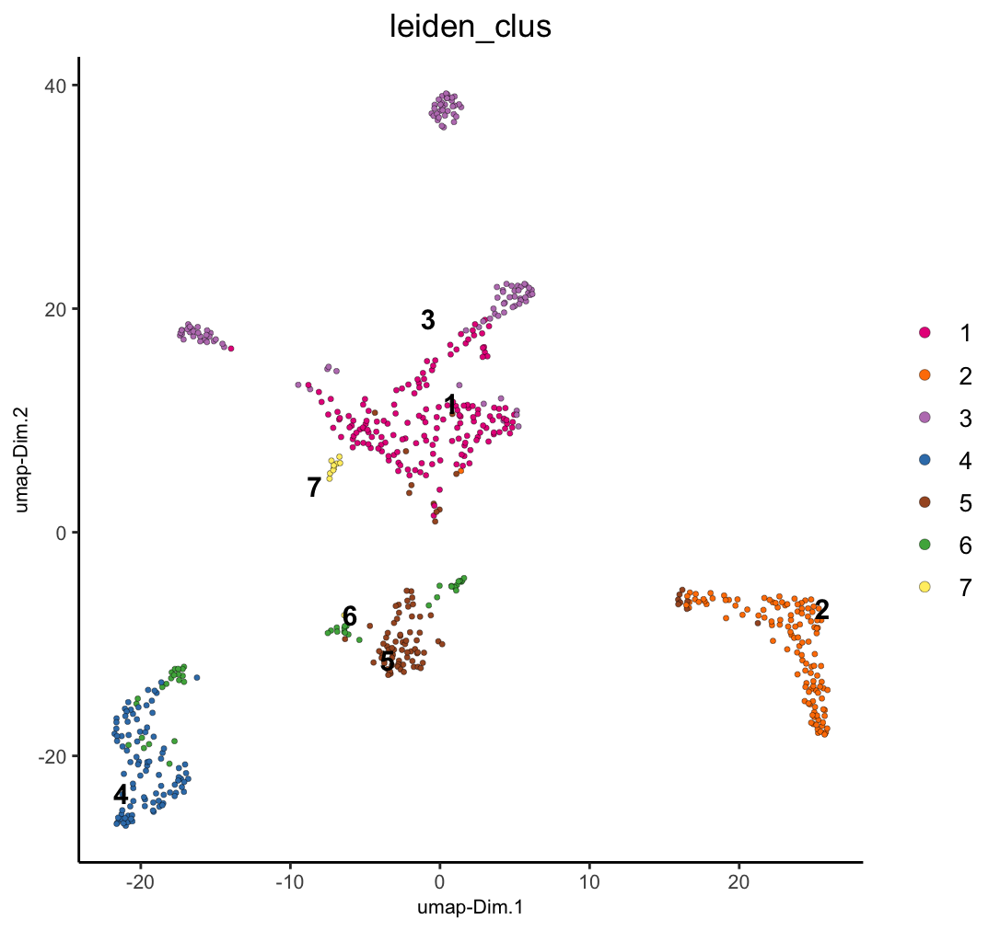
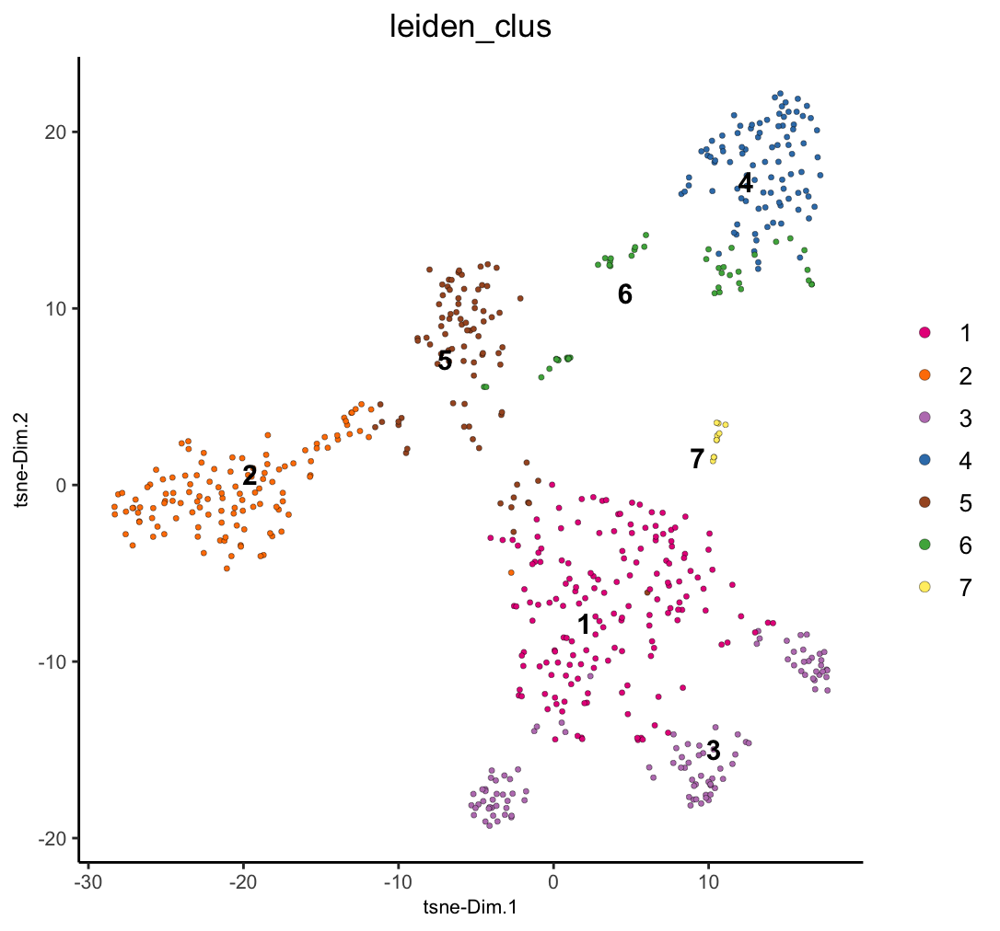

Dimension reduction methods are ways of taking high-dimensional biological data and simplifying them into lower dimensional embeddings while preserving the important information. This is useful both for downstream analysis and visualization. Giotto includes implementations of several of these methods.

# Setup and load example dataset
```{r, eval=FALSE}
# Ensure Giotto Suite is installed
if(!"Giotto" %in% installed.packages()) {
  pak::pkg_install("drieslab/Giotto")
}

# Ensure Giotto Data is installed
if(!"GiottoData" %in% installed.packages()) {
  pak::pkg_install("drieslab/GiottoData")
}

library(Giotto)

# Ensure the Python environment for Giotto has been installed
genv_exists <- checkGiottoEnvironment()

if(!genv_exists){
  # The following command need only be run once to install the Giotto environment
  installGiottoEnvironment()
}
```

```{r, eval=FALSE}
# load the object
g <- GiottoData::loadGiottoMini("visium")
```


# Feature Extraction / Primary Dimensionality Reduction

These methods are typically used early in the analysis pipeline after filtering, normalization, and variable feature detection in order to:

- Extract meaningful lower-dimensional embeddings from high-dimensional data
- Reduce noise and capture the most important features or patterns in the data
- Provide a basis for further analysis, including clustering or differential expression analysis

**Key characteristics:**

- Often reduce to tens or hundreds of dimensions
- Preserve global structure of the data
- Output can be used directly for downstream analyses

**Features to use**

Which features to include when calculating these dimension reductions has a large effect on the information extracted. Highly variable features will focus on variation from features with the largest expression variation. Spatially variable features will focus on features with spatially organized expression. However, when there are not many features (only hundreds of features), it is a better idea to include all features than to use a subset.

**Centering and Scaling**

These dimension reductions should generally be centered and scaled for the downstream steps, but it is important not to accidentally perform centering and scaling multiple times. Whether it is necessary depends on how the expression information was normalized prior to this step. For Giotto's provided normalization methods from `normalizeGiotto()`:

- giotto `'standard'` normalization -- needs center and scale (default behavior)
- `'pearson'` (can be considered already centered and scaled) -- do not center and scale again
- `'quantile'` (can be considered already centered and scaled) -- do not center and scale again

## Principal Component Analysis (PCA)
A linear dimensionality reduction technique that identifies the directions of maximum variance in high-dimensional data and projects it onto a lower-dimensional subspace. Giotto provides several implementations, but the default is with irlba through BiocSingular. Instead of calculating all PCs, Giotto only calculates the first 100 by default. 

```{r, eval=FALSE}
# - runPCA() uses 'hvf' (highly variable feats) by default if available
#   but we pass NULL to `feats_to_use` to use all of them for this mini dataset
# - runPCA() uses the 'normalized' expression values by default and performs centering and scaling by default. 
#   Set `center = FALSE` and `scale = FALSE` if not needed.
g <- runPCA(g, feats_to_use = NULL) 
dimPlot2D(g, dim_reduction_to_use = "pca")
```

```{r, echo=FALSE, out.width="60%", fig.align="center"}

```

### Scree Plot

A PCA is a rotation of the data into an orientation where the first PCs contain the most variance. Limiting the number of PCs used in downstream steps can be a good idea to focus on the PCs with useful information and minimize the effect of less significant PCs that describe noise more than biological variation. A screeplot can be used in order to gauge up to which PCs contain useful information.

```{r, eval=FALSE}
# will plot the `pca` by default
screePlot(g, ncp = 50)
```

```{r, echo=FALSE, out.width="80%", fig.align="center"}

```

The scree plot lets us estimate that the first 20 PCs are a good cutoff. Following applications of this PCA such as umap or clustering should use only the first 20 PCs.

### Jackstraw Plot

Another way of determining number of significant PCs is through permuting the input expression matrix across the features so that the set of expression values for a feature does not change, but which cells they are assigned to is randomized. Then, comparing the variation explained by the actual vs permuted values.

```{r, eval=FALSE}
# will plot the `pca` by default
jackstrawPlot(g, feats_to_use = NULL, ncp = 50)
```

```{r, echo=FALSE, out.width="80%", fig.align="center"}

```

## Non-negative Matrix Factorization (NMF)

A technique that decomposes non-negative data into two non-negative matrices. In biology, it's useful for analyzing gene expression, metagenomics, and protein-ligand interactions. NMF can reveal underlying patterns and molecular signatures in complex biological datasets. While it is fine to calculate as many PCs as desired for PCA, the k (rank) value for NMF requires more fine tuning since the k value essentially define how many metafeatures to split the expression information into. Too few, and there is not enough extracted information. Too many, and single signatures will be split and diluted.
Giotto implements NMF through RcppML.

```{r, eval=FALSE}
g <- runNMF(g, k = 20, feats_to_use = NULL)
dimPlot2D(g, dim_reduction_to_use = "nmf")
```

```{r, echo=FALSE, out.width="60%", fig.align="center"}

```


# Visualization / Further Dimensionality Reduction

These methods are usually applied later in the analysis, often on the output of PCA or NMF, to:

- Further reduce dimensions, typically to 2 or 3 for visualization purposes
- Reveal local structures and relationships in the data
- Provide intuitive visualizations for exploration and presentation

**Key characteristics:**

- Reduce to very low dimensions (usually 2D or 3D)
- Focus on preserving local structure, potentially at the expense of global structure
- Primarily used for visualization, not typically for downstream quantitative analyses


## Uniform Manifold Approximation and Projection (UMAP)

A non-linear dimensionality reduction method that preserves both local and global structure of the data.

```{r, eval=FALSE}
g <- runUMAP(g, # uses any calculated 'pca' by default, default name is "umap"
    dimensions_to_use = 1:20 # determined from screePlot
)
g <- runUMAP(g, 
    dim_reduction_to_use = "nmf",
    dim_reduction_name = "nmf",
    name = "nmf_umap",
    dimensions_to_use = 1:20 # this was the k used
)

# visualize both dim reductions with previously added annotations
dimPlot2D(g, dim_reduction_name = "umap", cell_color = "leiden_clus")
```

```{r, echo=FALSE, out.width="60%", fig.align="center"}

```

```{r, eval=FALSE}
dimPlot2D(g, dim_reduction_name = "nmf_umap", cell_color = "leiden_clus")
```

```{r, echo=FALSE, out.width="60%", fig.align="center"}

```


## t-distributed Stochastic Neighbor Embedding (t-SNE)

A non-linear dimensionality reduction technique that emphasizes preserving local structure. It's widely used in single-cell analysis, particularly for visualizing clusters of cell types. t-SNE is good at revealing local patterns in data but may not preserve global structure as well as UMAP.

```{r, eval=FALSE}
g <- runtSNE(g, dimensions_to_use = 1:20) # uses any calculated 'pca' by default
dimPlot2D(g, dim_reduction_to_use = "tsne", cell_color = "leiden_clus")
```

```{r, echo=FALSE, out.width="60%", fig.align="center"}

```

# Typical Workflow

1. Start with high-dimensional data (e.g., gene expression data)
2. Apply PCA or NMF to reduce to a manageable number of dimensions (e.g., 50-100)
3. Use this reduced representation for various analyses (clustering, trajectory inference, etc.)
4. Apply UMAP or t-SNE to the PCA/NMF output for visualization and exploration

This workflow combines the strengths of both categories: using PCA/NMF to capture the essential features of the data, and then UMAP/t-SNE to create informative visualizations.

# Scalability Concerns

For large datasets, many of these functions also have projection-based approaches where a sampled subset is calculated, and the the remaining data is projected into the same embedding space. This can greatly shorten the processing time for large datasets for only a small tradeoff in accuracy. Currently existing are:

- `runPCAprojection()`
- `runUMAPprojection()`

# API function
A convenient single function for access to the above functions is `reduceDims()`. This makes it easy to create workflow functions or parallelized implementations to perform several dimension reductions with programmatically defined settings.

```{r, eval=FALSE}
# example of a pca run with projection approach through reduceDims()
g <- reduceDims(g, method = "pca", feats_to_use = NULL, projection = TRUE)
```


# Session Info
```{r, eval=FALSE}
sessionInfo()
```
```
R version 4.4.1 (2024-06-14)
Platform: aarch64-apple-darwin20
Running under: macOS Sonoma 14.4

Matrix products: default
BLAS:   /System/Library/Frameworks/Accelerate.framework/Versions/A/Frameworks/vecLib.framework/Versions/A/libBLAS.dylib 
LAPACK: /Library/Frameworks/R.framework/Versions/4.4-arm64/Resources/lib/libRlapack.dylib;  LAPACK version 3.12.0

locale:
[1] en_US.UTF-8/en_US.UTF-8/en_US.UTF-8/C/en_US.UTF-8/en_US.UTF-8

time zone: America/New_York
tzcode source: internal

attached base packages:
[1] stats     graphics  grDevices utils     datasets  methods   base     

other attached packages:
[1] Giotto_4.1.3      GiottoClass_0.4.0

loaded via a namespace (and not attached):
  [1] colorRamp2_0.1.0            deldir_2.0-4               
  [3] rlang_1.1.4                 magrittr_2.0.3             
  [5] GiottoUtils_0.2.0           matrixStats_1.4.1          
  [7] compiler_4.4.1              png_0.1-8                  
  [9] vctrs_0.6.5                 pkgconfig_2.0.3            
 [11] SpatialExperiment_1.14.0    crayon_1.5.3               
 [13] fastmap_1.2.0               backports_1.5.0            
 [15] magick_2.8.4                XVector_0.44.0             
 [17] labeling_0.4.3              utf8_1.2.4                 
 [19] rmarkdown_2.28              UCSC.utils_1.0.0           
 [21] purrr_1.0.2                 xfun_0.47                  
 [23] zlibbioc_1.50.0             beachmat_2.20.0            
 [25] GenomeInfoDb_1.40.0         jsonlite_1.8.9             
 [27] DelayedArray_0.30.0         BiocParallel_1.38.0        
 [29] terra_1.7-78                irlba_2.3.5.1              
 [31] parallel_4.4.1              R6_2.5.1                   
 [33] RColorBrewer_1.1-3          reticulate_1.39.0          
 [35] GenomicRanges_1.56.0        scattermore_1.2            
 [37] Rcpp_1.0.13                 SummarizedExperiment_1.34.0
 [39] knitr_1.48                  R.utils_2.12.3             
 [41] IRanges_2.38.0              FNN_1.1.4.1                
 [43] Matrix_1.7-0                igraph_2.0.3               
 [45] tidyselect_1.2.1            rstudioapi_0.16.0          
 [47] abind_1.4-8                 codetools_0.2-20           
 [49] lattice_0.22-6              tibble_3.2.1               
 [51] Biobase_2.64.0              withr_3.0.1                
 [53] Rtsne_0.17                  evaluate_1.0.0             
 [55] pillar_1.9.0                MatrixGenerics_1.16.0      
 [57] checkmate_2.3.1             stats4_4.4.1               
 [59] plotly_4.10.4               generics_0.1.3             
 [61] dbscan_1.2-0                sp_2.1-4                   
 [63] S4Vectors_0.42.0            ggplot2_3.5.1              
 [65] munsell_0.5.1               scales_1.3.0               
 [67] GiottoData_0.2.15           gtools_3.9.5               
 [69] glue_1.8.0                  lazyeval_0.2.2             
 [71] tools_4.4.1                 GiottoVisuals_0.2.5        
 [73] data.table_1.16.0           ScaledMatrix_1.12.0        
 [75] RcppML_0.3.7                cowplot_1.1.3              
 [77] grid_4.4.1                  tidyr_1.3.1                
 [79] colorspace_2.1-1            SingleCellExperiment_1.26.0
 [81] GenomeInfoDbData_1.2.12     BiocSingular_1.20.0        
 [83] cli_3.6.3                   rsvd_1.0.5                 
 [85] fansi_1.0.6                 S4Arrays_1.4.0             
 [87] viridisLite_0.4.2           dplyr_1.1.4                
 [89] uwot_0.2.2                  gtable_0.3.5               
 [91] R.methodsS3_1.8.2           digest_0.6.37              
 [93] progressr_0.14.0            BiocGenerics_0.50.0        
 [95] SparseArray_1.4.1           ggrepel_0.9.6              
 [97] rjson_0.2.21                htmlwidgets_1.6.4          
 [99] farver_2.1.2                htmltools_0.5.8.1          
[101] R.oo_1.26.0                 lifecycle_1.0.4            
[103] httr_1.4.7      
```


