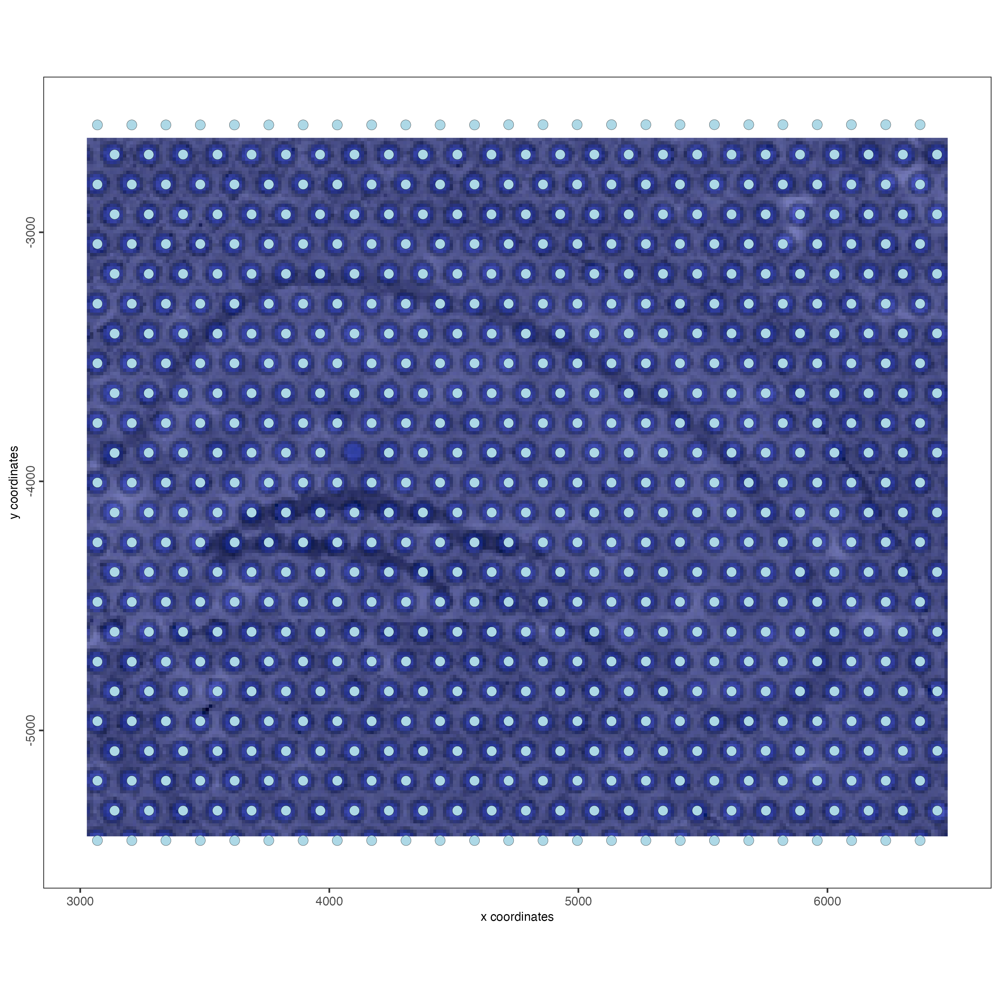
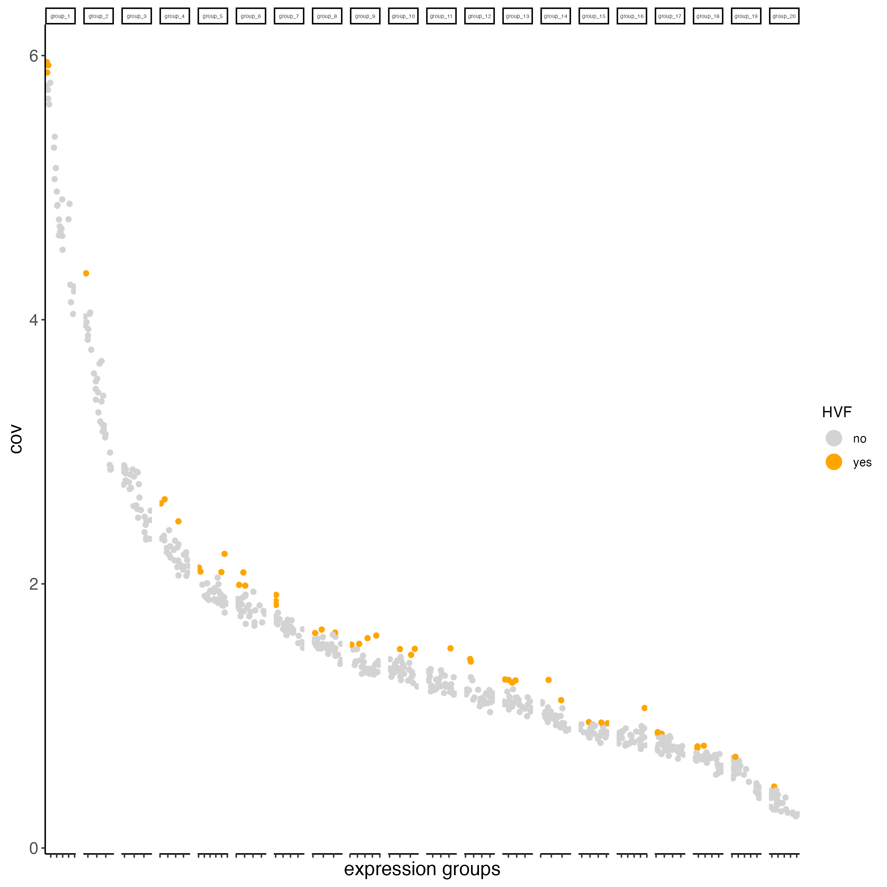

Independently of the technology that you used, there are some common steps on every analysis such as the filtering of cells or spots with enough features, normalization, dimension reduction, etc. This tutorial shows the most common steps, which might be helpful if it's your first time running an analysis with Giotto. 

After the common workflow, there are different downstream analysis that you can perform with Giotto depending on the resolution of your dataset and the purpose of your analysis, such as cell-type annotation, deconvolution, detection of spatial genes, ligand-receptor analysis, etc. Check the individual technologies examples and the tutorials section for more details.

# Pre-processing

Depending on the technology used for sequencing your sample, you might need to run some specific steps for reading the expression matrix, spatial locations (when using a spatial dataset), images, fields of view, or even sub-cellular information. Look at the different technologies examples available in the Giotto website for more details.

# Dataset explanation

For running this example, we will use two mini datasets available at the GiottoData package. A mini visium dataset with spots resolution, and a mini vizgen dataset with cellular and sub-cellular resolution.

# Set up Giotto Environment

```{r, eval=FALSE}
# Ensure Giotto Suite is installed.
if(!"Giotto" %in% installed.packages()) {
  pak::pkg_install("drieslab/Giotto")
}

# Ensure the Python environment for Giotto has been installed.
genv_exists <- Giotto::checkGiottoEnvironment()
if(!genv_exists){
  # The following command need only be run once to install the Giotto environment.
  Giotto::installGiottoEnvironment()
}
```

# Create Giotto Objects

```{r, eval=FALSE}
library(Giotto)

# 1. set working directory
results_folder <- "path/to/results"

# Optional: Specify a path to a Python executable within a conda or miniconda 
# environment. If set to NULL (default), the Python executable within the previously
# installed Giotto environment will be used.
python_path <- NULL # alternatively, "/local/python/path/python" if desired.
```

- Load mini visium object

```{r, eval=FALSE}
visium_object <- GiottoData::loadGiottoMini("visium", 
                                            python_path = python_path)
```

- Load mini vizgen object

```{r, eval=FALSE}
vizgen_object <- GiottoData::loadGiottoMini("vizgen",
                                            python_path = python_path)
```

- Update instructions to save plots

```{r, eval=FALSE}
instructions(visium_object, "save_plot") <- TRUE
instructions(visium_object, "save_dir") <- results_folder
instructions(visium_object, "show_plot") <- FALSE
instructions(visium_object, "return_plot") <- FALSE

instructions(vizgen_object, "save_plot") <- TRUE
instructions(vizgen_object, "save_dir") <- results_folder
instructions(vizgen_object, "show_plot") <- FALSE
instructions(vizgen_object, "return_plot") <- FALSE
```

- Visualize datasets

```{r, eval=FALSE}
spatPlot2D(gobject = visium_object,
           show_image = TRUE)
```

```{r, echo=FALSE, out.width="80%", fig.align="center"}

```

```{r, eval=FALSE}
spatPlot2D(gobject = vizgen_object,
           show_image = TRUE)
```

```{r, echo=FALSE, out.width="80%", fig.align="center"}
knitr::include_graphics("images/general_workflow/1-spatPlot2D.png")
```

# Filtering

```{r, eval=FALSE}
visium_object <- filterGiotto(gobject = visium_object,
                             expression_threshold = 1,
                             feat_det_in_min_cells = 1,
                             min_det_feats_per_cell = 50,
                             verbose = TRUE)

vizgen_object <- filterGiotto(gobject = vizgen_object,
                             expression_threshold = 1,
                             feat_det_in_min_cells = 1,
                             min_det_feats_per_cell = 1,
                             verbose = TRUE)
```

# Normalization

```{r, eval=FALSE}
visium_object <- normalizeGiotto(gobject = visium_object)

vizgen_object <- normalizeGiotto(gobject = vizgen_object)
```

# Statistics

```{r, eval=FALSE}
## add gene & cell statistics
visium_object <- addStatistics(gobject = visium_object)

vizgen_object <- addStatistics(gobject = vizgen_object)
```

```{r, eval=FALSE}
## visualize
spatPlot2D(gobject = visium_object, 
           show_image = TRUE, 
           cell_color = "nr_feats", 
           color_as_factor = FALSE)
```

```{r, echo=FALSE, out.width="80%", fig.align="center"}
knitr::include_graphics("images/general_workflow/2-spatPlot2D.png")
```

```{r, eval=FALSE}
spatPlot2D(gobject = vizgen_object, 
           show_image = TRUE, 
           cell_color = "nr_feats", 
           color_as_factor = FALSE)
```

```{r, echo=FALSE, out.width="80%", fig.align="center"}
knitr::include_graphics("images/general_workflow/3-spatPlot2D.png")
```

# Highly variable features / genes (HVF)

```{r, eval=FALSE}
visium_object <- calculateHVF(gobject = visium_object, 
                             save_plot = TRUE)
```

```{r, echo=FALSE, out.width="80%", fig.align="center"}

```

```{r, eval=FALSE}
vizgen_object <- calculateHVF(gobject = vizgen_object, 
                             save_plot = TRUE)
```

```{r, echo=FALSE, out.width="80%", fig.align="center"}

```

# Principal Component Analysis 

```{r, eval=FALSE}
# In this example we are setting feats_to_use = NULL because the number of HVF's is too small, for a regular-size dataset you don't need to use this argument
visium_object <- runPCA(gobject = visium_object,
                        feats_to_use = NULL)

screePlot(visium_object, 
          ncp = 30)
```

```{r, echo=FALSE, out.width="80%", fig.align="center"}

```

```{r, eval=FALSE}
plotPCA(gobject = visium_object)
```

```{r, echo=FALSE, out.width="80%", fig.align="center"}
knitr::include_graphics("images/general_workflow/7-PCA.png")
```

```{r, eval=FALSE}
# In this example we are setting feats_to_use = NULL because the number of HVF's is too small, for a regular-size dataset you don't need to use this argument
vizgen_object <- runPCA(gobject = vizgen_object,
                        feats_to_use = NULL)

screePlot(vizgen_object, 
          ncp = 30)
```

```{r, echo=FALSE, out.width="80%", fig.align="center"}

```

```{r, eval=FALSE}
plotPCA(gobject = vizgen_object)
```

```{r, echo=FALSE, out.width="80%", fig.align="center"}
knitr::include_graphics("images/general_workflow/9-PCA.png")
```

# UMAP

```{r, eval=FALSE}
visium_object <- runUMAP(visium_object, 
                        dimensions_to_use = 1:10)

plotUMAP(gobject = visium_object)
```

```{r, echo=FALSE, out.width="80%", fig.align="center"}
knitr::include_graphics("images/general_workflow/10-UMAP.png")
```

```{r, eval=FALSE}
vizgen_object <- runUMAP(vizgen_object, 
                         dimensions_to_use = 1:10)

plotUMAP(gobject = vizgen_object)
```

```{r, echo=FALSE, out.width="80%", fig.align="center"}

```

# tSNE

```{r, eval=FALSE}
visium_object <- runtSNE(visium_object, 
                         dimensions_to_use = 1:10)

plotTSNE(gobject = visium_object)
```

```{r, echo=FALSE, out.width="80%", fig.align="center"}

```

```{r, eval=FALSE}
vizgen_object <- runtSNE(vizgen_object, 
                         dimensions_to_use = 1:10)

plotTSNE(gobject = vizgen_object)
```

```{r, echo=FALSE, out.width="80%", fig.align="center"}

```

# Nearest Network

```{r, eval=FALSE}
## sNN network (default)
visium_object <- createNearestNetwork(gobject = visium_object, 
                                     dimensions_to_use = 1:10, 
                                     k = 15)

## sNN network (default)
vizgen_object <- createNearestNetwork(gobject = vizgen_object, 
                                      dimensions_to_use = 1:10, 
                                      k = 15)
```

# Clustering

```{r, eval=FALSE}
## Leiden clustering
visium_object <- doLeidenCluster(gobject = visium_object, 
                                resolution = 0.4, 
                                n_iterations = 1000)

vizgen_object<- doLeidenCluster(gobject = vizgen_object, 
                                resolution = 1, 
                                n_iterations = 1000)
```

# Plot results with clusters

- UMAP

```{r, eval=FALSE}
plotUMAP(gobject = visium_object,
         cell_color = "leiden_clus", 
         show_NN_network = TRUE, 
         point_size = 2.5)
```

```{r, echo=FALSE, out.width="80%", fig.align="center"}

```

```{r, eval=FALSE}
plotUMAP(gobject = vizgen_object,
         cell_color = "leiden_clus", 
         show_NN_network = TRUE, 
         point_size = 2.5)
```

```{r, echo=FALSE, out.width="80%", fig.align="center"}
knitr::include_graphics("images/general_workflow/15-UMAP.png")
```

- tSNE

```{r, eval=FALSE}
plotTSNE(gobject = visium_object,
         cell_color = "leiden_clus", 
         show_NN_network = FALSE, 
         point_size = 2.5)
```

```{r, echo=FALSE, out.width="80%", fig.align="center"}

```

```{r, eval=FALSE}
plotTSNE(gobject = vizgen_object,
         cell_color = "leiden_clus", 
         show_NN_network = FALSE, 
         point_size = 2.5)
```

```{r, echo=FALSE, out.width="80%", fig.align="center"}
knitr::include_graphics("images/general_workflow/17-tSNE.png")
```

- Spatial plots

```{r, eval=FALSE}
spatPlot2D(gobject = visium_object, 
           cell_color = "leiden_clus",
           show_image = TRUE,
           point_size = 4)
```

```{r, echo=FALSE, out.width="80%", fig.align="center"}
knitr::include_graphics("images/general_workflow/18-spatPlot2D.png")
```


```{r, eval=FALSE}
spatPlot2D(gobject = vizgen_object, 
           cell_color = "leiden_clus",
           show_image = TRUE,
           point_size = 3)
```

```{r, echo=FALSE, out.width="80%", fig.align="center"}

```

# Session info

```{r, eval=FALSE}
sessionInfo()
```

```{r, eval=FALSE}
R version 4.4.0 (2024-04-24)
Platform: x86_64-apple-darwin20
Running under: macOS Sonoma 14.6.1

Matrix products: default
BLAS:   /System/Library/Frameworks/Accelerate.framework/Versions/A/Frameworks/vecLib.framework/Versions/A/libBLAS.dylib 
LAPACK: /Library/Frameworks/R.framework/Versions/4.4-x86_64/Resources/lib/libRlapack.dylib;  LAPACK version 3.12.0

locale:
[1] en_US.UTF-8/en_US.UTF-8/en_US.UTF-8/C/en_US.UTF-8/en_US.UTF-8

time zone: America/New_York
tzcode source: internal

attached base packages:
[1] stats     graphics  grDevices utils     datasets  methods   base     

other attached packages:
[1] Giotto_4.1.1      GiottoClass_0.3.5

loaded via a namespace (and not attached):
  [1] colorRamp2_0.1.0            deldir_2.0-4               
  [3] rlang_1.1.4                 magrittr_2.0.3             
  [5] GiottoUtils_0.1.11          matrixStats_1.3.0          
  [7] compiler_4.4.0              png_0.1-8                  
  [9] systemfonts_1.1.0           vctrs_0.6.5                
 [11] reshape2_1.4.4              stringr_1.5.1              
 [13] pkgconfig_2.0.3             SpatialExperiment_1.14.0   
 [15] crayon_1.5.3                fastmap_1.2.0              
 [17] backports_1.5.0             magick_2.8.4               
 [19] XVector_0.44.0              labeling_0.4.3             
 [21] utf8_1.2.4                  rmarkdown_2.28             
 [23] UCSC.utils_1.0.0            ragg_1.3.2                 
 [25] purrr_1.0.2                 xfun_0.47                  
 [27] beachmat_2.20.0             zlibbioc_1.50.0            
 [29] GenomeInfoDb_1.40.1         jsonlite_1.8.8             
 [31] DelayedArray_0.30.1         BiocParallel_1.38.0        
 [33] terra_1.7-78                irlba_2.3.5.1              
 [35] parallel_4.4.0              R6_2.5.1                   
 [37] stringi_1.8.4               RColorBrewer_1.1-3         
 [39] reticulate_1.38.0           parallelly_1.38.0          
 [41] GenomicRanges_1.56.1        scattermore_1.2            
 [43] Rcpp_1.0.13                 SummarizedExperiment_1.34.0
 [45] knitr_1.48                  future.apply_1.11.2        
 [47] R.utils_2.12.3              FNN_1.1.4                  
 [49] IRanges_2.38.1              Matrix_1.7-0               
 [51] igraph_2.0.3                tidyselect_1.2.1           
 [53] rstudioapi_0.16.0           abind_1.4-5                
 [55] yaml_2.3.10                 codetools_0.2-20           
 [57] listenv_0.9.1               lattice_0.22-6             
 [59] tibble_3.2.1                plyr_1.8.9                 
 [61] Biobase_2.64.0              withr_3.0.1                
 [63] Rtsne_0.17                  evaluate_0.24.0            
 [65] future_1.34.0               pillar_1.9.0               
 [67] MatrixGenerics_1.16.0       checkmate_2.3.2            
 [69] stats4_4.4.0                plotly_4.10.4              
 [71] generics_0.1.3              dbscan_1.2-0               
 [73] sp_2.1-4                    S4Vectors_0.42.1           
 [75] ggplot2_3.5.1               munsell_0.5.1              
 [77] scales_1.3.0                GiottoData_0.2.13          
 [79] globals_0.16.3              gtools_3.9.5               
 [81] glue_1.7.0                  lazyeval_0.2.2             
 [83] tools_4.4.0                 GiottoVisuals_0.2.5        
 [85] data.table_1.16.0           ScaledMatrix_1.12.0        
 [87] cowplot_1.1.3               grid_4.4.0                 
 [89] tidyr_1.3.1                 colorspace_2.1-1           
 [91] SingleCellExperiment_1.26.0 GenomeInfoDbData_1.2.12    
 [93] BiocSingular_1.20.0         rsvd_1.0.5                 
 [95] cli_3.6.3                   textshaping_0.4.0          
 [97] fansi_1.0.6                 S4Arrays_1.4.1             
 [99] viridisLite_0.4.2           dplyr_1.1.4                
[101] uwot_0.2.2                  gtable_0.3.5               
[103] R.methodsS3_1.8.2           digest_0.6.37              
[105] BiocGenerics_0.50.0         SparseArray_1.4.8          
[107] ggrepel_0.9.5               rjson_0.2.22               
[109] htmlwidgets_1.6.4           farver_2.1.2               
[111] htmltools_0.5.8.1           R.oo_1.26.0                
[113] lifecycle_1.0.4             httr_1.4.7 
```
