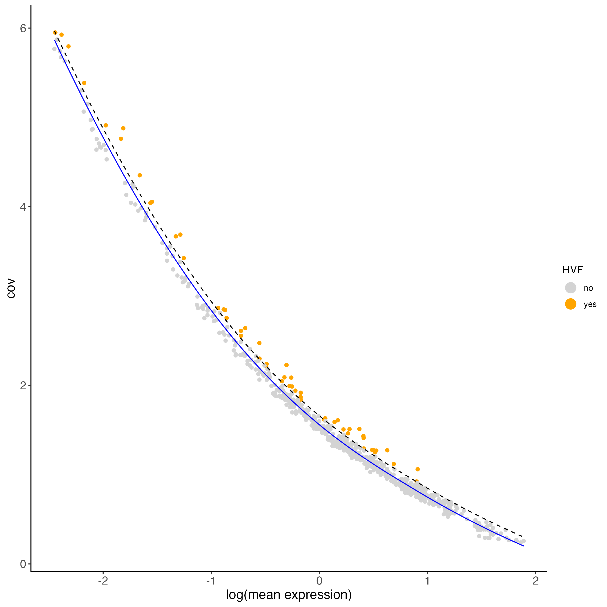
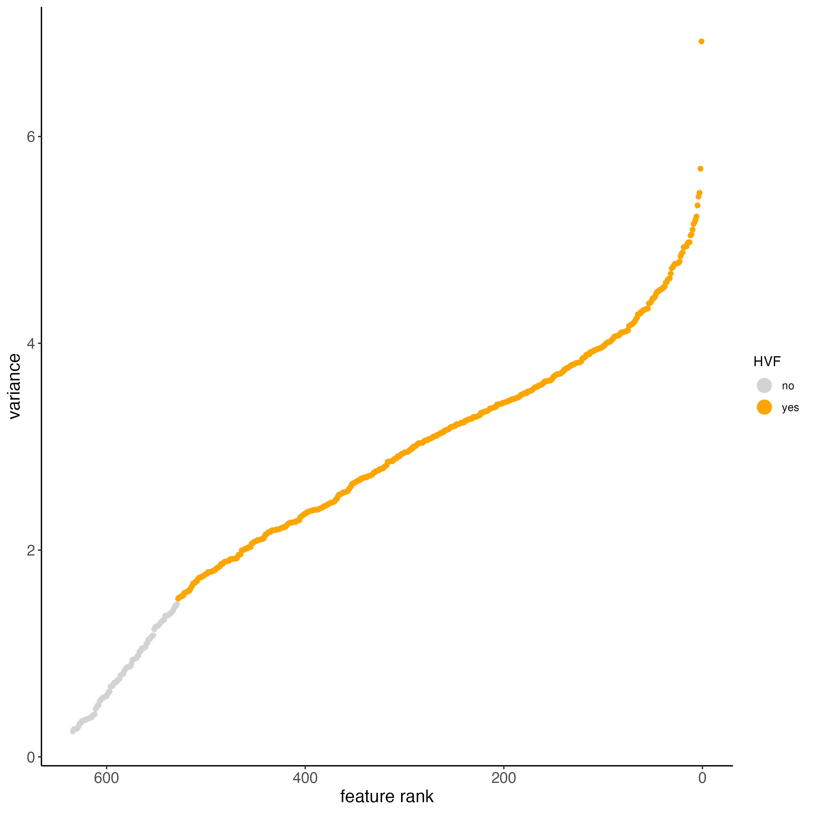
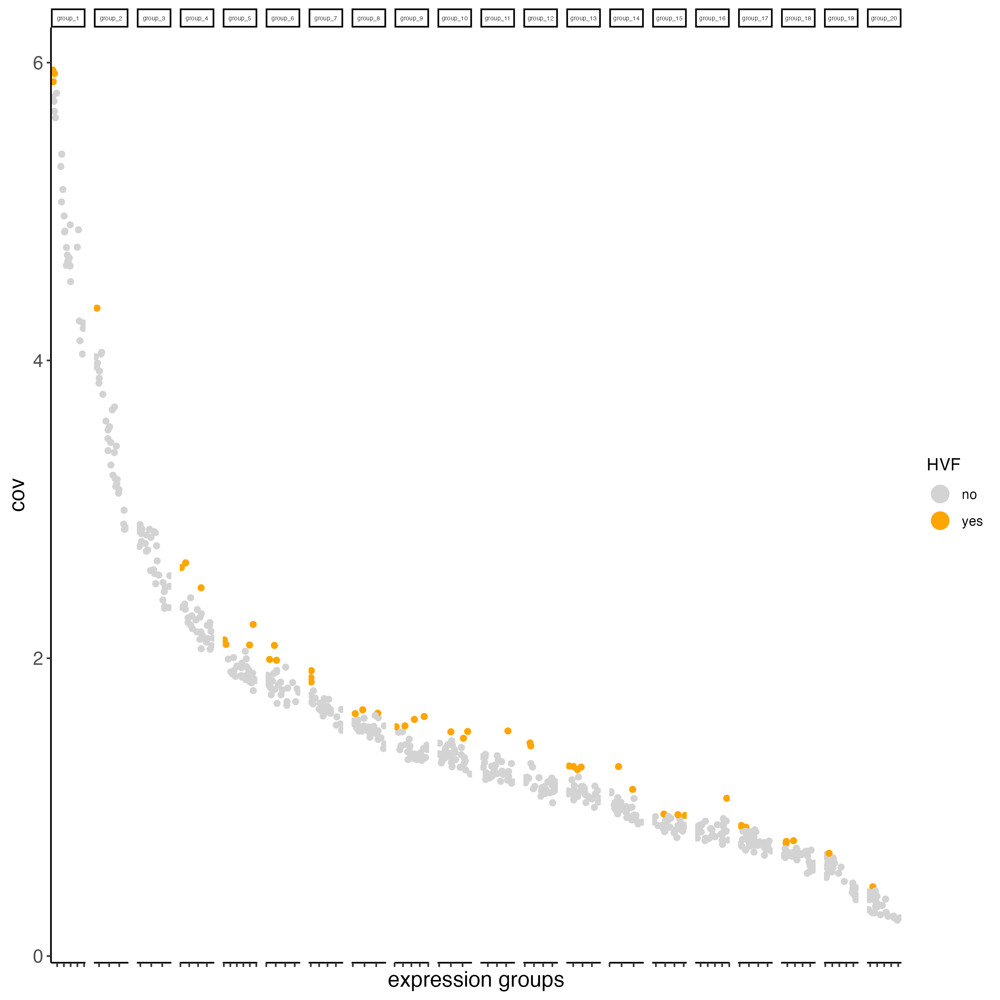

Calculating Highly Variable Features (HVF) is necessary to identify genes (or features) that display significant variability across the spots. 

# Setup and load example dataset

```{r, eval=FALSE}
# Ensure Giotto Suite is installed
if(!"Giotto" %in% installed.packages()) {
  pak::pkg_install("drieslab/Giotto")
}

# Ensure Giotto Data is installed
if(!"GiottoData" %in% installed.packages()) {
  pak::pkg_install("drieslab/GiottoData")
}

library(Giotto)

# Ensure the Python environment for Giotto has been installed
genv_exists <- checkGiottoEnvironment()

if(!genv_exists){
  # The following command need only be run once to install the Giotto environment
  installGiottoEnvironment()
}
```

```{r, eval=FALSE}
# load the object
g <- GiottoData::loadGiottoMini("visium")
```

There are a few methods to choose from depending on the underlying distribution of the data:

## Loess regression 

It is used when the relationship between mean expression and variance is non-linear or can be described by a non-parametric model.

```{r, eval=FALSE}
g <- calculateHVF(gobject = g, 
                  method = "cov_loess",
                  save_plot = TRUE)
```

```{r, echo=FALSE, out.width="60%", fig.align='center'}

```


## Pearson residuals 

They are used for variance stabilization (to account for technical noise) and highlighting overdispersed genes.

```{r, eval=FALSE}
g <- calculateHVF(gobject = g, 
                  method = "var_p_resid",
                  save_plot = TRUE)
```

```{r, echo=FALSE, out.width="60%", fig.align='center'}

```

## Binned (covariance groups) 

They are used when gene expression variability differs across expression levels or spatial regions, without assuming a specific relationship between mean expression and variance. This is the default method in the calculateHVF() function.

```{r, eval=FALSE}
g <- calculateHVF(gobject = g, 
                  method = "cov_groups",
                  save_plot = TRUE)
```

```{r, echo=FALSE, out.width="60%", fig.align='center'}

```

# Session Info

```{r, eval=FALSE}
sessionInfo()
```

```{r, eval=FALSE}
R version 4.4.1 (2024-06-14)
Platform: x86_64-apple-darwin20
Running under: macOS 15.0

Matrix products: default
BLAS:   /System/Library/Frameworks/Accelerate.framework/Versions/A/Frameworks/vecLib.framework/Versions/A/libBLAS.dylib 
LAPACK: /Library/Frameworks/R.framework/Versions/4.4-x86_64/Resources/lib/libRlapack.dylib;  LAPACK version 3.12.0

locale:
[1] en_US.UTF-8/en_US.UTF-8/en_US.UTF-8/C/en_US.UTF-8/en_US.UTF-8

time zone: America/New_York
tzcode source: internal

attached base packages:
[1] stats     graphics  grDevices utils     datasets  methods   base     

other attached packages:
[1] Giotto_4.1.3      GiottoClass_0.4.0

loaded via a namespace (and not attached):
 [1] tidyselect_1.2.1            viridisLite_0.4.2          
 [3] farver_2.1.2                dplyr_1.1.4                
 [5] GiottoVisuals_0.2.5         R.utils_2.12.3             
 [7] fastmap_1.2.0               SingleCellExperiment_1.26.0
 [9] lazyeval_0.2.2              digest_0.6.37              
[11] lifecycle_1.0.4             terra_1.7-78               
[13] magrittr_2.0.3              compiler_4.4.1             
[15] rlang_1.1.4                 tools_4.4.1                
[17] igraph_2.0.3                utf8_1.2.4                 
[19] yaml_2.3.10                 data.table_1.16.0          
[21] knitr_1.48                  labeling_0.4.3             
[23] S4Arrays_1.4.1              htmlwidgets_1.6.4          
[25] reticulate_1.39.0           DelayedArray_0.30.1        
[27] RColorBrewer_1.1-3          abind_1.4-8                
[29] withr_3.0.1                 purrr_1.0.2                
[31] BiocGenerics_0.50.0         R.oo_1.26.0                
[33] grid_4.4.1                  stats4_4.4.1               
[35] fansi_1.0.6                 future_1.34.0              
[37] colorspace_2.1-1            ggplot2_3.5.1              
[39] globals_0.16.3              scales_1.3.0               
[41] gtools_3.9.5                SummarizedExperiment_1.34.0
[43] cli_3.6.3                   rmarkdown_2.28             
[45] crayon_1.5.3                ragg_1.3.3                 
[47] generics_0.1.3              future.apply_1.11.2        
[49] rstudioapi_0.16.0           httr_1.4.7                 
[51] rjson_0.2.23                zlibbioc_1.50.0            
[53] parallel_4.4.1              XVector_0.44.0             
[55] matrixStats_1.4.1           vctrs_0.6.5                
[57] Matrix_1.7-0                jsonlite_1.8.9             
[59] GiottoData_0.2.15           IRanges_2.38.1             
[61] S4Vectors_0.42.1            ggrepel_0.9.6              
[63] scattermore_1.2             listenv_0.9.1              
[65] systemfonts_1.1.0           magick_2.8.5               
[67] GiottoUtils_0.2.0           plotly_4.10.4              
[69] tidyr_1.3.1                 parallelly_1.38.0          
[71] glue_1.8.0                  codetools_0.2-20           
[73] cowplot_1.1.3               gtable_0.3.5               
[75] GenomeInfoDb_1.40.1         GenomicRanges_1.56.1       
[77] UCSC.utils_1.0.0            munsell_0.5.1              
[79] tibble_3.2.1                pillar_1.9.0               
[81] htmltools_0.5.8.1           GenomeInfoDbData_1.2.12    
[83] R6_2.5.1                    textshaping_0.4.0          
[85] evaluate_1.0.0              lattice_0.22-6             
[87] Biobase_2.64.0              png_0.1-8                  
[89] R.methodsS3_1.8.2           backports_1.5.0            
[91] SpatialExperiment_1.14.0    Rcpp_1.0.13                
[93] SparseArray_1.4.8           checkmate_2.3.2            
[95] colorRamp2_0.1.0            xfun_0.47                  
[97] MatrixGenerics_1.16.0       pkgconfig_2.0.3 
```
