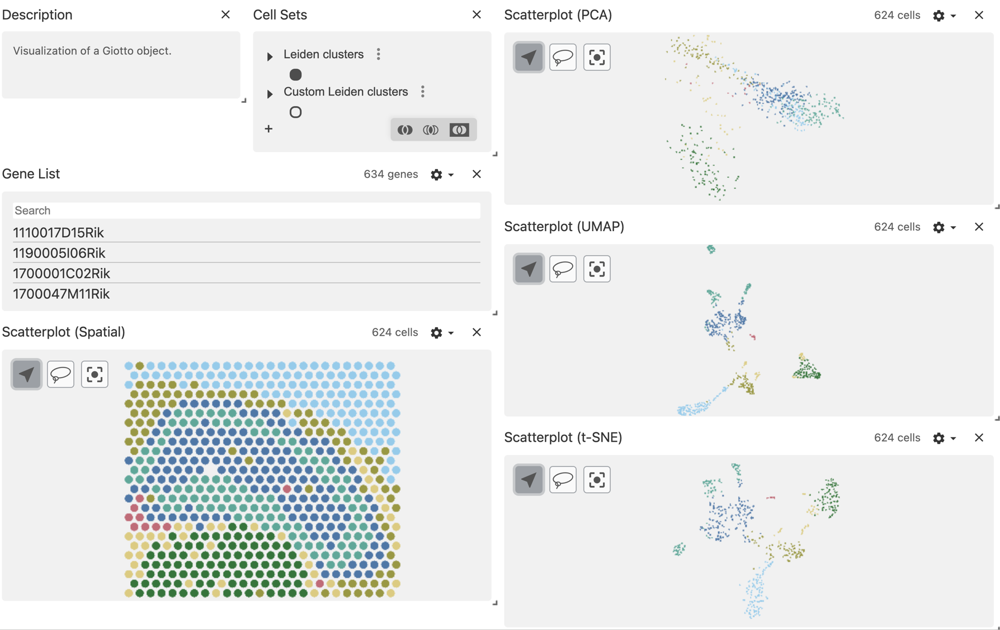
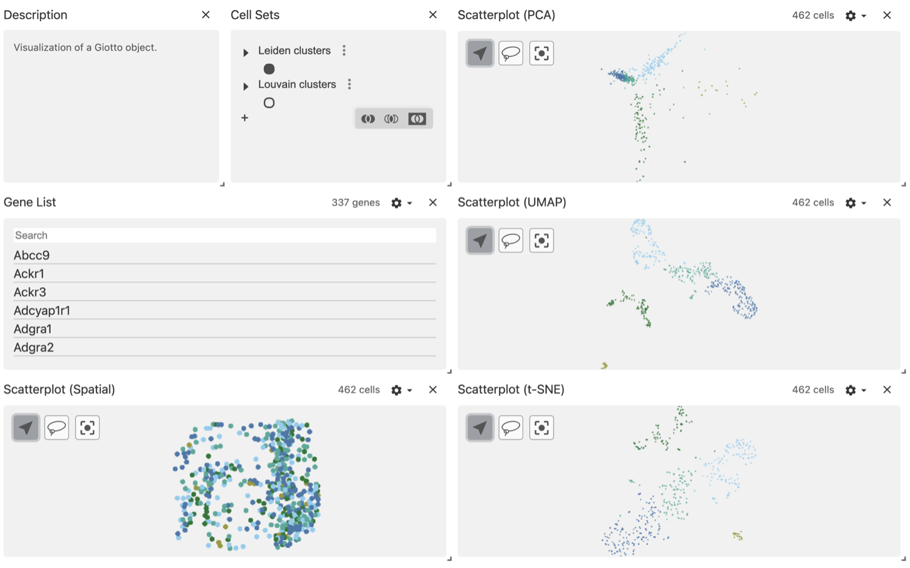
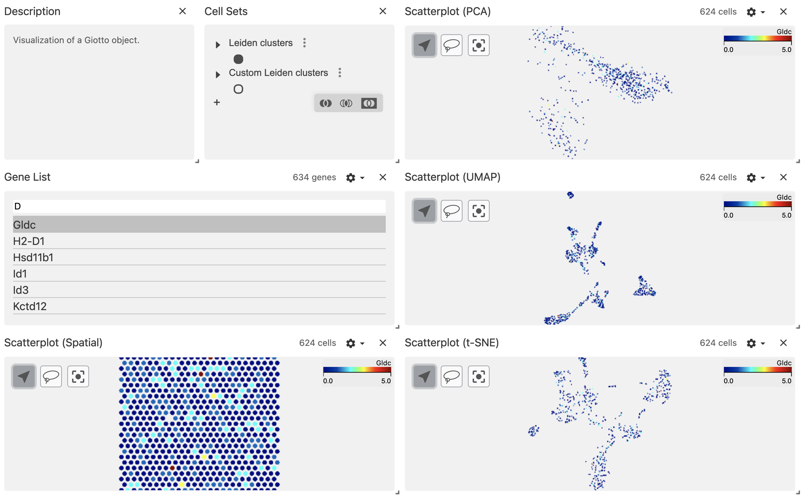

We have created a function that facilitates the interaction with the [vitessceR package](https://r-docs.vitessce.io) for interactive visualization of processed datasets.

# Set up the Giotto enviroment

```{r, eval=FALSE}
# Ensure Giotto Suite is installed.
if(!"Giotto" %in% installed.packages()) {
  pak::pkg_install("drieslab/Giotto")
}

# Ensure GiottoData, a small, helper module for tutorials, is installed.
if(!"GiottoData" %in% installed.packages()) {
  pak::pkg_install("drieslab/GiottoData")
}

library(Giotto)

# Ensure the Python environment for Giotto has been installed.
genv_exists <- checkGiottoEnvironment()
if(!genv_exists){
  # The following command need only be run once to install the Giotto environment.
  installGiottoEnvironment()
}
```

# Install the vitessceR package

```{r, eval=FALSE}
pak::pkg_install("vitessce/vitessceR")
```

# Load a mini Giotto object

For this tutorial, we will work with two mini objects: the mini visium and mini vizgen datasets.

```{r, eval=FALSE}
visium_object <- GiottoData::loadGiottoMini("visium")

vizgen_object <- GiottoData::loadGiottoMini("vizgen")
```

# Export the Giotto object to a local Anndata-Zarr folder

By default, the function giottoToAnndataZarr() will look for the "cell" spatial unit and "rna" feature type, but you can specify the spat_unit and feat_type arguments, as well as the expression values to use.

In addition, you need to specify the path or name for creating a new folder that will store the Anndata-Zarr information.

```{r, eval=FALSE}
giottoToAnndataZarr(visium_object,
                    expression = "raw"
                    output_path = "visium_anndata_zarr")

giottoToAnndataZarr(vizgen_object,
                    spat_unit = "aggregate",
                    expression = "scaled",
                    output_path = "vizgen_anndata_zarr")
```

# Create the vitessceR object

To create the vitessceR object, you need to provide the paths for the metadata information that you want to load from your Anndata-Zarr folder. We suggest to explore the subfolders obs (for cell metadata), var (for feature metadata), and obsm (for spatial and dimension reduction data). 

```{r, eval=FALSE}
library(vitessceR)

w <- AnnDataWrapper$new(
  adata_path = "visium_anndata_zarr",
  obs_feature_matrix_path = "X",
  obs_set_paths = c("obs/leiden_clus", "obs/custom_leiden"),
  obs_set_names = c("Leiden clusters", "Custom Leiden clusters"),
  obs_locations_path = "obsm/spatial",
  obs_embedding_paths = c("obsm/spatial", "obsm/pca", "obsm/tsne", "obsm/umap"),
  obs_embedding_names = c("Spatial", "PCA",  "t-SNE", "UMAP"),
  feature_labels_path = "var/feat_ID",
  obs_labels_paths = "obs/cell_ID",
  obs_labels_names = "cell_ID",
)

w <- AnnDataWrapper$new(
  adata_path = "vizgen_anndata_zarr",
  obs_feature_matrix_path = "X",
  obs_set_paths = c("obs/leiden_clus", "obs/louvain_clus"),
  obs_set_names = c("Leiden clusters", "Louvain clusters"),
  obs_locations_path = "obsm/spatial",
  obs_embedding_paths = c("obsm/spatial", "obsm/pca", "obsm/tsne", "obsm/umap"),
  obs_embedding_names = c("Spatial", "PCA", "t-SNE", "UMAP"),
  feature_labels_path = "var/feat_ID",
  obs_labels_paths = "obs/cell_ID",
  obs_labels_names = "cell_ID"
)
```

# Create the vitessceR schema

Here we will create the base of the schema using the previous object, then we will add the components to generate interactive plots.

```{r, eval=FALSE}
vc <- VitessceConfig$new(schema_version = "1.0.16", name = "My config")
dataset <- vc$add_dataset("My dataset")$add_object(w)
cluster_sets <- vc$add_view(dataset, Component$OBS_SETS)
features <- vc$add_view(dataset, Component$FEATURE_LIST)
scatterplot_spatial <- vc$add_view(dataset, Component$SCATTERPLOT, mapping = "Spatial")
scatterplot_pca <- vc$add_view(dataset, Component$SCATTERPLOT, mapping = "PCA")
scatterplot_umap <- vc$add_view(dataset, Component$SCATTERPLOT, mapping = "UMAP")
scatterplot_tsne <- vc$add_view(dataset, Component$SCATTERPLOT, mapping = "t-SNE")
desc <- vc$add_view(dataset, Component$DESCRIPTION)
desc <- desc$set_props(description = "Visualization of a Giotto object.")
```

# Create the layout

You can create multi-column layout and add more compartments using the horizontal (hconcat) or vertical (vconcat) sections.

```{r, eval=FALSE}
vc$layout(
  hconcat(
    vconcat(
      hconcat(desc, cluster_sets),
      features,
      scatterplot_spatial
      ),
    vconcat(
      scatterplot_pca,
      scatterplot_umap,
      scatterplot_tsne)
  )
)
```

# Render the Vitessce widget

```{r, eval=FALSE}
vc$widget(theme = "light")
```

The default view will color the points using the first column defined in the obs_set_paths section, in this case is the Leiden clusters column.

```{r, echo=FALSE, out.width="100%", fig.cap="mini visium object"}

```

```{r, echo=FALSE, out.width="100%", fig.cap="mini vizgen object"}

```

Using the configuration wheel, you can choose to color the points using the gene expression values instead. 

```{r, echo=FALSE, out.width="100%"}

```

# Session info

```{r, eval=FALSE}
sessionInfo()
```

```{r, eval=FALSE}
R version 4.4.1 (2024-06-14)
Platform: x86_64-apple-darwin20
Running under: macOS Sonoma 14.6.1

Matrix products: default
BLAS:   /System/Library/Frameworks/Accelerate.framework/Versions/A/Frameworks/vecLib.framework/Versions/A/libBLAS.dylib 
LAPACK: /Library/Frameworks/R.framework/Versions/4.4-x86_64/Resources/lib/libRlapack.dylib;  LAPACK version 3.12.0

locale:
[1] en_US.UTF-8/en_US.UTF-8/en_US.UTF-8/C/en_US.UTF-8/en_US.UTF-8

time zone: America/New_York
tzcode source: internal

attached base packages:
[1] stats     graphics  grDevices utils     datasets  methods   base     

other attached packages:
[1] vitessceR_0.99.0  Giotto_4.1.3      GiottoClass_0.4.0

loaded via a namespace (and not attached):
  [1] RcppAnnoy_0.0.22            splines_4.4.1               later_1.3.2                
  [4] filelock_1.0.3              tibble_3.2.1                R.oo_1.26.0                
  [7] polyclip_1.10-7             basilisk.utils_1.16.0       fastDummies_1.7.4          
 [10] lifecycle_1.0.4             rprojroot_2.0.4             globals_0.16.3             
 [13] lattice_0.22-6              MASS_7.3-60.2               backports_1.5.0            
 [16] magrittr_2.0.3              plotly_4.10.4               yaml_2.3.10                
 [19] httpuv_1.6.15               Seurat_5.1.0                sctransform_0.4.1          
 [22] spam_2.10-0                 sp_2.1-4                    spatstat.sparse_3.1-0      
 [25] reticulate_1.39.0           cowplot_1.1.3               pbapply_1.7-2              
 [28] RColorBrewer_1.1-3          abind_1.4-5                 zlibbioc_1.50.0            
 [31] Rtsne_0.17                  GenomicRanges_1.56.1        purrr_1.0.2                
 [34] R.utils_2.12.3              BiocGenerics_0.50.0         rappdirs_0.3.3             
 [37] GenomeInfoDbData_1.2.12     IRanges_2.38.1              S4Vectors_0.42.1           
 [40] ggrepel_0.9.6               irlba_2.3.5.1               listenv_0.9.1              
 [43] spatstat.utils_3.1-0        terra_1.7-78                goftest_1.2-3              
 [46] RSpectra_0.16-2             spatstat.random_3.3-1       fitdistrplus_1.2-1         
 [49] parallelly_1.38.0           webutils_1.2.1              leiden_0.4.3.1             
 [52] colorRamp2_0.1.0            codetools_0.2-20            DelayedArray_0.30.1        
 [55] tidyselect_1.2.1            farver_2.1.2                UCSC.utils_1.0.0           
 [58] matrixStats_1.4.1           stats4_4.4.1                spatstat.explore_3.3-2     
 [61] GiottoData_0.2.13           jsonlite_1.8.8              progressr_0.14.0           
 [64] ggridges_0.5.6              survival_3.6-4              dbscan_1.2-0               
 [67] tools_4.4.1                 ica_1.0-3                   Rcpp_1.0.13                
 [70] glue_1.7.0                  gridExtra_2.3               SparseArray_1.4.8          
 [73] here_1.0.1                  MatrixGenerics_1.16.0       GenomeInfoDb_1.40.1        
 [76] dplyr_1.1.4                 withr_3.0.1                 fastmap_1.2.0              
 [79] basilisk_1.16.0             fansi_1.0.6                 digest_0.6.37              
 [82] R6_2.5.1                    mime_0.12                   colorspace_2.1-1           
 [85] scattermore_1.2             gtools_3.9.5                tensor_1.5                 
 [88] spatstat.data_3.1-2         R.methodsS3_1.8.2           utf8_1.2.4                 
 [91] tidyr_1.3.1                 generics_0.1.3              data.table_1.16.0          
 [94] httr_1.4.7                  htmlwidgets_1.6.4           S4Arrays_1.4.1             
 [97] uwot_0.2.2                  pkgconfig_2.0.3             gtable_0.3.5               
[100] lmtest_0.9-40               GiottoVisuals_0.2.5         SingleCellExperiment_1.26.0
[103] XVector_0.44.0              htmltools_0.5.8.1           dotCall64_1.1-1            
[106] swagger_5.17.14.1           SeuratObject_5.0.2          scales_1.3.0               
[109] Biobase_2.64.0              SeuratData_0.2.2.9001       GiottoUtils_0.1.12         
[112] png_0.1-8                   SpatialExperiment_1.14.0    spatstat.univar_3.0-1      
[115] plumber_1.2.2               rstudioapi_0.16.0           reshape2_1.4.4             
[118] rjson_0.2.22                checkmate_2.3.2             nlme_3.1-164               
[121] zoo_1.8-12                  stringr_1.5.1               KernSmooth_2.23-24         
[124] parallel_4.4.1              miniUI_0.1.1.1              pillar_1.9.0               
[127] grid_4.4.1                  vctrs_0.6.5                 RANN_2.6.2                 
[130] promises_1.3.0              xtable_1.8-4                cluster_2.1.6              
[133] magick_2.8.4                cli_3.6.3                   compiler_4.4.1             
[136] rlang_1.1.4                 crayon_1.5.3                vitessceAnalysisR_0.99.0   
[139] future.apply_1.11.2         labeling_0.4.3              plyr_1.8.9                 
[142] stringi_1.8.4               viridisLite_0.4.2           deldir_2.0-4               
[145] munsell_0.5.1               lazyeval_0.2.2              spatstat.geom_3.3-2        
[148] Matrix_1.7-0                dir.expiry_1.12.0           RcppHNSW_0.6.0             
[151] patchwork_1.2.0             future_1.34.0               ggplot2_3.5.1              
[154] shiny_1.9.1                 SummarizedExperiment_1.34.0 ROCR_1.0-11                
[157] igraph_2.0.3 
```


