While the interactive region selection using the [Shiny app](https://drieslab.github.io/Giotto_website/articles/interactive_selection.html) is very user-friendly, it doesn’t offer the best performance when handling big datasets.

We have created a function that facilitates the interaction with the [vitessceR package](https://r-docs.vitessce.io) for interactive visualization of processed large datasets.

# Set up the Giotto enviroment

```{r, eval=FALSE}
# Ensure Giotto Suite is installed.
if(!"Giotto" %in% installed.packages()) {
  pak::pkg_install("drieslab/Giotto")
}

library(Giotto)

# Ensure the Python environment for Giotto has been installed.
genv_exists <- checkGiottoEnvironment()
if(!genv_exists){
  # The following command need only be run once to install the Giotto environment.
  installGiottoEnvironment()
}
```

# Install the vitessceR package

```{r, eval=FALSE}
pak::pkg_install("vitessce/vitessceR")
```

# Dataset explanation

For this tutorial, we will use the [Nanostring CosMx Subcellular Lung Cancer](https://drieslab.github.io/Giotto_website/articles/nanostring_cosmx_lung_cancer.html) processed Giotto object. 

# Load the Giotto object

If you have the object already in your R environment, you can skip this step. If you exported it to a folder using the `saveGiotto()` function, then run the following command:

```{r, eval=FALSE}
giotto_object <- loadGiotto("cosmx_object/")
```

# Export the Giotto object to a local Anndata-Zarr folder

By default, the function giottoToAnndataZarr() will look for the "cell" spatial unit and "rna" feature type, but you can specify the spat_unit and feat_type arguments, as well as the expression values to use.

In addition, you need to specify the path or name for creating a new folder that will store the Anndata-Zarr information.

```{r, eval=FALSE}
giottoToAnndataZarr(giotto_object,
                    output_path = "cosmx_anndata_zarr",
                    expression = "normalized")
```

# Create the vitessceR object

To create the vitessceR object, you need to provide the paths for the metadata information that you want to load from your Anndata-Zarr folder. We suggest to explore the subfolders obs (for cell metadata), var (for feature metadata), and obsm (for spatial and dimension reduction data). 

```{r, eval=FALSE}
library(vitessceR)

w <- AnnDataWrapper$new(
  adata_path = "cosmx_anndata_zarr",
  obs_feature_matrix_path = "X",
  obs_set_paths = c("obs/leiden_clus", "obs/cell_types"),
  obs_set_names = c("Leiden clusters", "Cell types"),
  obs_locations_path = "obsm/spatial",
  obs_embedding_paths = c("obsm/spatial", "obsm/pca", "obsm/tsne", "obsm/umap"),
  obs_embedding_names = c("Spatial", "PCA",  "t-SNE", "UMAP"),
  feature_labels_path = "var/feat_ID",
  obs_labels_paths = "obs/cell_ID",
  obs_labels_names = "cell_ID",
)
```

# Create the vitessceR schema

Here we will create the base of the schema using the previous object, then we will add the components to generate interactive plots.

```{r, eval=FALSE}
vc <- VitessceConfig$new(schema_version = "1.0.16", name = "My config")
dataset <- vc$add_dataset("My dataset")$add_object(w)
cluster_sets <- vc$add_view(dataset, Component$OBS_SETS)
features <- vc$add_view(dataset, Component$FEATURE_LIST)
scatterplot_spatial <- vc$add_view(dataset, Component$SCATTERPLOT, mapping = "Spatial")
scatterplot_pca <- vc$add_view(dataset, Component$SCATTERPLOT, mapping = "PCA")
scatterplot_umap <- vc$add_view(dataset, Component$SCATTERPLOT, mapping = "UMAP")
scatterplot_tsne <- vc$add_view(dataset, Component$SCATTERPLOT, mapping = "t-SNE")
desc <- vc$add_view(dataset, Component$DESCRIPTION)
desc <- desc$set_props(description = "Visualization of a Giotto object.")
```

# Create the layout

You can create multi-column layout and add more compartments using the horizontal (hconcat) or vertical (vconcat) sections.

```{r, eval=FALSE}
vc$layout(
  hconcat(
    vconcat(
      hconcat(desc, cluster_sets),
      features,
      scatterplot_spatial
      ),
    vconcat(
      scatterplot_pca,
      scatterplot_umap,
      scatterplot_tsne)
  )
)
```

# Render the Vitessce widget

```{r, eval=FALSE}
vc$widget(theme = "light")
```

```{r, echo=FALSE, out.width="100%"}
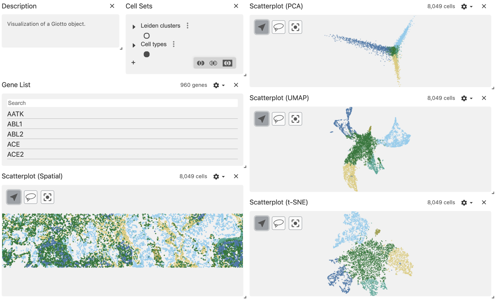
```

# Select the regions of interest

Use the lasso tool to select a region of interest.

```{r, echo=FALSE, out.width="100%"}
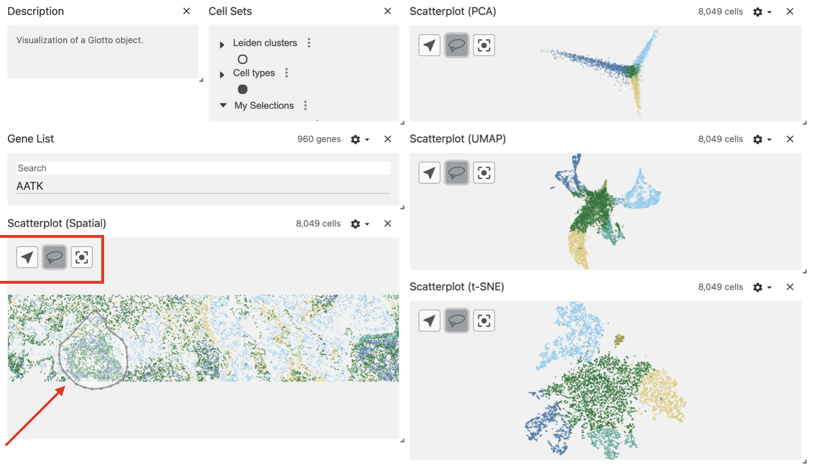
```

After drawing the selection, the area will be highlighted and the corresponding cells will be mapped and highlighted in the dimension reduction plots.

```{r, echo=FALSE, out.width="100%"}
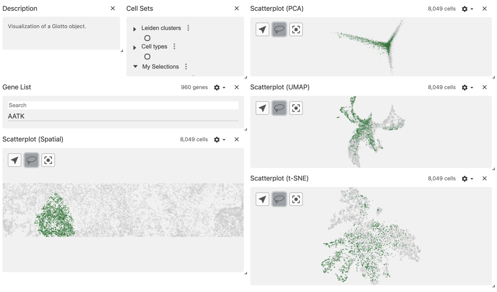
```

You can see your selected regions in the Cell Sets panel, under the My Selections group. 

```{r, echo=FALSE, out.width="40%"}
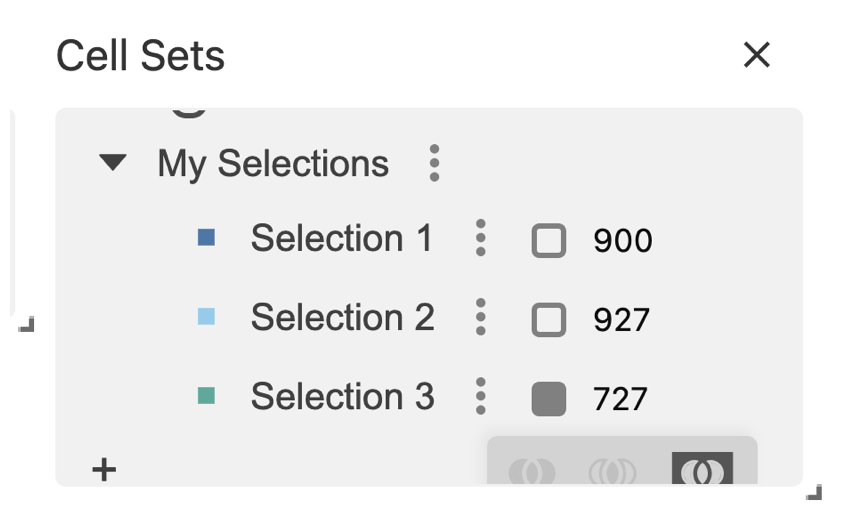
```

# Export your selected regions

When you have finished selecting the regions of interest, click on the dots menu and select the option Export hierarchy to csv.

```{r, echo=FALSE, out.width="40%"}
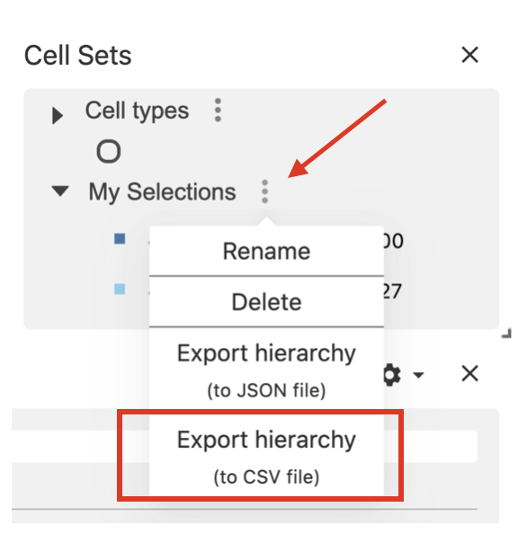
```

# Add the selected regions to the Giotto object

## Read the selections file

```{r, eval=FALSE}
my_selections <- read.csv("my_selections.csv")
colnames(my_selections)[4] <- "cell_ID"
```

```{r, echo=FALSE, out.width="70%"}
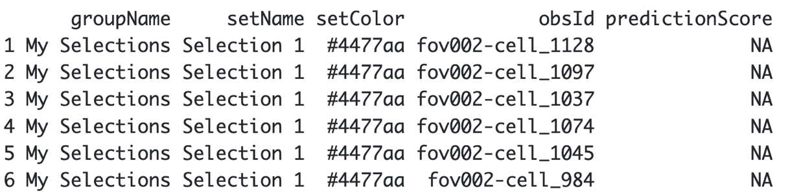
```

Use the cell_IDs to add their corresponding spatial coordinates.

```{r, eval=FALSE}
spatial_locs <- getSpatialLocations(giotto_object,
                                    output = "data.table")

my_selections <- merge(my_selections, spatial_locs)
my_selections <- my_selections[order(my_selections$setName),]
```

## Create a Giotto polygon object

We must transform the data.frame with coordinates into a Giotto polygon object.

```{r, eval=FALSE}
my_giotto_polygons <- createGiottoPolygonsFromDfr(my_selections[, c("sdimx", "sdimy", "setName")], 
                                                  name = "selections",
                                                  calc_centroids = TRUE)

giotto_object <- addGiottoPolygons(gobject = giotto_object,
                                   gpolygons = list(my_giotto_polygons))
```

## Add the cells within the polygons to the Giotto object

```{r, eval=FALSE}
giotto_object <- addPolygonCells(giotto_object,
                                 polygon_name = "selections")
```

Let's see how it looks like now the cell_metadata

```{r, eval=FALSE}
pDataDT(giotto_object)
```

```{r, echo=FALSE, out.width="60%"}
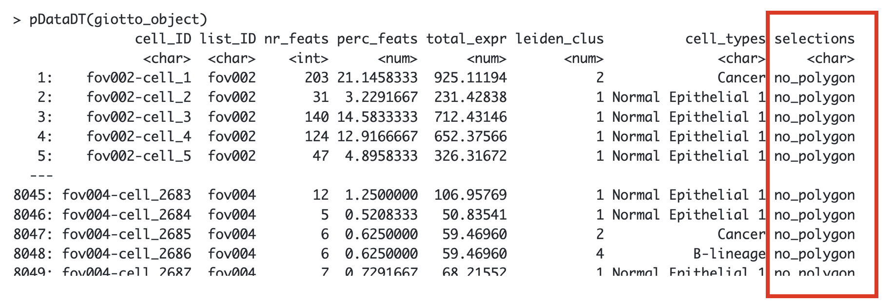
```

# Downstream analysis

## Extract the cells within each selected region

By default, the function will retrieve the cells located within all the selected regions. You can use the argument `polygons` to specify what Selection you want to get, e.g "Selection 1".

```{r, eval=FALSE}
getCellsFromPolygon(giotto_object,
                    polygon_name = "selections")
```

```{r, echo=FALSE, out.width="50%"}
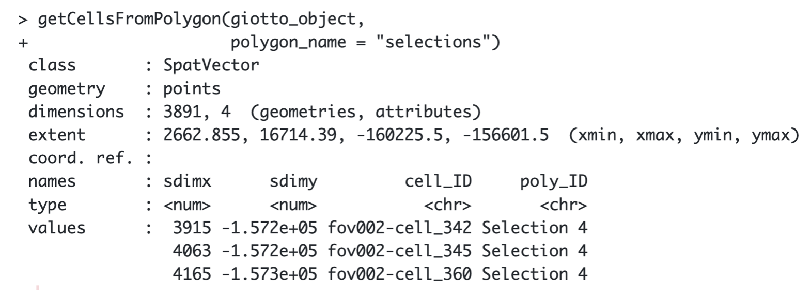
```

## Compare the cell types between regions

```{r, eval=FALSE}
compareCellAbundance(giotto_object, 
                     cell_type_column = "cell_types")
```

```{r, echo=FALSE, out.width="100%"}
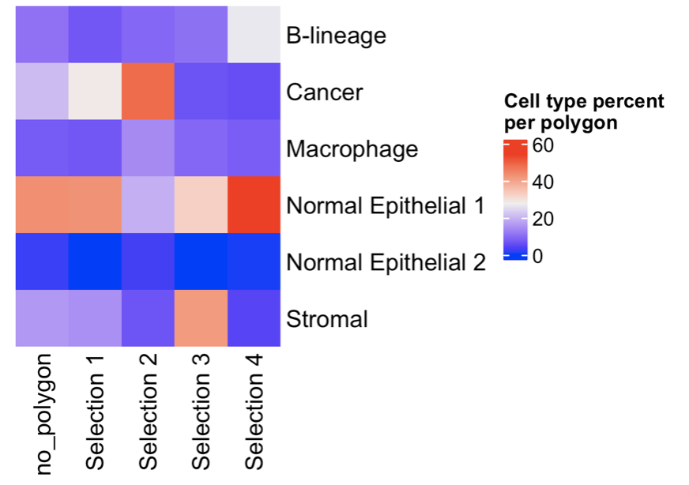
```

## Compare the gene expression between regions

You can provide a list of genes
 
```{r, eval=FALSE}
comparePolygonExpression(giotto_object,
                         selected_feats = c("KRT19", "SERPINA1", "TYK2"))
```

```{r, echo=FALSE, out.width="100%"}
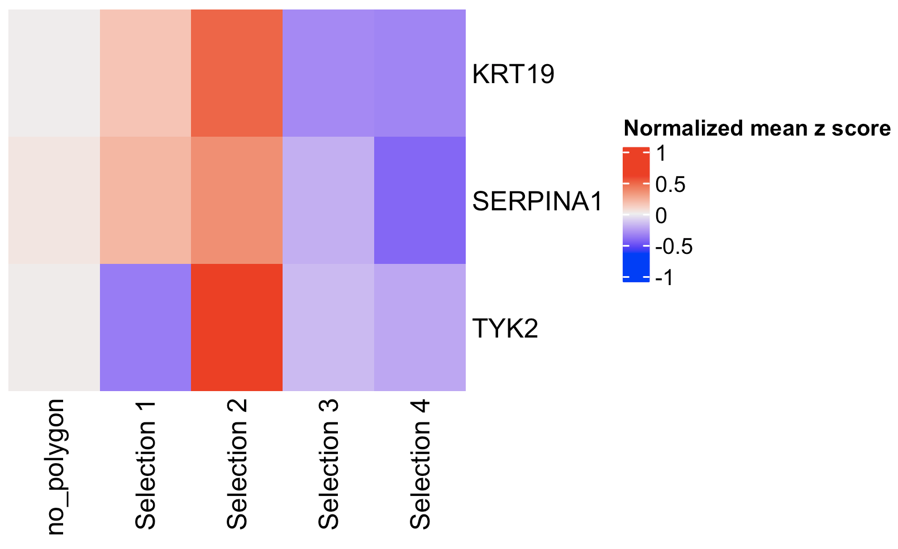
```

Or you can calculate the top expressed genes per region and then plot them.

```{r, eval=FALSE}
markers_scran <- findMarkers_one_vs_all(gobject = giotto_object,
                                        method = "scran",
                                        expression_values = "normalized",
                                        cluster_column = "selections")

topgenes_scran <- markers_scran[, head(.SD, 2), by = "cluster"]$feats

comparePolygonExpression(giotto_object,
                         selected_feats = topgenes_scran)
```

```{r, echo=FALSE, out.width="100%"}
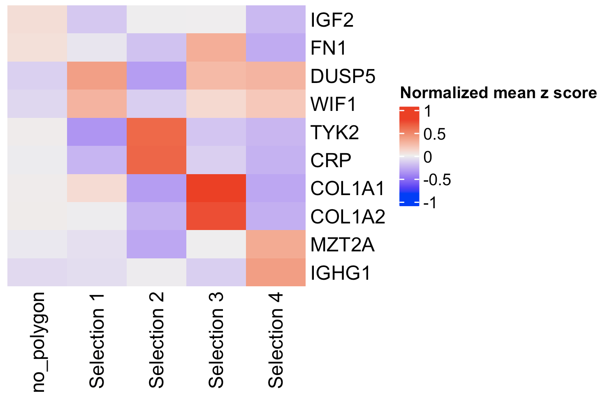
```

## Plot again the selected regions

Use the 'selections' column in the metadata table to color the cells with their corresponding Selection ID.

```{r, eval=FALSE}
spatPlot2D(giotto_object,
           cell_color = "selections",
           point_size = 1)
```

```{r, echo=FALSE, out.width="100%"}
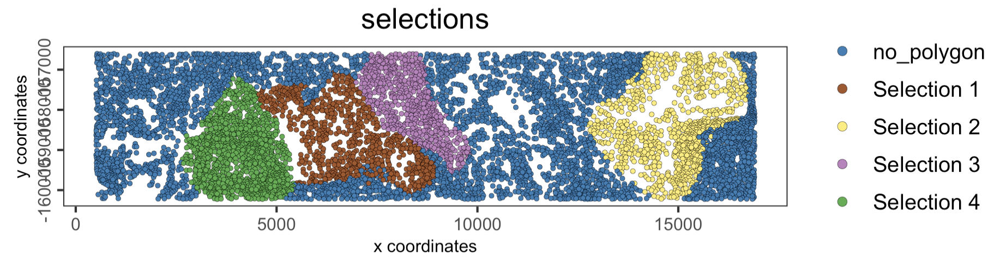
```

# Session info

```{r, eval=FALSE}
sessionInfo()
```

```{r, eval=FALSE}
R version 4.4.1 (2024-06-14)
Platform: x86_64-apple-darwin20
Running under: macOS 15.0

Matrix products: default
BLAS:   /System/Library/Frameworks/Accelerate.framework/Versions/A/Frameworks/vecLib.framework/Versions/A/libBLAS.dylib 
LAPACK: /Library/Frameworks/R.framework/Versions/4.4-x86_64/Resources/lib/libRlapack.dylib;  LAPACK version 3.12.0

locale:
[1] en_US.UTF-8/en_US.UTF-8/en_US.UTF-8/C/en_US.UTF-8/en_US.UTF-8

time zone: America/New_York
tzcode source: internal

attached base packages:
[1] stats     graphics  grDevices utils     datasets  methods   base     

other attached packages:
[1] vitessceR_0.99.0  Giotto_4.1.3      GiottoClass_0.4.0

loaded via a namespace (and not attached):
  [1] RColorBrewer_1.1-3          rstudioapi_0.16.0          
  [3] jsonlite_1.8.8              shape_1.4.6.1              
  [5] magrittr_2.0.3              magick_2.8.4               
  [7] farver_2.1.2                GlobalOptions_0.1.2        
  [9] zlibbioc_1.50.0             ragg_1.3.2                 
 [11] vctrs_0.6.5                 DelayedMatrixStats_1.26.0  
 [13] Cairo_1.6-2                 GiottoUtils_0.1.12         
 [15] terra_1.7-78                htmltools_0.5.8.1          
 [17] S4Arrays_1.4.1              BiocNeighbors_1.22.0       
 [19] SparseArray_1.4.8           parallelly_1.38.0          
 [21] htmlwidgets_1.6.4           basilisk_1.16.0            
 [23] desc_1.4.3                  plotly_4.10.4              
 [25] igraph_2.0.3                lifecycle_1.0.4            
 [27] iterators_1.0.14            pkgconfig_2.0.3            
 [29] rsvd_1.0.5                  Matrix_1.7-0               
 [31] R6_2.5.1                    fastmap_1.2.0              
 [33] GenomeInfoDbData_1.2.12     MatrixGenerics_1.16.0      
 [35] future_1.34.0               clue_0.3-65                
 [37] digest_0.6.37               colorspace_2.1-1           
 [39] S4Vectors_0.42.1            rprojroot_2.0.4            
 [41] dqrng_0.4.1                 irlba_2.3.5.1              
 [43] textshaping_0.4.0           GenomicRanges_1.56.1       
 [45] beachmat_2.20.0             filelock_1.0.3             
 [47] labeling_0.4.3              progressr_0.14.0           
 [49] fansi_1.0.6                 httr_1.4.7                 
 [51] abind_1.4-5                 compiler_4.4.1             
 [53] here_1.0.1                  withr_3.0.1                
 [55] doParallel_1.0.17           backports_1.5.0            
 [57] BiocParallel_1.38.0         webutils_1.2.1             
 [59] R.utils_2.12.3              DelayedArray_0.30.1        
 [61] bluster_1.14.0              rjson_0.2.22               
 [63] gtools_3.9.5                GiottoVisuals_0.2.5        
 [65] tools_4.4.1                 httpuv_1.6.15              
 [67] R.oo_1.26.0                 glue_1.7.0                 
 [69] dbscan_1.2-0                promises_1.3.0             
 [71] grid_4.4.1                  checkmate_2.3.2            
 [73] Rtsne_0.17                  cluster_2.1.6              
 [75] generics_0.1.3              plumber_1.2.2              
 [77] gtable_0.3.5                R.methodsS3_1.8.2          
 [79] tidyr_1.3.1                 data.table_1.16.0          
 [81] metapod_1.12.0              ScaledMatrix_1.12.0        
 [83] BiocSingular_1.20.0         sp_2.1-4                   
 [85] utf8_1.2.4                  XVector_0.44.0             
 [87] BiocGenerics_0.50.0         RcppAnnoy_0.0.22           
 [89] ggrepel_0.9.6               foreach_1.5.2              
 [91] pillar_1.9.0                limma_3.60.4               
 [93] later_1.3.2                 circlize_0.4.16            
 [95] dplyr_1.1.4                 lattice_0.22-6             
 [97] swagger_5.17.14.1           deldir_2.0-4               
 [99] tidyselect_1.2.1            locfit_1.5-9.10            
[101] ComplexHeatmap_2.20.0       SingleCellExperiment_1.26.0
[103] scuttle_1.14.0              IRanges_2.38.1             
[105] edgeR_4.2.1                 SummarizedExperiment_1.34.0
[107] scattermore_1.2             stats4_4.4.1               
[109] Biobase_2.64.0              statmod_1.5.0              
[111] matrixStats_1.4.1           stringi_1.8.4              
[113] UCSC.utils_1.0.0            lazyeval_0.2.2             
[115] yaml_2.3.10                 codetools_0.2-20           
[117] GiottoData_0.2.13           tibble_3.2.1               
[119] colorRamp2_0.1.0            cli_3.6.3                  
[121] reticulate_1.39.0           systemfonts_1.1.0          
[123] munsell_0.5.1               Rcpp_1.0.13                
[125] GenomeInfoDb_1.40.1         globals_0.16.3             
[127] dir.expiry_1.12.0           png_0.1-8                  
[129] parallel_4.4.1              ggplot2_3.5.1              
[131] basilisk.utils_1.16.0       scran_1.32.0               
[133] sparseMatrixStats_1.16.0    listenv_0.9.1              
[135] SpatialExperiment_1.14.0    viridisLite_0.4.2          
[137] scales_1.3.0                purrr_1.0.2                
[139] crayon_1.5.3                GetoptLong_1.0.5           
[141] rlang_1.1.4                 cowplot_1.1.3
```

