# Dataset explanation

This example uses subcellular data from Nanostring"s CosMx Spatial Molecular Imager. This publicly available [dataset](https://nanostring.com/resources/smi-ffpe-dataset-lung12-data/) is from an FFPE sample of non-small-cell lung cancer (NSCLC). This example works with Lung12.


```{r, eval=FALSE}
# Ensure Giotto Suite is installed.
if(!"Giotto" %in% installed.packages()) {
  pak::pkg_install("drieslab/Giotto")
}

# Ensure the Python environment for Giotto has been installed.
genv_exists <- Giotto::checkGiottoEnvironment()
if(!genv_exists){
  # The following command need only be run once to install the Giotto environment.
  Giotto::installGiottoEnvironment()
}
```


# Setup

```{r, eval=FALSE}
library(Giotto)

# Custom color palettes from rcartocolor
pal10 <- c("#66C5CC","#F6CF71","#F89C74","#DCB0F2","#87C55F",
           "#9EB9F3","#FE88B1","#C9DB74","#8BE0A4","#B3B3B3")

viv10 <- c("#E58606","#5D69B1","#52BCA3","#99C945","#CC61B0",
           "#24796C","#DAA51B","#2F8AC4","#764E9F","#A5AA99")

# set working directory
results_folder <- "/path/to/results/"

# Optional: Specify a path to a Python executable within a conda or miniconda
# environment. If set to NULL (default), the Python executable within the previously
# installed Giotto environment will be used.
python_path <- NULL # alternatively, "/local/python/path/python" if desired.

## Set object behavior
# by directly saving plots, but not rendering them you will save a lot of time
instructions <- createGiottoInstructions(save_dir = results_folder,
                                         save_plot = TRUE,
                                         show_plot = FALSE,
                                         return_plot = FALSE,
                                         python_path = python_path)
```


# Create the Giotto object using the convenience function

Convenience function for loading in the CosMx data. It loads subcellular transcript information and polygons and generates a `giotto` object with `giottoPoints` objects for both "rna" and "neg_probe" nested in the gobject `feat_info` slot, and a `giottoPolygon` object for the "cell" spatial unit in the `spatial_info` slot.

This function performs the manual object creation steps described  below. To skip those steps and preliminary data exploration, go to Section 5.

Additionally, a comparison of the count matrix produced through the convenience function "subcellular" workflow and Nanostring"s provided matrix can be found at Section 6.4.


```{r, eval=FALSE}
## provide path to nanostring folder
data_path <- "/path/to/data/"

## create giotto cosmx object
fov_join <- createGiottoCosMxObject(cosmx_dir = data_path,
                                    data_to_use = "subcellular", # only subcellular
                                    FOVs = c(2,3,4),
                                    instructions = instructions)

showGiottoFeatInfo(fov_join)
showGiottoSpatialInfo(fov_join)
```


# Manual creation of the Giotto object

## Subcellular detections (points info)

`tx_file.csv` contains the subcellular detections information. It contains information on each of the individual feature detections within the sample.

- **fov** which FOV the detection happened in
- **cell_ID** the ID of the cell the detection happened in
- **x_global_px** the global spatial x location in pixels
- **y_global_px** the global spatial y location in pixels
- **x_local_px** the spatial x location in pixels within the FOV
- **y_local_px** the spatial y location in pixels within the FOV
- **z** the z plane the detection was called in (-1 to 16)
- **target** the feature the probe is targeted against
- **CellComp** Cellular compartment the detection happened in (0, Cytoplasm, Membrane, Nuclear)


```{r, eval=FALSE}
# load transcript coordinates
tx_coord_all <- data.table::fread(file.path(data_path, "Lung12_tx_file.csv"))

colnames(tx_coord_all)

# z planes
tx_coord_all[, table(z)]

# Cell compartment
tx_coord_all[, table(CellComp)]
```

## Split detections by features vs negative probes

`tx_file.csv` contains information on both actual features (960 targeted gene probes in this dataset) and negative probes (20) that are targeted to alien sequences defined by the External RNA Controls  Consortium (ERCC) that do not exist in human tissue. These two types of detections will be treated as separate feature types (`feat_type`) and placed in separate expression matrices.


```{r, eval=FALSE}
all_IDs <- tx_coord_all[, unique(target)]

# negative probe IDs
neg_IDs <- all_IDs[grepl(pattern = "NegPrb", all_IDs)]
neg_IDs

# Feature IDs
feat_IDs <- all_IDs[!all_IDs %in% neg_IDs]
length(feat_IDs)

# split detections
feat_coords_all <- tx_coord_all[target %in% feat_IDs]
neg_coords_all <- tx_coord_all[target %in% neg_IDs]

cat("\nFeatures: ", feat_coords_all[, .N], "\n",
    "NegProbes: ", neg_coords_all[, .N])
```

### Preview negative probes (optional)

Previewing the probe information can be done by converting to `giottoPoints` and then using `plot()`. Here we show a preview of the negative probes.

**Note:** if previewing the rna expression information, it is highly recommended to set a subset of features using the `feats` param. The default is to plot all points, which can be very slow for large data.


```{r, eval=FALSE}
neg_points <- createGiottoPoints(
  x = neg_coords_all[, .(target, x_global_px, y_global_px)]
)

plot(neg_points, 
     point_size = 0.2, 
     feats = neg_IDs)
```

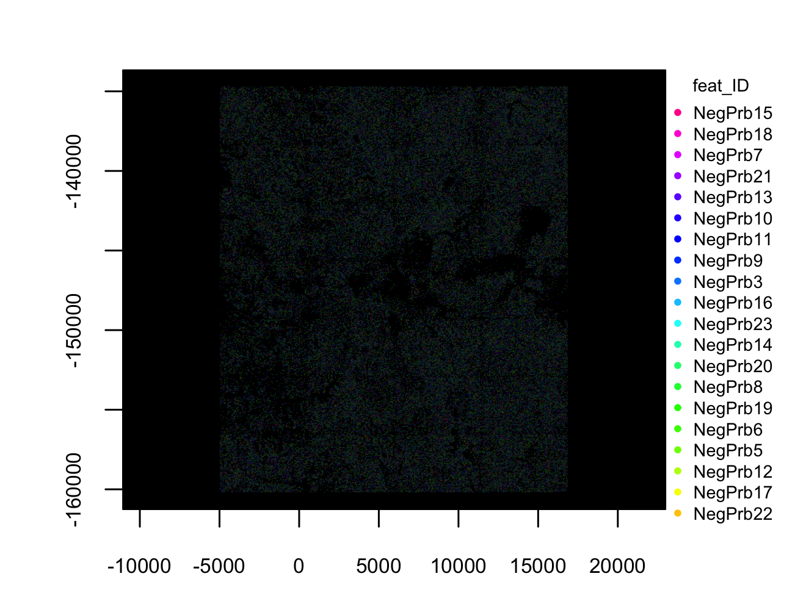

## FOV shifts

`fov_positions_file.csv` contains information on the x and y shifts needed in order to put the FOVs tiles together into a cohesive whole. This information is needed during the image attachment and alignment process.


```{r, eval=FALSE}
#  load field of vision (fov) positions
fov_offset_file <- data.table::fread(file.path(data_path, "Lung12_fov_positions_file.csv"))
```


## Choose field of view for analysis

CosMx data is large and Giotto loads in the subcellular information by FOV. This dataset includes 28 FOVs which can be difficult for most computers to handle at once.

This tutorial will use FOVs "02", "03", and "04" which correspond to the 3 FOVs visible on the bottom right in the negative probe preview above.


```{r, eval=FALSE}
gobjects_list <- list()

id_set <- c("02", "03", "04")
```

## Create a Giotto Object for each FOV

```{r, eval=FALSE}
for(fov_i in 1:length(id_set)) {

  fov_id <- id_set[fov_i]

  # 1. original composite image as png
  original_composite_image <- paste0(data_path, "CellComposite/CellComposite_F0", fov_id,".jpg")

  # 2. input cell segmentation as mask file
  segmentation_mask <- paste0(data_path, "CellLabels/CellLabels_F0", fov_id, ".tif")

  # 3. input features coordinates + offset
  feat_coord <- feat_coords_all[fov == as.numeric(fov_id)]
  neg_coord <- neg_coords_all[fov == as.numeric(fov_id)]
  feat_coord <- feat_coord[,.(x_local_px, y_local_px, z, target)]
  neg_coord <- neg_coord[,.(x_local_px, y_local_px, z, target)]
  colnames(feat_coord) <- c("x", "y", "z", "gene_id")
  colnames(neg_coord) <- c("x", "y", "z", "gene_id")
  feat_coord <- feat_coord[,.(x, y, gene_id)]
  neg_coord <- neg_coord[,.(x, y, gene_id)]


  fovsubset <- createGiottoObjectSubcellular(
    gpoints = list("rna" = feat_coord,
                   "neg_probe" = neg_coord),
    gpolygons = list("cell" = segmentation_mask),
    polygon_mask_list_params = list(
      mask_method = "guess",
      flip_vertical = TRUE,
      flip_horizontal = FALSE,
      shift_horizontal_step = FALSE
    ),
    instructions = instructions
  )


  # cell centroids are now used to provide the spatial locations
  fovsubset <- addSpatialCentroidLocations(fovsubset,
                                           poly_info = "cell")

  # create and add Giotto images
  composite <- createGiottoLargeImage(raster_object = original_composite_image,
                                      negative_y = FALSE,
                                      name = "composite")

  fovsubset <- addGiottoImage(gobject = fovsubset,
                              images = list(composite))


  fovsubset <- convertGiottoLargeImageToMG(giottoLargeImage = composite,
                                           gobject = fovsubset,
                                           return_gobject = TRUE)

  gobjects_list[[fov_i]] <- fovsubset

}
```


## Join FOV Giotto Objects


```{r, eval=FALSE}
new_names <- paste0("fov0", id_set)

id_match <- match(as.numeric(id_set), fov_offset_file$fov)
x_shifts <- fov_offset_file[id_match]$x_global_px
y_shifts <- fov_offset_file[id_match]$y_global_px

# Create Giotto object that includes all selected FOVs
fov_join <- joinGiottoObjects(gobject_list = gobjects_list,
                              gobject_names = new_names,
                              join_method = "shift",
                              x_shift = x_shifts,
                              y_shift = y_shifts)
```


# Visualize Cells and Genes of Interest 

When plotting subcellular data, Giotto uses the `spatInSituPlot` functions. Spatial plots showing the feature points and polygons are plotted using `spatInSituPlotPoints()`.


```{r, eval=FALSE}
showGiottoImageNames(fov_join)

# Set up vector of image names
id_set <- c("02", "03", "04")
new_names <- paste0("fov0", id_set)
image_names <- paste0(new_names, "-image")

spatInSituPlotPoints(fov_join,
                     show_image = TRUE,
                     image_name = image_names,
                     feats = list("rna" = c("MMP2", "VEGFA", "IGF1R",
                                            "MKI67", "EPCAM", "KRT8")),
                     feats_color_code = viv10,
                     spat_unit = "cell",
                     point_size = 0.01,
                     show_polygon = TRUE,
                     use_overlap = FALSE,
                     polygon_feat_type = "cell",
                     polygon_color = "white",
                     polygon_line_size = 0.03,
                     save_param = list(base_height = 3))
```

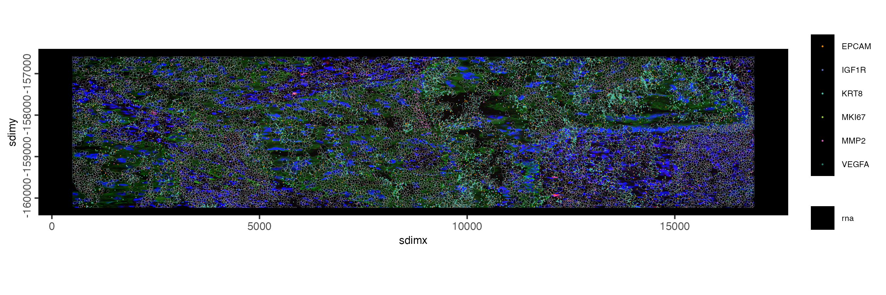

## Visualize Cell Centroids

The standard `spatPlot2D()` function can also be used, but this works off only the aggregated information that is assembled based on the subcellular information. Plotting information based on cell centroids can be done through this function.

```{r, eval=FALSE}
spatPlot2D(gobject = fov_join,
           image_name = image_names,
           show_image = TRUE,
           point_shape = "no_border",
           point_size = 0.01,
           point_alpha = 0.5,
           coord_fix_ratio = 1,
           save_param = list(base_height = 2))
```

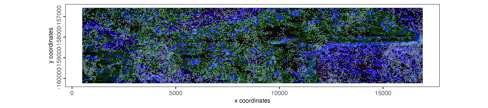

# Aggregate subcellular features

Giotto supports working directly with the subcellular features in order to generate cell by feature matrices. The data generated this way is then given the spatial unit `"cell"`. This workflow is recommended over loading the provided cell by feature (aggregated expression) matrix and then including the subcellular information as secondary data.

When both the raw subcellular information and the pre-made expression matrix are loaded in at the same time, the subcellular data and all data generated from it should be given the spatial unit `"cell"` and the pre-generated aggregated information should be given a different spatial unit such as `"cell_agg"` to differentiate between the two sources of information.

In this step, we will be aggregating the feature points of `"rna"` and `"neg_probe"` into the `"cell"` spatial unit.

```{r, eval=FALSE}
# Find the feature points overlapped by polygons. This overlap information is then
# returned to the relevant giottoPolygon object"s overlaps slot.
fov_join <- calculateOverlapRaster(fov_join, 
                                   feat_info = "rna")

fov_join <- calculateOverlapRaster(fov_join, 
                                   feat_info = "neg_probe")

# Convert the overlap information into a cell by feature expression matrix which
# is then stored in the Giotto object"s expression slot
fov_join <- overlapToMatrix(fov_join, 
                            feat_info = "rna")

fov_join <- overlapToMatrix(fov_join, 
                            feat_info = "neg_probe")

showGiottoExpression(fov_join)
```

## Plot histograms of total counts per cell

```{r, eval=FALSE}
filterDistributions(fov_join,
                    plot_type = "hist",
                    detection = "cells",
                    method = "sum",
                    feat_type = "rna",
                    nr_bins = 100,
                    save_param = list(base_height = 3))
```

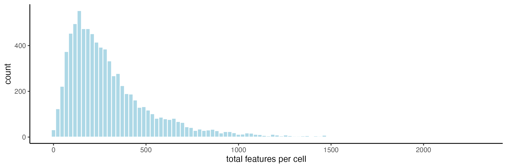

```{r, eval=FALSE}
filterDistributions(fov_join,
                    plot_type = "hist",
                    detection = "cells",
                    method = "sum",
                    feat_type = "neg_probe",
                    nr_bins = 25,
                    save_param = list(base_height = 3))
```

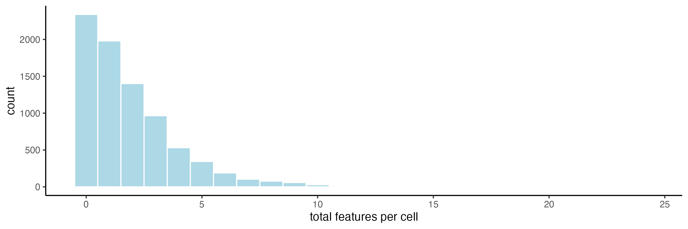

## 2D Density Plots

Density-based representations may sometimes be preferred instead of viewing the raw points information, especially when points are dense enough that there is overplotting. After overlaps information has been calculated, `spatInSituPlotDensity()` can be used in order to get a general idea of how much expression there is of a feature.

```{r, eval=FALSE}
spatInSituPlotDensity(gobject = fov_join,
                      feats = c("MMP2", "VEGFA", "IGF1R",
                                "MKI67", "EPCAM", "KRT8"),
                      cow_n_col = 2,
                      save_param = list(base_height = 4))
```

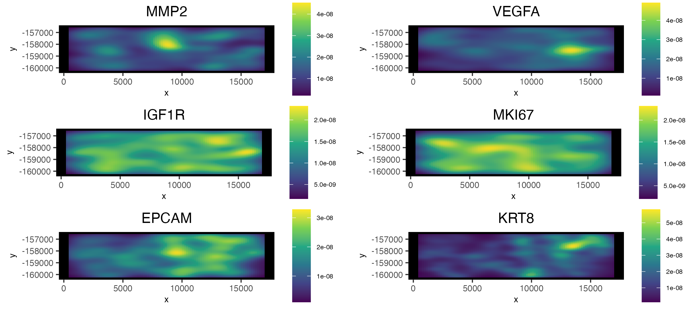

## Extract Data from Giotto Object

```{r, eval=FALSE}
# combine cell data
morphometa <- combineCellData(fov_join,
                              feat_type = "rna")

# combine feature data
featmeta <- combineFeatureData(fov_join,
                               feat_type = "rna")

# combine overlapping feature data
featoverlapmeta <- combineFeatureOverlapData(fov_join,
                                             feat_type = "rna")
```

## Comparison of Giotto aggregated and Nanostring provided matrices

Comparison of Giotto's aggregated matrix results and those provided by Nanostring. Only FOV2 will be used in this comparison. Matrices are expected to be similar when the same sets of cell polygons/masks are used for both.

```{r, eval=FALSE}
# Load and prepare data
nanoDT <- data.table::fread(paste0(data_path, "Lung12_exprMat_file.csv"))
test1 <- nanoDT[fov == 2]

# Set up cell_IDs
test1[, cell_ID := paste0("cell_", cell_ID)]
test1[, cell_ID := paste0("f", fov, "-", cell_ID)]
test1[, fov := NULL]

test1mat <- t_flex(GiottoUtils::dt_to_matrix(test1))
testnano_f2 <- test1mat

# Remove cell_0 (all tx counts that do not fall within a polygon)
testnano_f2 <- testnano_f2[, -1]

# Remove negative probe counts
testnano_f2 <- testnano_f2[!grepl("NegPrb", rownames(testnano_f2)),]

# giotto matrix
testg <- fov_join@expression$cell$rna$raw[]
testg_f2 <- testg[, grepl("fov002", colnames(testg))]
sorted_rownames <- sort(rownames(testg_f2))
testg_f2 <- testg_f2[sorted_rownames, ]

# Prepare matrix comparison
# Summarise sparse matrices (i and j are matrix indices, x is value)
testg_f2_DT <- data.table::as.data.table(Matrix::summary(testg_f2))
testg_f2_DT[, method := "giotto"]
testnano_f2_DT <- data.table::as.data.table(Matrix::summary(testnano_f2))
testnano_f2_DT[, method := "nanostring"]
testDT <- data.table::rbindlist(list(testg_f2_DT, testnano_f2_DT))

# Combine sparse matrix indices
testDT[, combo := paste0(i,"-",j)]
```


```{r, eval=FALSE}
# Plot results
library(ggplot2)

# matrix index similarity
pl_n <- ggplot()
pl_n <- pl_n + geom_tile(data = testnano_f2_DT, aes(x = i, y = j, fill = log(x+1)))
pl_n <- pl_n + ggtitle("Nanostring Sparse Matrix")
pl_n <- pl_n + scale_fill_gradient(low = "blue", high = "red")
pl_n <- pl_n + theme(panel.grid.major = element_blank(),
                     panel.grid.minor = element_blank(),
                     panel.background = element_rect(fill = "black"))

pl_g <- ggplot()
pl_g <- pl_g + geom_tile(data = testg_f2_DT, aes(x = i, y = j, fill = log(x+1)))
pl_g <- pl_g + ggtitle("Giotto Sparse Matrix")
pl_g <- pl_g + scale_fill_gradient(low = "blue", high = "red")
pl_g <- pl_g + theme(panel.grid.major = element_blank(),
                     panel.grid.minor = element_blank(),
                     panel.background = element_rect(fill = "black"))

combplot <- cowplot::plot_grid(pl_n, pl_g,
                               nrow = 2,
                               labels = "AUTO")

ggsave(file.path(results_folder, "mat_comparison.png"), combplot)
```

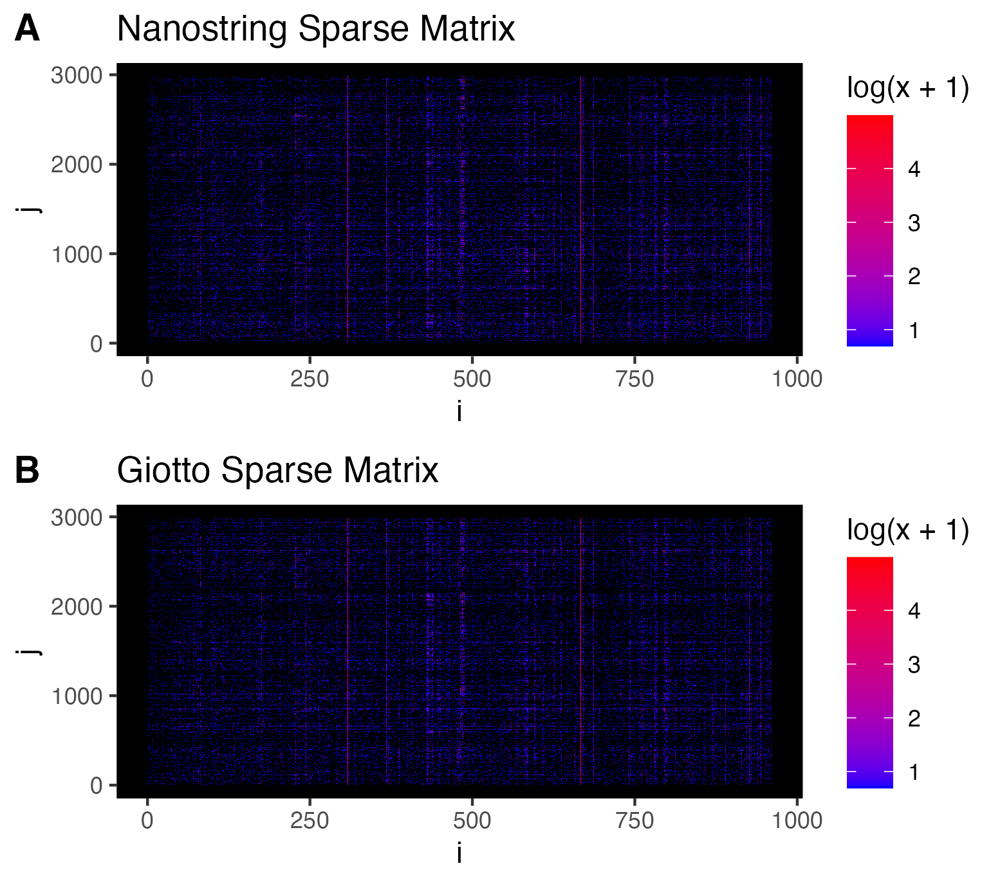

```{r, eval=FALSE}
# directly compare differences in matrix values (counts assigned)
vartestDT <- testDT[, list(var = var(x), diff = diff(x), mean = mean(x)), by = .(i,j)]

data.table::setorder(vartestDT, var)

# check arbitrary index values
testDT[i == "812" & j == "2"]
testDT[i == "667" & j == "1072"]
testDT[i == "667" & j == "2880"]

# plot difference in values
pl <- ggplot()
pl <- pl + geom_bar(data = vartestDT, aes(x = diff))
pl <- pl + theme_bw()
pl <- pl + labs(x = "difference nanostring - Giotto")

ggsave(file.path(results_folder,"values_diff.png"), pl)

testDT[order(x)]
```

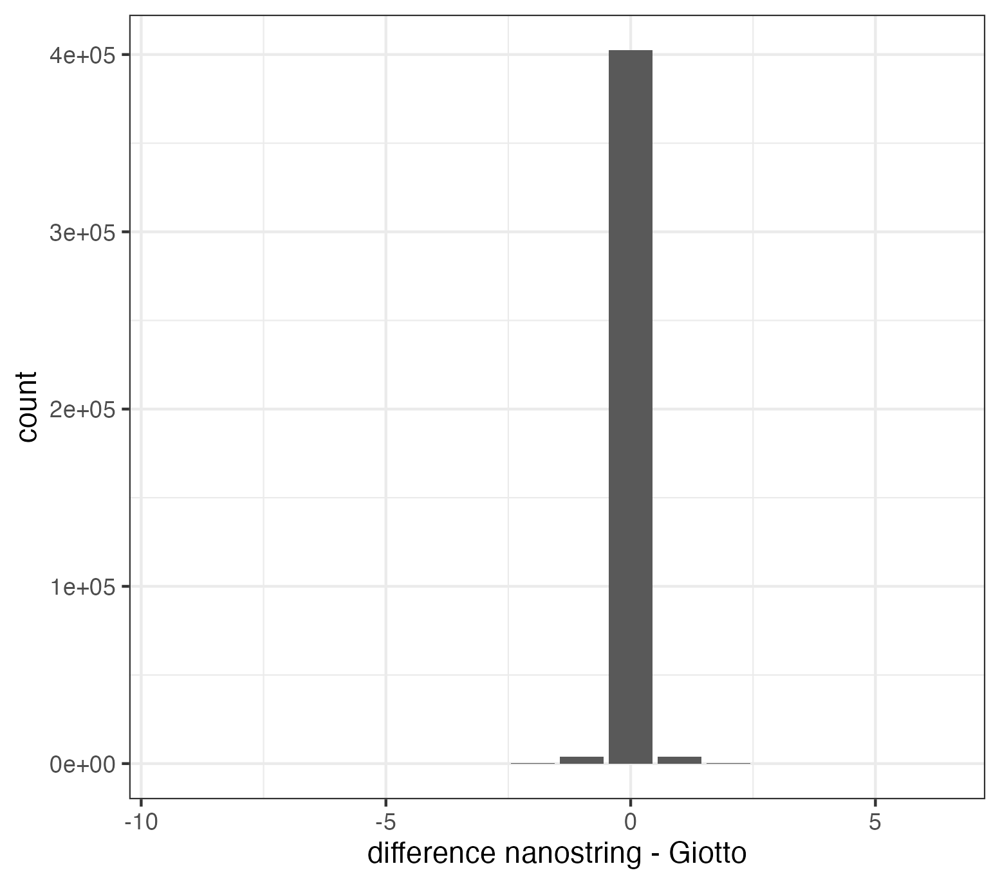

```{r, eval=FALSE}
testDT[, .N, by = "method"]

testDT[, method, by = combo][, sum(duplicated(combo))]
```

Overall, the nanostring matrix has **416099 - 415952 = 147** more non-zero values than giotto's matrix for FOV2. Within the **411053** shared entries that were called by both methods (common i and j indices), there appears to be no major bias in terms of counts/values assigned. Moreover, the vast majority of these shared entries have the same values (difference of 0).

# Filtering and normalization

After the expression matrix is generated from the subcellular information, analysis proceeds through data filtering and normalization.

For the normalization step, we will employ two types.

- **standard normalization method:** *library size normalization and log normalization.* This method will produce both normalized and scaled values that are be returned as the "normalized" and "scaled"expression matrices respectively. In this tutorial, the normalized values will be used for generating expression statistics and plotting expression values. The scaled values will be ignored. We will also generate normalized values for the negative probes for visualization purposes during which the library normalization step will be skipped.

- **pearson residuals:** *A normalization that uses the method described in* [Lause/Kobak et al, 2021](https://doi.org/10.1186/s13059-021-02451-7). This produces a set of values that are most similar in utility to a scaled matrix and offer improvements to both HVF detection and PCA generation. These values should not be used for statistics, plotting of expression values, or differential expression analysis.


```{r, eval=FALSE}
# filter (feat_type = "rna" by default)
fov_join <- filterGiotto(gobject = fov_join,
                         feat_type = "rna",
                         expression_threshold = 1,
                         feat_det_in_min_cells = 5,
                         min_det_feats_per_cell = 5)

# normalize
# standard method of normalization (log normalization based)
fov_join <- normalizeGiotto(gobject = fov_join,
                            feat_type = "rna",
                            norm_methods = "standard",
                            verbose = TRUE)

fov_join <- normalizeGiotto(gobject = fov_join,
                            feat_type = "neg_probe",
                            norm_methods = "standard",
                            library_size_norm = FALSE,
                            verbose = TRUE)

# new normalization method based on pearson correlations (Lause/Kobak et al. 2021)
# this normalized matrix is given the name "pearson" using the update_slot param
fov_join <- normalizeGiotto(gobject = fov_join,
                            feat_type = "rna",
                            scalefactor = 5000,
                            verbose = TRUE,
                            norm_methods = "pearson_resid",
                            update_slot = "pearson")

showGiottoExpression(fov_join)
```

```{r, eval=FALSE}
# add statistics based on log normalized values for features rna and negative probes
fov_join <- addStatistics(gobject = fov_join,
                          expression_values = "normalized",
                          feat_type = "rna")

fov_join <- addStatistics(gobject = fov_join,
                          expression_values = "normalized",
                          feat_type = "neg_probe")

# View cellular data (default is feat = "rna")
showGiottoCellMetadata(fov_join)

# View feature data
showGiottoFeatMetadata(fov_join)
```

**Note:** The show functions for metadata do not return the information. To retrieve the metadata information, instead use `pDataDT()` and `fDataDT()` along with the `feat_type` param for either "rna" or "neg_probe".

# View Transcript Total Expression Distribution

## Histogram of log normalized data

```{r, eval=FALSE}
filterDistributions(fov_join,
                    detection = "cells",
                    feat_type = "rna",
                    expression_values = "normalized",
                    method = "sum",
                    nr_bins = 100,
                    save_param = list(base_height = 3))
```

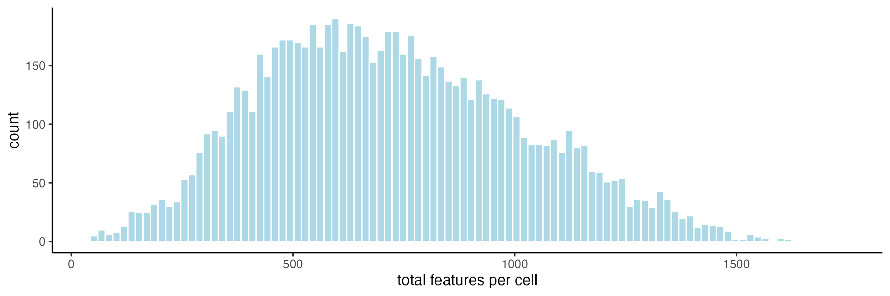

```{r, eval=FALSE}
filterDistributions(fov_join,
                    detection = "cell",
                    feat_type = "neg_probe",
                    expression_values = "normalized",
                    method = "sum",
                    nr_bins = 20,
                    save_param = list(base_height = 3))
```

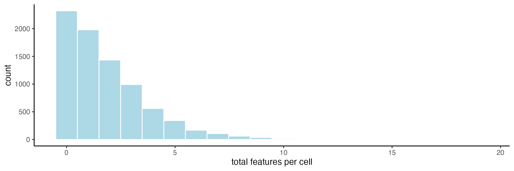

## Plot spatially as centroids

```{r, eval=FALSE}
spatPlot2D(gobject = fov_join,
           cell_color = "total_expr",
           color_as_factor = FALSE,
           show_image = TRUE,
           image_name = image_names,
           point_size = 0.9,
           point_alpha = 0.75,
           save_param = list(base_height = 2))
```

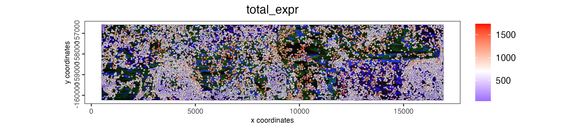

## Plot spatially as color-scaled polygons

```{r, eval=FALSE}
spatInSituPlotPoints(fov_join,
                     show_polygon = TRUE,
                     polygon_color = "gray",
                     polygon_line_size = 0.05,
                     polygon_fill = "total_expr",
                     polygon_fill_as_factor = FALSE,
                     save_param = list(base_height = 2))
```

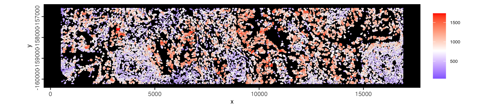

```{r, eval=FALSE}
spatInSituPlotPoints(fov_join,
                     feat_type = "neg_probe",
                     show_polygon = TRUE,
                     polygon_color = "gray",
                     polygon_line_size = 0.05,
                     polygon_fill = "total_expr",
                     polygon_fill_as_factor = FALSE,
                     save_param = list(base_height = 2))
```

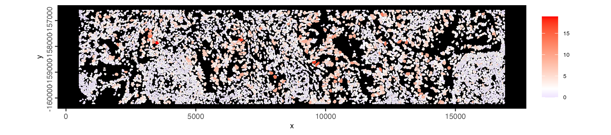

# Dimension Reduction

## Detect highly variable genes and generate PCA

Detect highly variable genes using the pearson residuals method based on the "pearson" expression matrix. These results will be returned as a new "hvf" column in the "rna" feature metadata.

PCA generation will also be based on the "pearson" matrix. Scaling and centering of the PCA which is usually done by default will be skipped since the pearson matrix is already scaled.

```{r, eval=FALSE}
fov_join <- calculateHVF(fov_join,
                         method = "var_p_resid",
                         expression_values = "pearson",
                         save_plot = TRUE)
# If you get an Error related to future.apply, please modify the maximum size 
# of global variables by running: options(future.globals.maxSize = 1e10)

# print HVFs
gene_metadata <- fDataDT(fov_join)
gene_metadata[hvf == "yes", feat_ID]
```

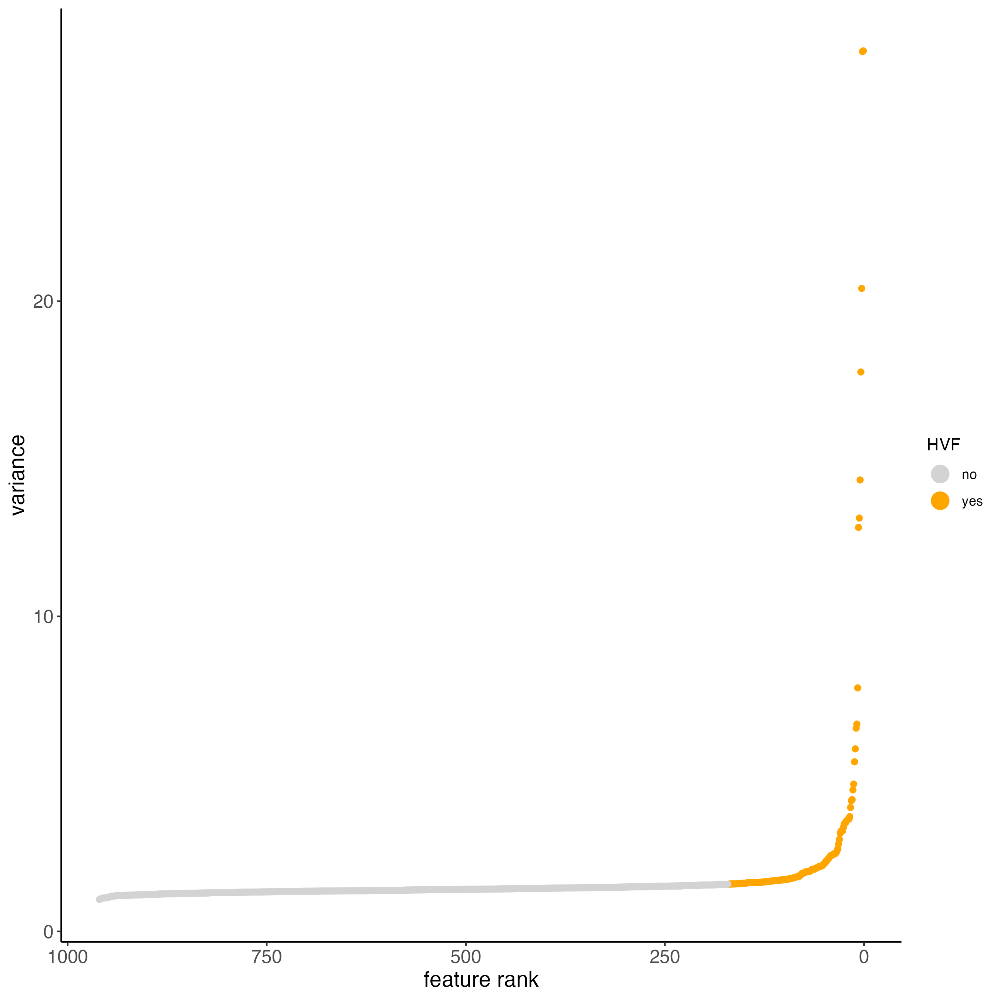

```{r, eval=FALSE}
fov_join <- runPCA(fov_join,
                   scale_unit = FALSE,
                   center = FALSE,
                   expression_values = "pearson")

# screeplot uses the generated PCA. No need to specify expr values
screePlot(fov_join, 
          ncp = 20)
```

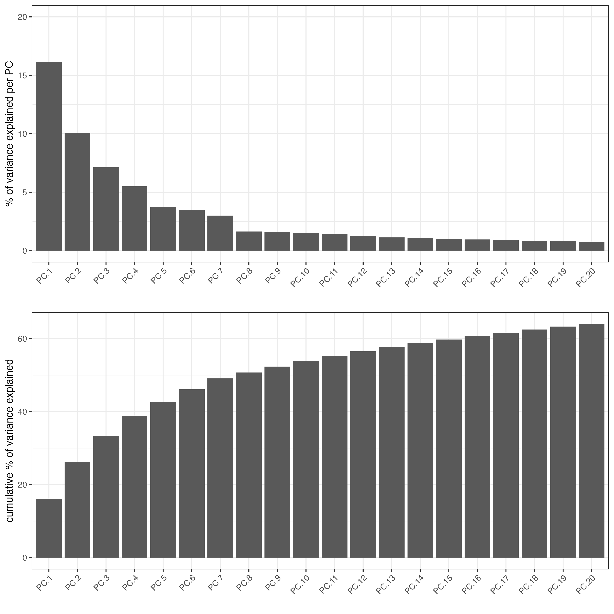

```{r, eval=FALSE}
plotPCA(fov_join,
        cell_color = "nr_feats", # (from log norm statistics)
        color_as_factor = FALSE,
        point_size = 0.1,
        point_shape = "no_border")
```

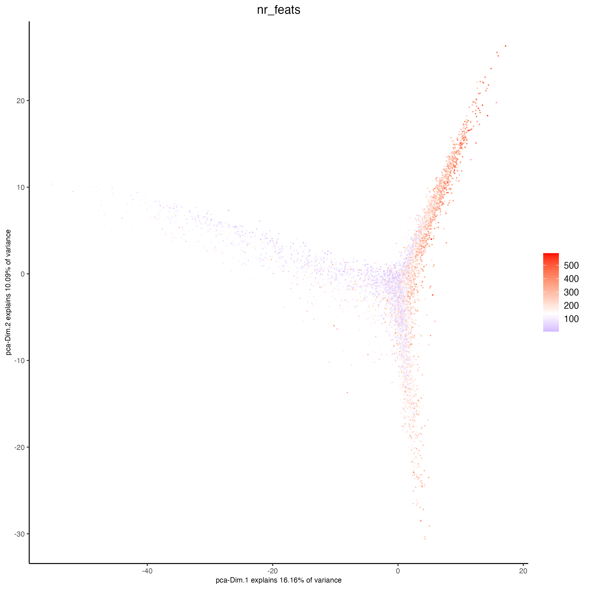

## Run UMAP

```{r, eval=FALSE}
# Generate UMAP from PCA
fov_join <- runUMAP(fov_join,
                    dimensions_to_use = 1:10,
                    n_threads = 4)

plotUMAP(gobject = fov_join)
```

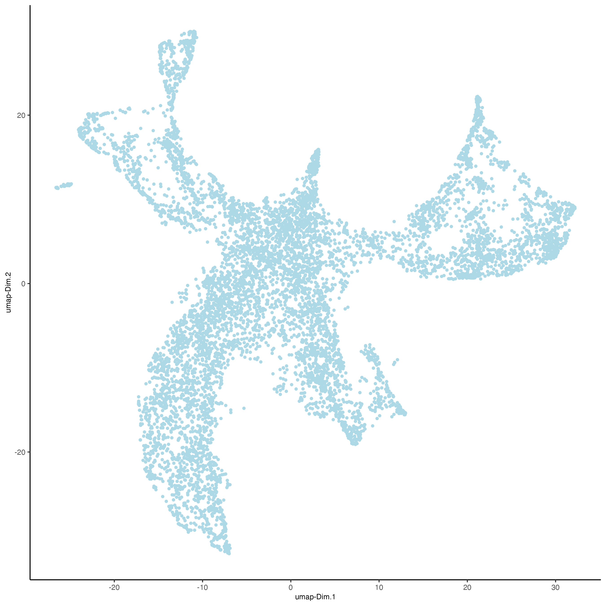

## Plot features on expression space

```{r, eval=FALSE}
dimFeatPlot2D(gobject = fov_join,
              feat_type = "rna",
              feats = c("MKI67", "CD8A", "CD4",
                        "COL1A1", "MS4A1", "MZB1"),
              expression_values = "normalized",
              point_shape = "no_border",
              point_size = 0.01,
              cow_n_col = 3,
              save_param = list(base_height = 5))
```

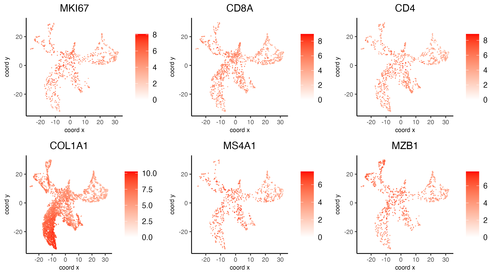

# Cluster

## Visualize clustering

```{r, eval=FALSE}
fov_join <- createNearestNetwork(gobject = fov_join,
                                 dimensions_to_use = 1:10,
                                 k = 10)

fov_join <- doLeidenCluster(gobject = fov_join,
                            resolution = 0.07,
                            n_iterations = 1000)

# visualize UMAP cluster results
plotUMAP(gobject = fov_join,
         cell_color = "leiden_clus",
         cell_color_code = pal10,
         show_NN_network = TRUE,
         point_size = 2)
```

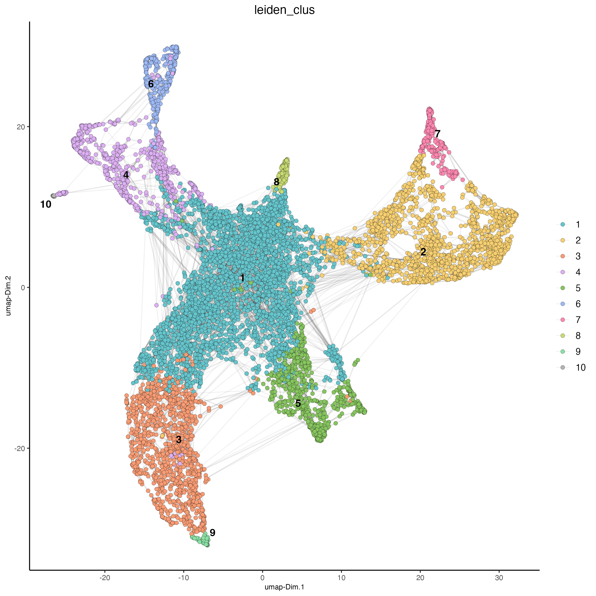

## Visualize clustering on expression and spatial space

```{r, eval=FALSE}
# visualize UMAP and spatial results
spatDimPlot2D(gobject = fov_join,
              show_image = TRUE,
              image_name = image_names,
              cell_color = "leiden_clus",
              cell_color_code = pal10,
              spat_point_size = 1)
```

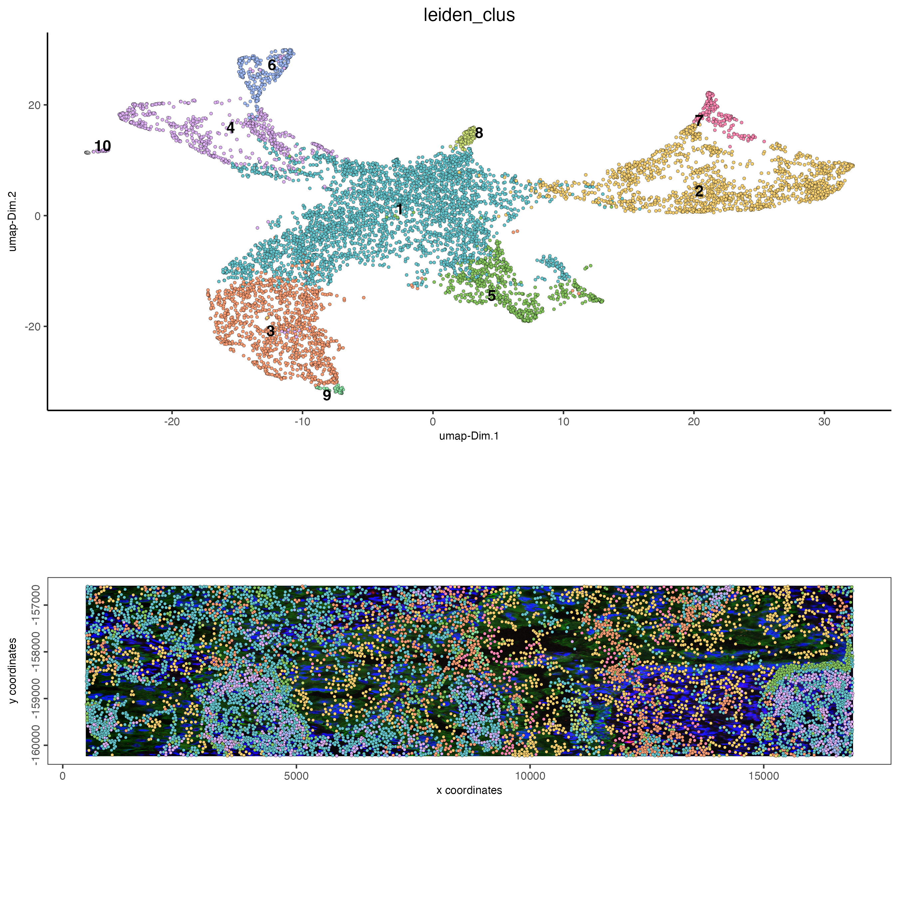

## Map clustering spatially

```{r, eval=FALSE}
spatInSituPlotPoints(fov_join,
                     feats = list("rna" = c("MMP2", "VEGFA", "IGF1R",
                                            "MKI67", "EPCAM", "MZB1")),
                     point_size = 0.15,
                     feats_color_code = viv10,
                     show_polygon = TRUE,
                     polygon_color = "white",
                     polygon_line_size = 0.01,
                     polygon_fill = "leiden_clus",
                     polygon_fill_as_factor = TRUE,
                     polygon_fill_code = pal10,
                     save_param = list(base_height = 5))
```

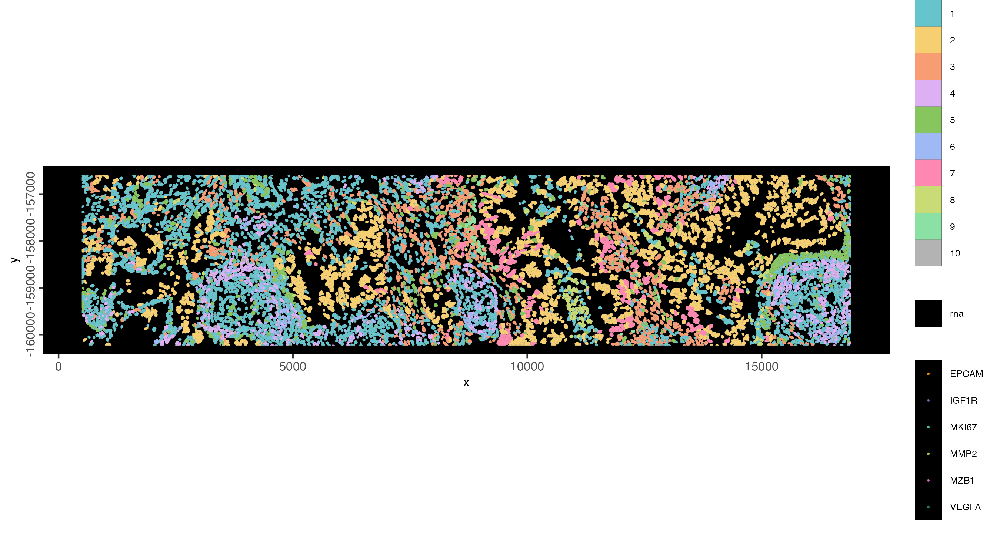

# Small Subset Visualization

```{r, eval=FALSE}
#subset a Giotto object based on spatial locations
smallfov <- subsetGiottoLocs(fov_join,
                             x_max = 3000,
                             x_min = 1000,
                             y_max = -157800,
                             y_min = -159800)

#extract all genes observed in new object
smallfeats <- fDataDT(smallfov)[, feat_ID]

#plot all genes
spatInSituPlotPoints(smallfov,
                     feats = list(smallfeats),
                     point_size = 0.15,
                     polygon_line_size = 0.1,
                     show_polygon = TRUE,
                     polygon_color = "white",
                     show_image = TRUE,
                     image_name = "fov002-composite",
                     show_legend = FALSE)
```


```{r, eval=FALSE}
# plot only the polygon outlines
spatInSituPlotPoints(smallfov,
                     polygon_line_size = 0.1,
                     polygon_alpha = 0,
                     polygon_color = "white",
                     show_polygon = TRUE,
                     show_image = TRUE,
                     image_name = "fov002-composite",
                     show_legend = FALSE)
```

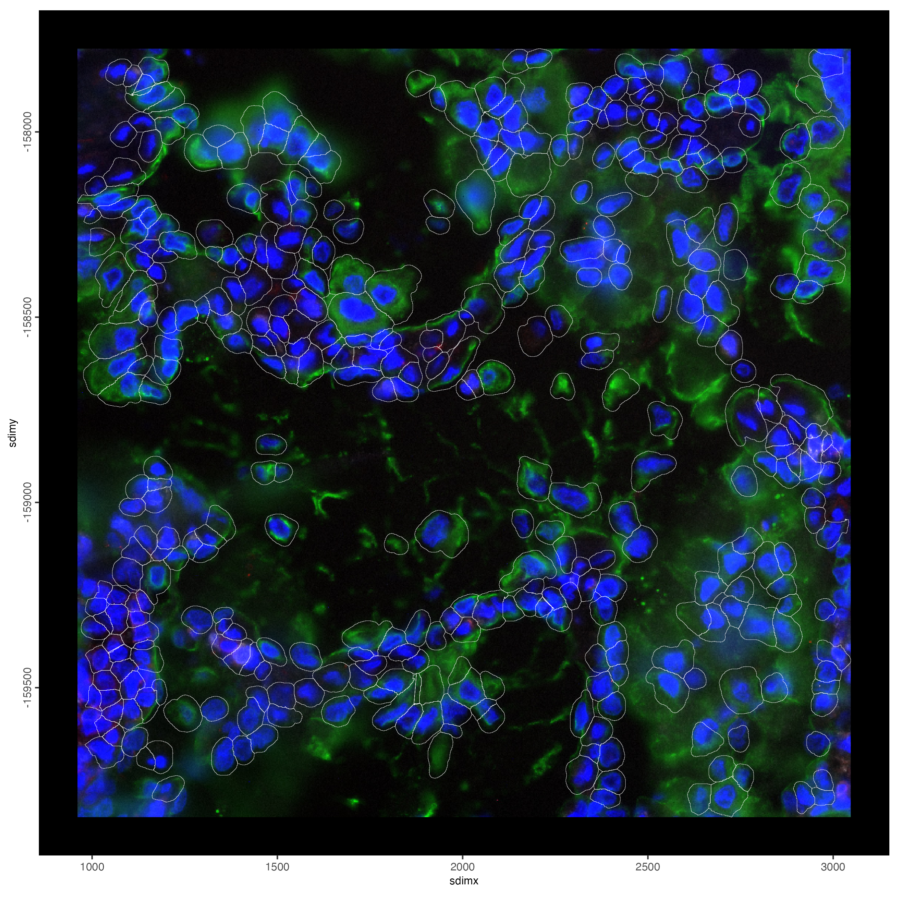

```{r, eval=FALSE}
# plot polygons colorlabeled with leiden clusters
spatInSituPlotPoints(smallfov,
                     polygon_line_size = 0.1,
                     show_polygon = TRUE,
                     polygon_fill = "leiden_clus",
                     polygon_fill_as_factor = TRUE,
                     polygon_fill_code = pal10,
                     show_image = TRUE,
                     image_name = "fov002-composite",
                     show_legend = FALSE)
```

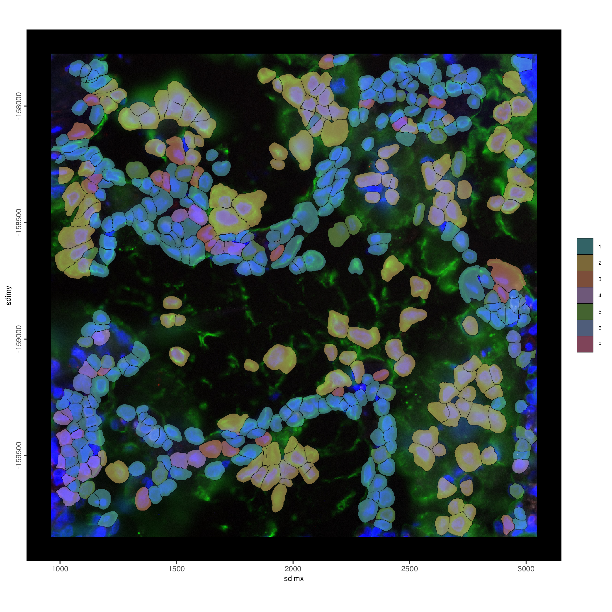

# Spatial Expression Patterns

Find spatially organized gene expression by examining the binarized expression of cells and their spatial neighbors.

```{r, eval=FALSE}
# create spatial network based on physical distance of cell centroids
fov_join <- createSpatialNetwork(gobject = fov_join,
                                 minimum_k = 2,
                                 maximum_distance_delaunay = 50)

# perform Binary Spatial Extraction of genes - NOTE: Depending on your system this could take time
km_spatialfeats <- binSpect(fov_join)

# visualize spatial expression of selected genes obtained from binSpect
spatFeatPlot2D(fov_join,
               expression_values = "normalized",
               feats = km_spatialfeats$feats[1:10],
               point_shape = "no_border",
               point_border_stroke = 0.01,
               point_size = 0.01,
               cow_n_col = 2)
```

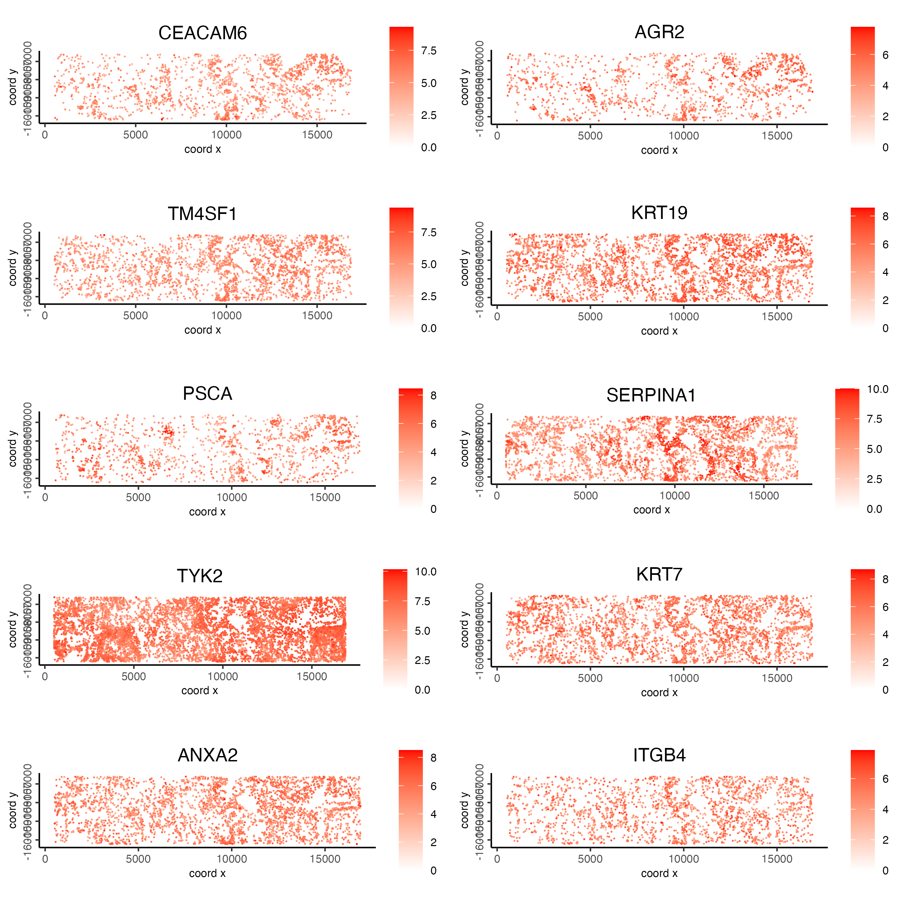

# Identify cluster differential expression genes

## Violin plot

```{r, eval=FALSE}
# Gini
markers_gini <- findMarkers_one_vs_all(gobject = fov_join,
                                       method = "gini",
                                       expression_values = "normalized",
                                       cluster_column = "leiden_clus",
                                       min_feats = 1,
                                       rank_score = 2)

# First 5 results by cluster
markers_gini[, head(.SD, 5), by = "cluster"]

# violinplot
topgenes_gini <- unique(markers_gini[, head(.SD, 2), by = "cluster"]$feats)

violinPlot(fov_join,
           feats = topgenes_gini,
           cluster_column = "leiden_clus",
           strip_position = "right")
```

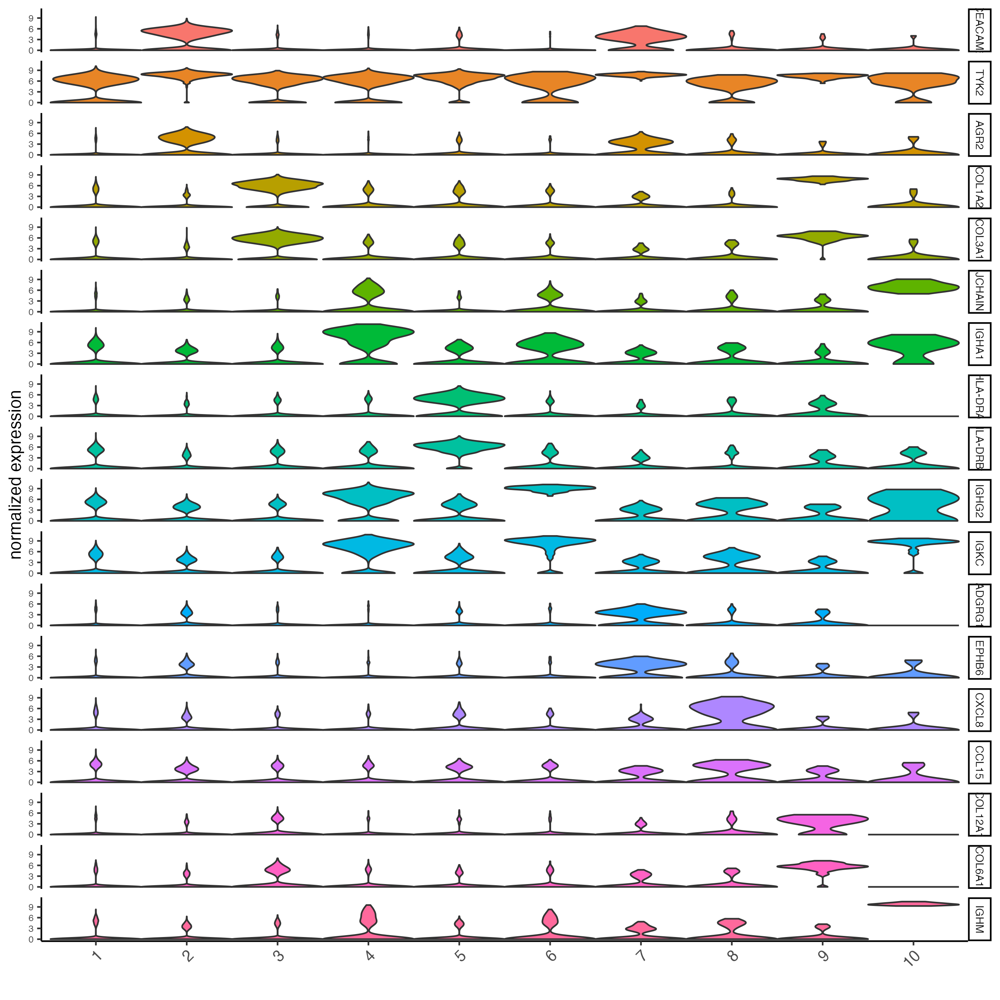

## Heatmap

```{r, eval=FALSE}
cluster_order <- 1:10

plotMetaDataHeatmap(fov_join,
                    expression_values = "normalized",
                    metadata_cols = "leiden_clus",
                    selected_feats = topgenes_gini,
                    custom_cluster_order = cluster_order,
                    save_param = list(base_height = 5))
```

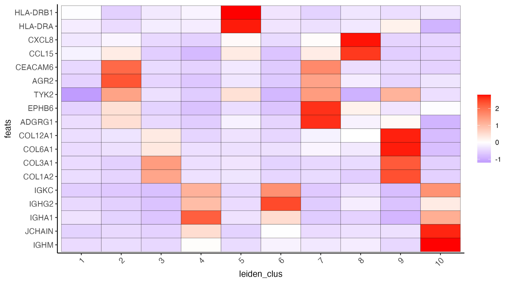

## Plot gini genes on UMAP

```{r, eval=FALSE}
# low, mid, high
custom_scale = c("#440154", "#1F968B", "#FDE725")

dimFeatPlot2D(fov_join,
              expression_values = "normalized",
              cell_color_gradient = custom_scale,
              gradient_midpoint = 5,
              feats = topgenes_gini,
              point_shape = "no_border",
              point_size = 0.001,
              cow_n_col = 4,
              save_param = list(base_height = 8))
```

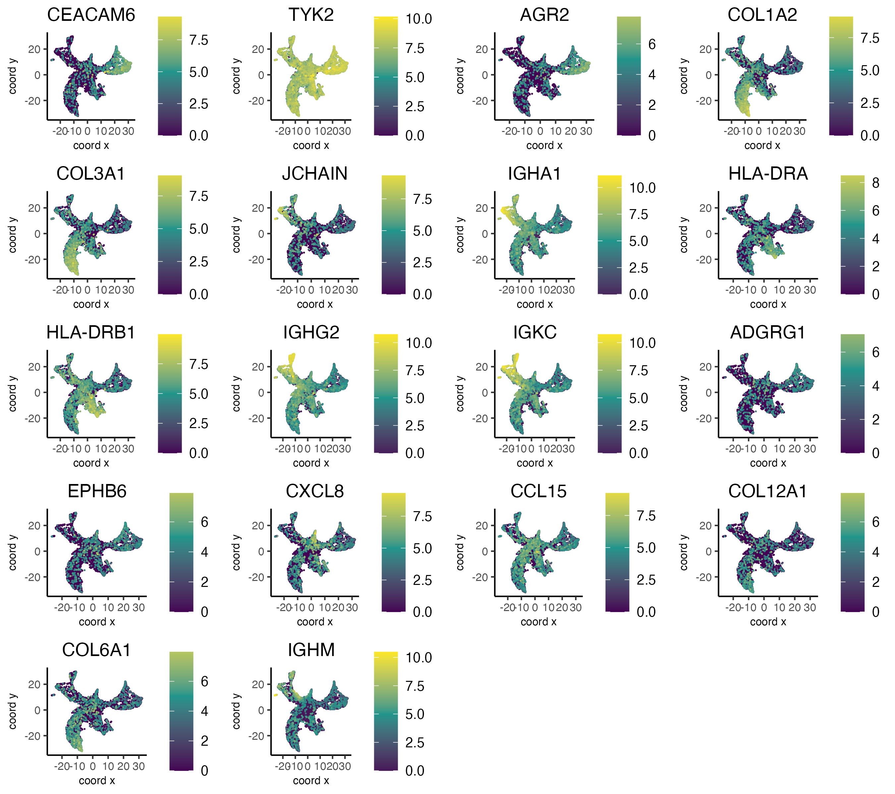

## Cell Type Annotation

```{r, eval=FALSE}
## add cell types ###
clusters_cell_types <- c("Normal Epithelial 1", "Cancer", "Stromal", "B-lineage",
                         "Macrophage", "B-lineage", "Cancer",
                         "Normal Epithelial 2", "Stromal", "B-lineage")

names(clusters_cell_types) <- 1:10

fov_join <- annotateGiotto(gobject = fov_join,
                           annotation_vector = clusters_cell_types,
                           cluster_column = "leiden_clus",
                           name = "cell_types")

plotUMAP(fov_join,
         cell_color = "cell_types",
         cell_color_code = viv10,
         point_size = 1.5)
```

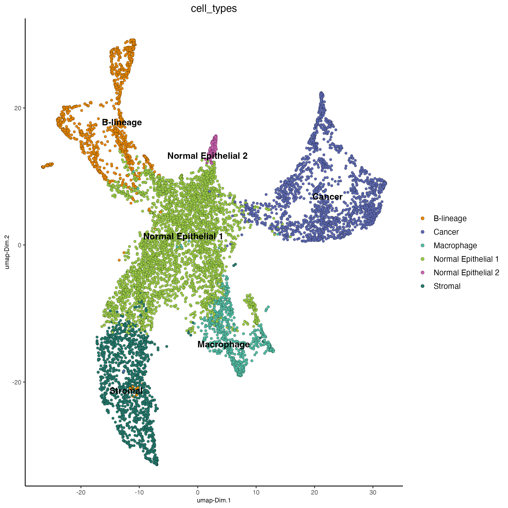

## Visualize

```{r, eval=FALSE}
spatDimPlot2D(gobject = fov_join,
              show_image = TRUE,
              image_name = image_names,
              cell_color = "cell_types",
              cell_color_code = viv10,
              spat_point_size = 1)
```

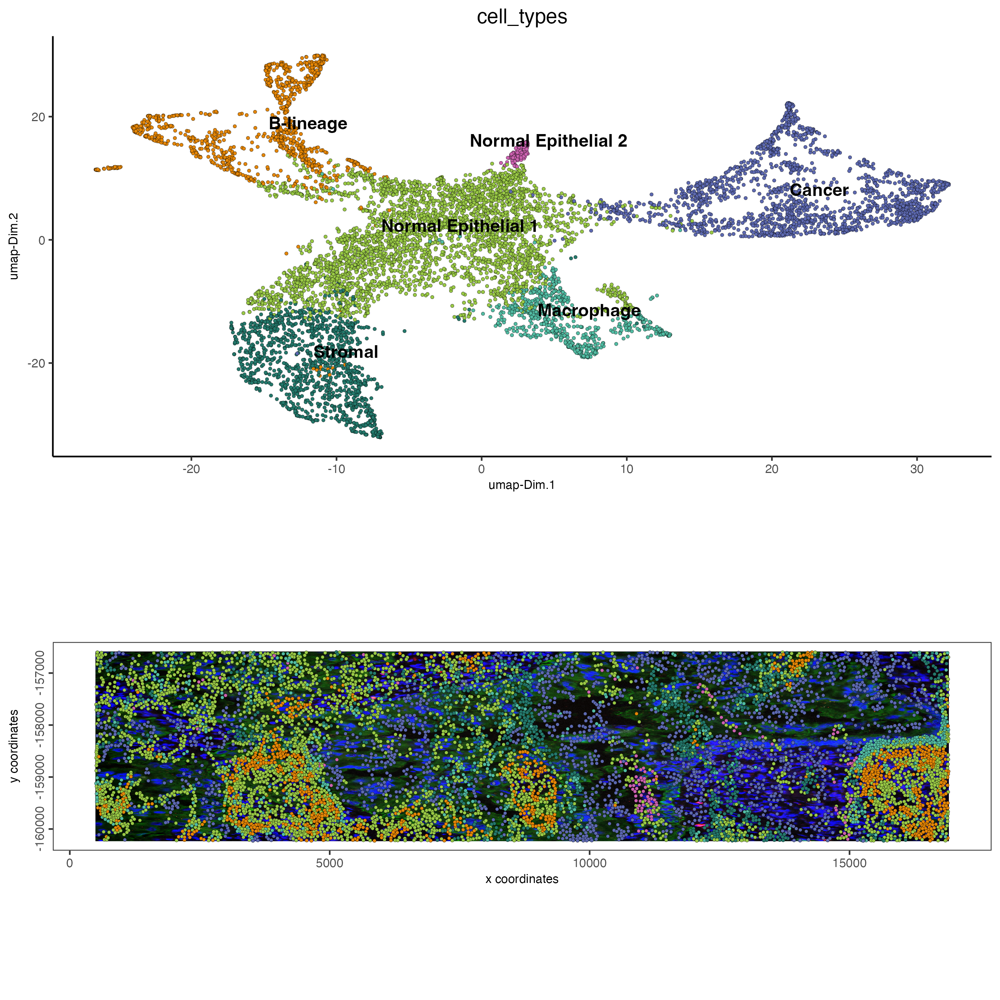

```{r, eval=FALSE}
spatInSituPlotPoints(fov_join,
                     show_polygon = TRUE,
                     polygon_feat_type = "cell",
                     polygon_color = "grey",
                     polygon_line_size = 0.05,
                     polygon_fill = "cell_types",
                     polygon_fill_as_factor = TRUE,
                     polygon_fill_code = viv10,
                     save_param = list(base_height = 2))
```

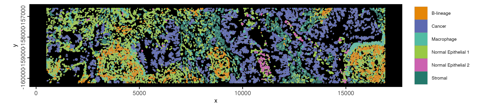

# Interaction Changed Genes

```{r, eval=FALSE}
future::plan("multisession", workers = 4) # NOTE: Depending on your system this could take time

icf <- findInteractionChangedFeats(gobject = fov_join,
                                   cluster_column = "cell_types")

# Identify top ten interaction changed features
icf$ICFscores[type_int == "hetero"]$feats[1:10]

# Skip first two genes since they are too highly expressed
icf_plotfeats <- icf$ICFscores[type_int == "hetero"]$feats[3:12]

# Visualize ICF expression
spatInSituPlotPoints(fov_join,
                     feats = list(icf_plotfeats),
                     point_size = 0.001,
                     show_polygon = TRUE,
                     polygon_feat_type = "cell",
                     polygon_color = "gray",
                     polygon_line_size = 0.05,
                     polygon_fill = "cell_types",
                     polygon_fill_as_factor = TRUE,
                     polygon_fill_code = pal10,
                     save_param = list(base_height = 6))
```

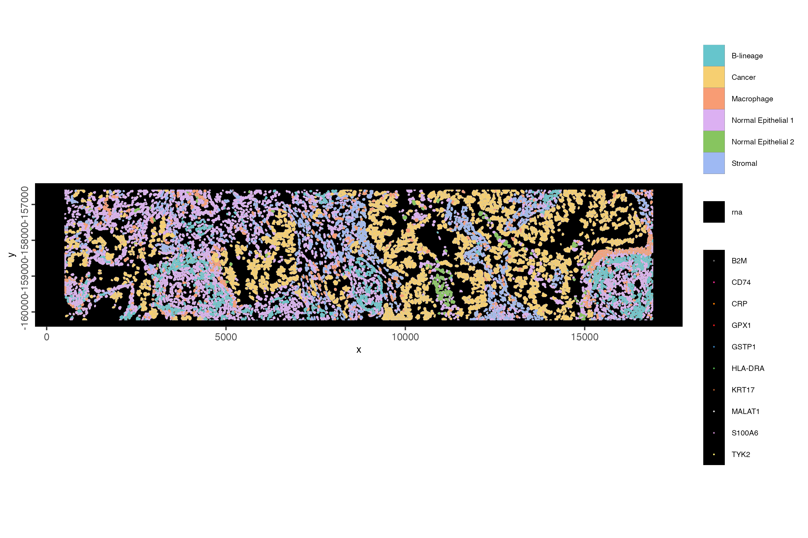

# Saving the giotto object

Giotto uses many objects that include pointers to information that live on disk instead of loading everything into memory. This includes both giotto image objects (`giottoImage`, `giottoLargeImage`) and also subcellular information (`giottoPoints`, `giottoPolygon`). When saving the project as a `.RDS` or `.Rdata`, these pointers are broken and can produce errors when loaded again.

`saveGiotto()` is a function that can save Giotto Suite projects into a contained structured directory that can then be properly loaded again later using `loadGiotto()`.

```{r, eval=FALSE}
saveGiotto(gobject = fov_join,
           foldername = "new_folder_name",
           dir = "/directory/to/save/to/")
```

# Session Info

```{r, eval=FALSE}
sessionInfo()
```

```{r, eval=FALSE}
R version 4.4.1 (2024-06-14)
Platform: x86_64-apple-darwin20
Running under: macOS Sonoma 14.6.1

Matrix products: default
BLAS:   /System/Library/Frameworks/Accelerate.framework/Versions/A/Frameworks/vecLib.framework/Versions/A/libBLAS.dylib 
LAPACK: /Library/Frameworks/R.framework/Versions/4.4-x86_64/Resources/lib/libRlapack.dylib;  LAPACK version 3.12.0

locale:
[1] en_US.UTF-8/en_US.UTF-8/en_US.UTF-8/C/en_US.UTF-8/en_US.UTF-8

time zone: America/New_York
tzcode source: internal

attached base packages:
[1] stats     graphics  grDevices utils     datasets  methods   base     

other attached packages:
[1] ggplot2_3.5.1     Giotto_4.1.3      GiottoClass_0.4.0

loaded via a namespace (and not attached):
  [1] colorRamp2_0.1.0            deldir_2.0-4                rlang_1.1.4                
  [4] magrittr_2.0.3              RcppAnnoy_0.0.22            GiottoUtils_0.1.12         
  [7] matrixStats_1.4.1           compiler_4.4.1              png_0.1-8                  
 [10] systemfonts_1.1.0           vctrs_0.6.5                 pkgconfig_2.0.3            
 [13] SpatialExperiment_1.14.0    crayon_1.5.3                fastmap_1.2.0              
 [16] backports_1.5.0             magick_2.8.4                XVector_0.44.0             
 [19] labeling_0.4.3              utf8_1.2.4                  rmarkdown_2.28             
 [22] UCSC.utils_1.0.0            ragg_1.3.2                  purrr_1.0.2                
 [25] xfun_0.47                   beachmat_2.20.0             zlibbioc_1.50.0            
 [28] GenomeInfoDb_1.40.1         jsonlite_1.8.8              DelayedArray_0.30.1        
 [31] BiocParallel_1.38.0         terra_1.7-78                irlba_2.3.5.1              
 [34] parallel_4.4.1              R6_2.5.1                    RColorBrewer_1.1-3         
 [37] reticulate_1.39.0           parallelly_1.38.0           GenomicRanges_1.56.1       
 [40] scattermore_1.2             Rcpp_1.0.13                 SummarizedExperiment_1.34.0
 [43] knitr_1.48                  future.apply_1.11.2         R.utils_2.12.3             
 [46] IRanges_2.38.1              Matrix_1.7-0                igraph_2.0.3               
 [49] tidyselect_1.2.1            rstudioapi_0.16.0           abind_1.4-5                
 [52] yaml_2.3.10                 codetools_0.2-20            listenv_0.9.1              
 [55] lattice_0.22-6              tibble_3.2.1                Biobase_2.64.0             
 [58] withr_3.0.1                 evaluate_0.24.0             future_1.34.0              
 [61] pillar_1.9.0                MatrixGenerics_1.16.0       checkmate_2.3.2            
 [64] stats4_4.4.1                plotly_4.10.4               generics_0.1.3             
 [67] dbscan_1.2-0                sp_2.1-4                    S4Vectors_0.42.1           
 [70] munsell_0.5.1               scales_1.3.0                gtools_3.9.5               
 [73] globals_0.16.3              glue_1.7.0                  lazyeval_0.2.2             
 [76] tools_4.4.1                 GiottoVisuals_0.2.5         data.table_1.16.0          
 [79] ScaledMatrix_1.12.0         cowplot_1.1.3               grid_4.4.1                 
 [82] tidyr_1.3.1                 colorspace_2.1-1            SingleCellExperiment_1.26.0
 [85] GenomeInfoDbData_1.2.12     BiocSingular_1.20.0         rsvd_1.0.5                 
 [88] cli_3.6.3                   textshaping_0.4.0           fansi_1.0.6                
 [91] S4Arrays_1.4.1              viridisLite_0.4.2           dplyr_1.1.4                
 [94] uwot_0.2.2                  gtable_0.3.5                R.methodsS3_1.8.2          
 [97] digest_0.6.37               progressr_0.14.0            BiocGenerics_0.50.0        
[100] SparseArray_1.4.8           ggrepel_0.9.6               rjson_0.2.22               
[103] htmlwidgets_1.6.4           farver_2.1.2                htmltools_0.5.8.1          
[106] R.oo_1.26.0                 lifecycle_1.0.4             httr_1.4.7                 
[109] MASS_7.3-60.2 
```
