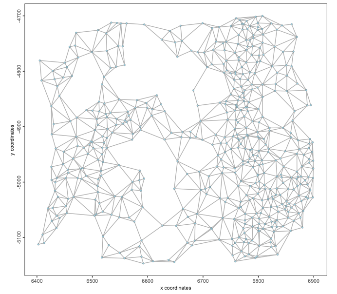
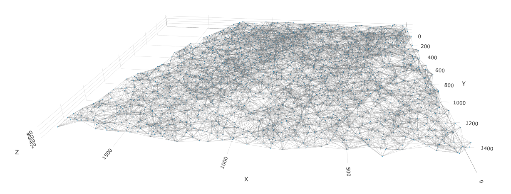
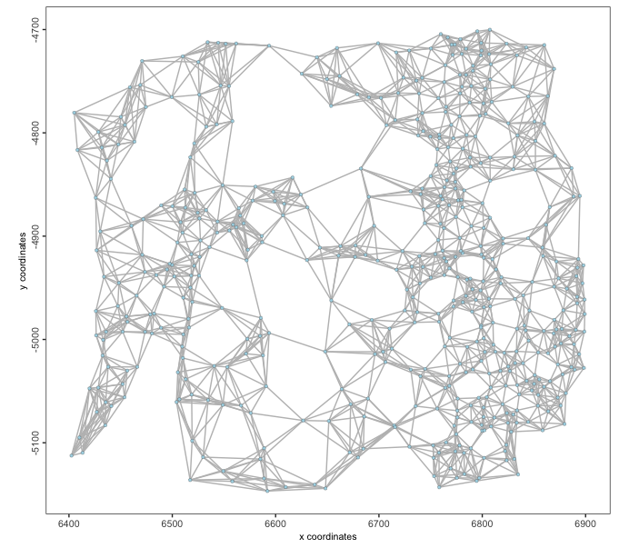
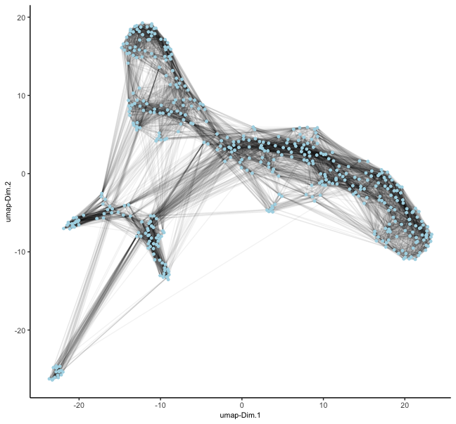
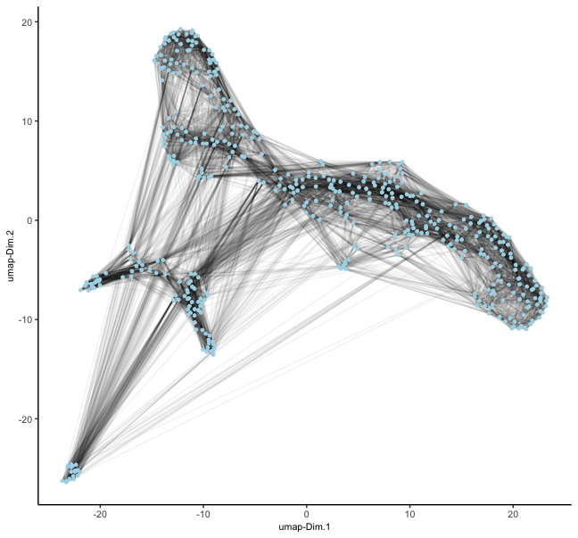

Networks between points can be generated based on coordinates in both spatial and feature embeddings. These allow calculations of how physically similar or phenotypically similar different observations are.


# Setup and load example dataset
```{r, eval=FALSE}
# Ensure Giotto Suite is installed
if(!"Giotto" %in% installed.packages()) {
  pak::pkg_install("drieslab/Giotto")
}

# Ensure Giotto Data is installed
if(!"GiottoData" %in% installed.packages()) {
  pak::pkg_install("drieslab/GiottoData")
}

library(Giotto)

# Ensure the Python environment for Giotto has been installed
genv_exists <- checkGiottoEnvironment()

if(!genv_exists){
  # The following command need only be run once to install the Giotto environment
  installGiottoEnvironment()
}
```

This example uses the 'vizgen' (MERSCOPE) and 'starmap' mini datasets for 2D and 3D spatial information respectively.
```{r, eval=FALSE}
# load the object
mer <- GiottoData::loadGiottoMini("vizgen")
activeSpatUnit(mer) <- "aggregate"
star <- GiottoData::loadGiottoMini("starmap")
```

# Spatial Networks
Spatial networks are generated based on spatial locations (cell or spot centroids). They are needed for analyses such as spatial pattern detection through `binSpect()`, or cell cell communication through `spatCellCellcom()`, and enrichment through `cellProximityEnrichment()`.

Giotto allows generation of Delaunay and k-nearest neighbors (KNN) networks for spatial networks.

## Delaunay Networks

**Key points**

- Construction: Created by connecting points in a plane such that no point is inside the circumcircle of any triangle formed by three points.
- Properties: Maximizes the minimum angle of all triangles, avoiding sliver triangles.
- Advantages: Provides efficient nearest neighbor search and natural neighbor interpolation.

A distance cutoff can be applied through the `maximum_distance` arg where Delaunay neighbors past a certain spatial distance apart are not considered. The default is to use the "upper whisker" value of the distance vector between neighbors; see the `graphics::boxplot()` documentation.

**Implementations**

Giotto provides Delaunay implementations through:

- *deldir* (default & 2D only)
- *RTriangle* (2D only)
- *geometry* (2D or 3D)

### 2D Delaunay

```{r, eval=FALSE}
mer <- createSpatialDelaunayNetwork(mer)
spatPlot2D(mer,
    show_network = TRUE, 
    point_size = 1.2, 
    network_color = "grey"
)
```

```{r, echo=FALSE, out.width="60%", fig.align="center"}

```

### 3D Delaunay

```{r, eval=FALSE}
star <- createSpatialDelaunayNetwork(star, 
    method = "delaunayn_geometry" # use geometry pkg implementation since only this one supports 3D
)
spatPlot3D(star, 
    spatial_network_name = "Delaunay_network", 
    show_network = TRUE, 
    point_size = 1.2, 
    network_color = "grey", 
    axis_scale = "real"
)
```

```{r, echo=FALSE, out.width="80%", fig.align="center"}

```


## Spatial k-Nearest Neighbors networks (kNN)

Generate a spatial network where each point has k neighbors. A `maximum_distance` cutoff can also be applied here, but is not done by default. Giotto implements KNN network generation through *dbscan*.

**Key points**

- Construction: For each point in the dataset, find the k closest points based on a distance metric (often Euclidean distance).
- Properties: May not preserve geometric properties as well as Delaunay triangulation.
- Advantages: KNN is simpler to compute and some spatial statistics operate best with a fixed number of connections per node.

```{r, eval=FALSE}
mer <- createSpatialKNNnetwork(mer, k = 8)
spatPlot2D(mer,
    spatial_network_name = "knn_network", 
    show_network = TRUE, 
    point_size = 1.2, 
    network_color = "grey"
)
```

```{r, echo=FALSE, out.width="60%", fig.align="center"}

```


# Spatial Feature Networks

KNN spatial networks can be created from the feature detections.

```{r, eval=FALSE}
mer <- createSpatialFeaturesKNNnetwork(mer)
# this appends the network to the giottoPoints object
mer[["feat_info", "rna"]][[1]]
```

# Nearest Neighbor Networks

Nearest neighbor networks are used in Giotto to aid in clustering of high-dimensional feature embeddings. Leiden and Louvain clustering are both examples of network community-based clustering approaches. These networks are usually built on top of primary dimension reduction embeddings such as PCA and NMF that help extract and highlight important signatures from the expression information.

## Shared Nearest Neighbor Networks (sNN)

sNN networks are the default NN network generated in Giotto. They are preferred for clustering in high-dimensional spaces since they adapt to local density variations, something crucial for identifying clusters of different densities or sizes.

**Key points**

- Construction: First, compute the k nearest neighbors for each point (like in kNN). For each pair of points, calculate the number of shared neighbors among their k nearest neighbors. Create an edge between two points if their number of shared neighbors exceeds a threshold.
- Properties: Can be treated as an undirected graph. The number of connections per node can vary.
- Advantages: More robust to variations in local density. Can capture complex cluster shapes and hierarchical structures.

```{r, eval=FALSE}
mer <- createNearestNetwork(mer, type = "sNN") # builds sNN on top of PCA space by default
dimPlot2D(mer, show_NN_network = TRUE, nn_network_to_use = "sNN", network_name = "sNN.pca")
```

```{r, echo=FALSE, out.width="60%", fig.align="center"}

```

## k-Nearest Neighbors Networks (kNN)

**Key points**

- Construction: For each point in the embedding space, find the k closest points based on a distance metric 
- Properties: Results in a directed graph, as the "nearest neighbor" relationship isn't always symmetric.

```{r, eval=FALSE}
mer <- createNearestNetwork(mer, type = "kNN") # builds kNN on top of PCA space by default
dimPlot2D(mer, show_NN_network = TRUE, nn_network_to_use = "kNN", network_name = "kNN.pca")
```

```{r, echo=FALSE, out.width="60%", fig.align="center"}

```

# Session Info
```{r, eval=FALSE}
sessionInfo()
```
```
R version 4.4.1 (2024-06-14)
Platform: aarch64-apple-darwin20
Running under: macOS Sonoma 14.4

Matrix products: default
BLAS:   /System/Library/Frameworks/Accelerate.framework/Versions/A/Frameworks/vecLib.framework/Versions/A/libBLAS.dylib 
LAPACK: /Library/Frameworks/R.framework/Versions/4.4-arm64/Resources/lib/libRlapack.dylib;  LAPACK version 3.12.0

locale:
[1] en_US.UTF-8/en_US.UTF-8/en_US.UTF-8/C/en_US.UTF-8/en_US.UTF-8

time zone: America/New_York
tzcode source: internal

attached base packages:
[1] stats     graphics  grDevices utils     datasets  methods   base     

other attached packages:
[1] Giotto_4.1.3      GiottoClass_0.4.0

loaded via a namespace (and not attached):
  [1] colorRamp2_0.1.0            deldir_2.0-4               
  [3] httr2_1.0.1                 rlang_1.1.4                
  [5] magrittr_2.0.3              GiottoUtils_0.2.0          
  [7] matrixStats_1.4.1           compiler_4.4.1             
  [9] png_0.1-8                   callr_3.7.6                
 [11] vctrs_0.6.5                 RTriangle_1.6-0.13         
 [13] pkgconfig_2.0.3             SpatialExperiment_1.14.0   
 [15] crayon_1.5.3                fastmap_1.2.0              
 [17] backports_1.5.0             magick_2.8.4               
 [19] XVector_0.44.0              magic_1.6-1                
 [21] labeling_0.4.3              utf8_1.2.4                 
 [23] rmarkdown_2.28              UCSC.utils_1.0.0           
 [25] ps_1.7.6                    purrr_1.0.2                
 [27] xfun_0.47                   zlibbioc_1.50.0            
 [29] GenomeInfoDb_1.40.0         jsonlite_1.8.9             
 [31] DelayedArray_0.30.0         terra_1.7-78               
 [33] parallel_4.4.1              R6_2.5.1                   
 [35] RColorBrewer_1.1-3          reticulate_1.39.0          
 [37] pkgload_1.3.4               GenomicRanges_1.56.0       
 [39] scattermore_1.2             Rcpp_1.0.13                
 [41] SummarizedExperiment_1.34.0 knitr_1.48                 
 [43] R.utils_2.12.3              IRanges_2.38.0             
 [45] Matrix_1.7-0                igraph_2.0.3               
 [47] tidyselect_1.2.1            rstudioapi_0.16.0          
 [49] abind_1.4-8                 yaml_2.3.10                
 [51] codetools_0.2-20            curl_5.2.3                 
 [53] processx_3.8.4              lattice_0.22-6             
 [55] tibble_3.2.1                Biobase_2.64.0             
 [57] withr_3.0.1                 evaluate_1.0.0             
 [59] desc_1.4.3                  pillar_1.9.0               
 [61] MatrixGenerics_1.16.0       checkmate_2.3.1            
 [63] stats4_4.4.1                geometry_0.4.7             
 [65] plotly_4.10.4               generics_0.1.3             
 [67] dbscan_1.2-0                sp_2.1-4                   
 [69] S4Vectors_0.42.0            ggplot2_3.5.1              
 [71] munsell_0.5.1               scales_1.3.0               
 [73] GiottoData_0.2.15           gtools_3.9.5               
 [75] glue_1.8.0                  lazyeval_0.2.2             
 [77] tools_4.4.1                 GiottoVisuals_0.2.5        
 [79] data.table_1.16.0           fs_1.6.4                   
 [81] cowplot_1.1.3               grid_4.4.1                 
 [83] tidyr_1.3.1                 crosstalk_1.2.1            
 [85] colorspace_2.1-1            SingleCellExperiment_1.26.0
 [87] GenomeInfoDbData_1.2.12     cli_3.6.3                  
 [89] rappdirs_0.3.3              fansi_1.0.6                
 [91] S4Arrays_1.4.0              viridisLite_0.4.2          
 [93] dplyr_1.1.4                 gtable_0.3.5               
 [95] R.methodsS3_1.8.2           digest_0.6.37              
 [97] BiocGenerics_0.50.0         SparseArray_1.4.1          
 [99] ggrepel_0.9.6               rjson_0.2.21               
[101] htmlwidgets_1.6.4           farver_2.1.2               
[103] htmltools_0.5.8.1           pkgdown_2.1.0              
[105] R.oo_1.26.0                 lifecycle_1.0.4            
[107] httr_1.4.7  
```
