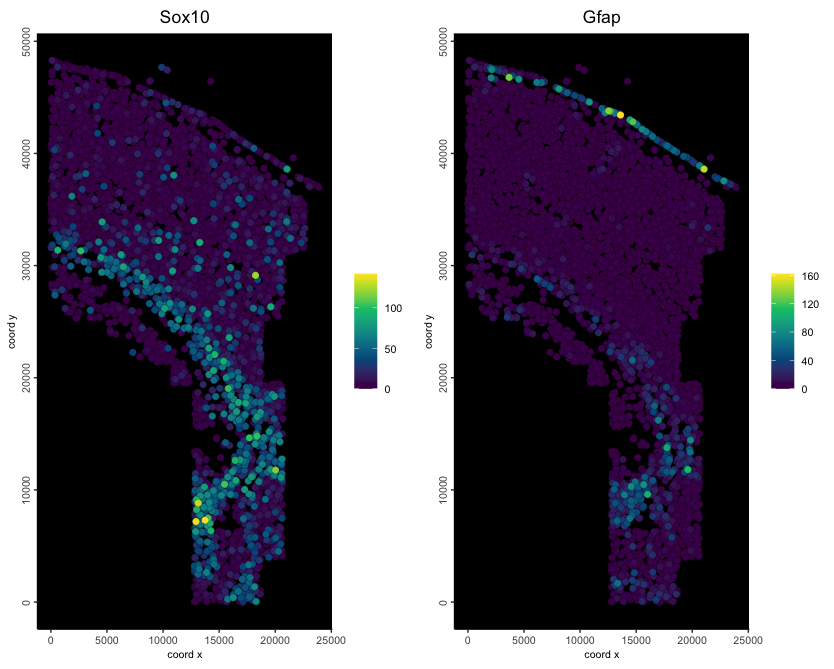
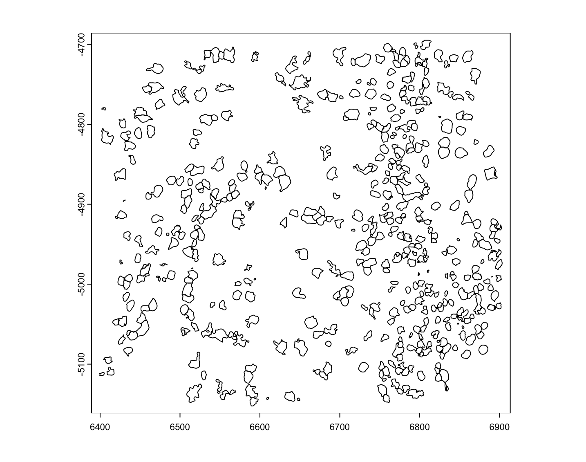
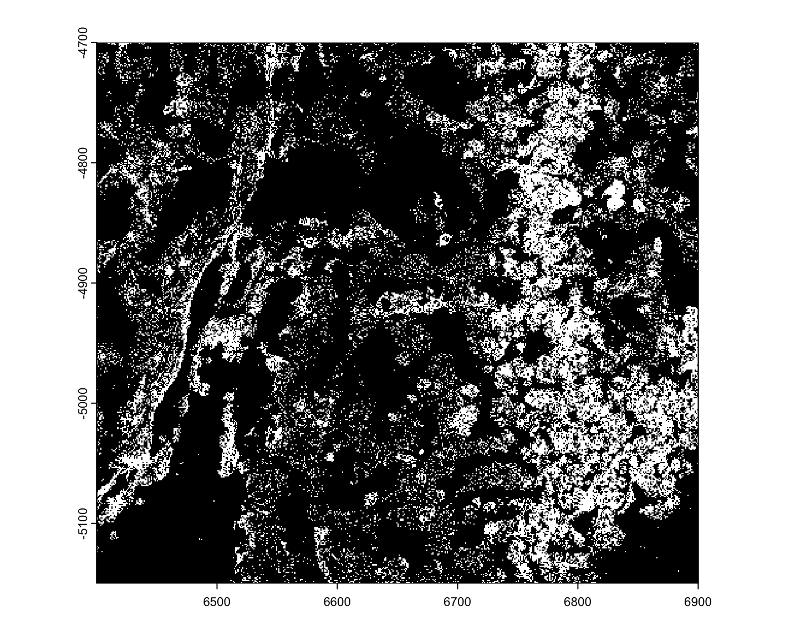
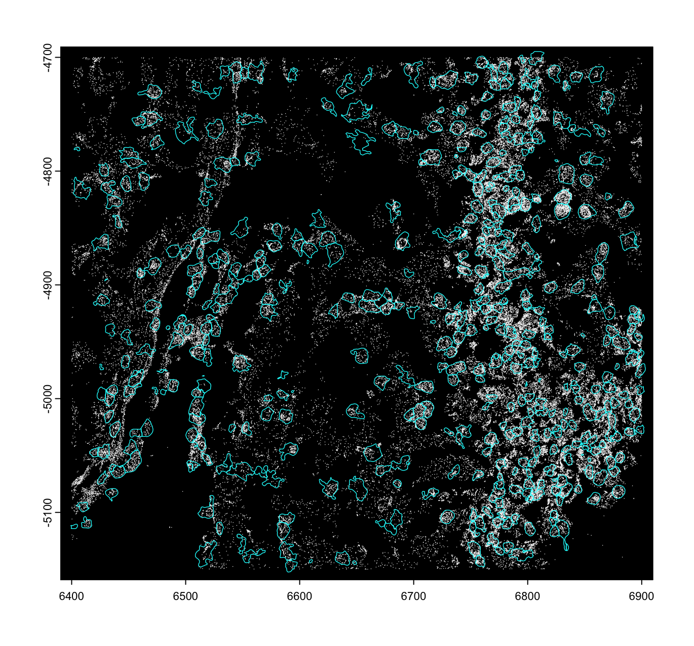
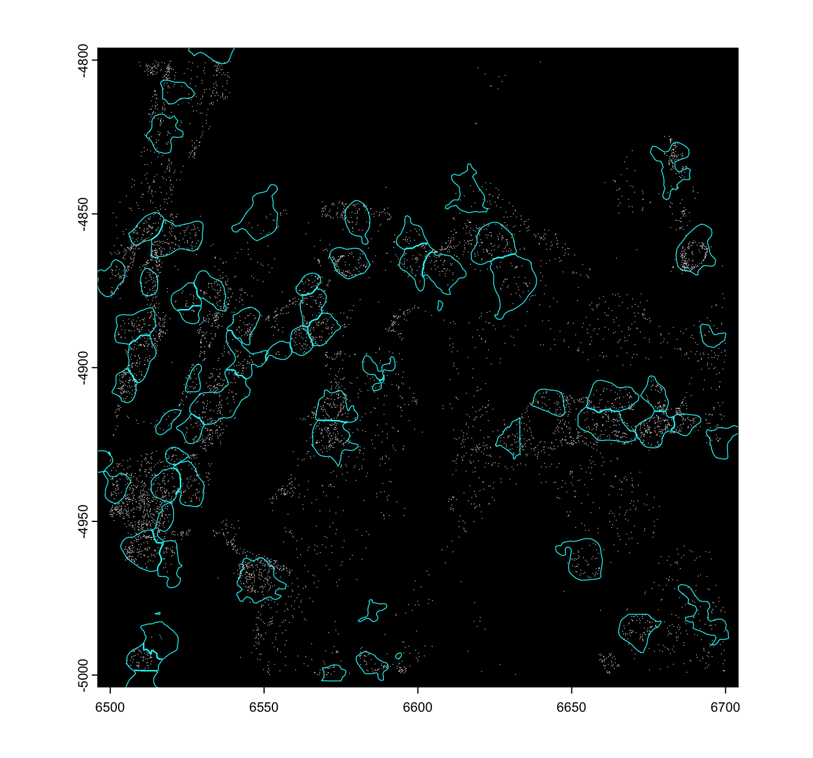
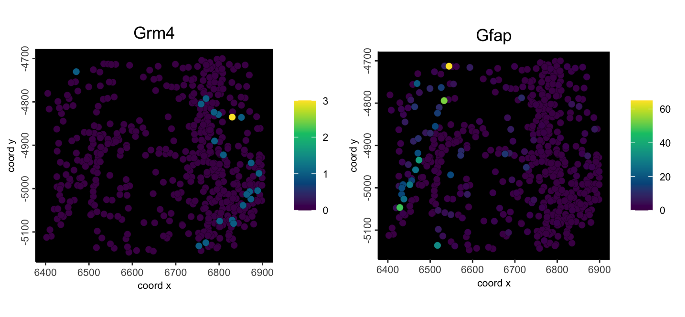
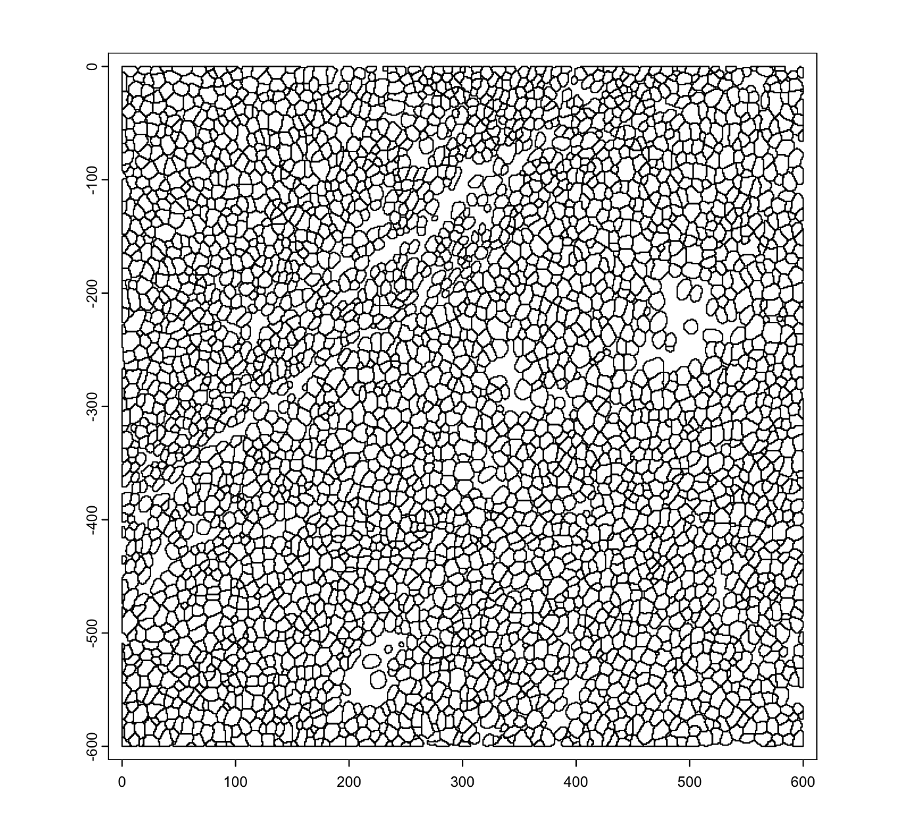
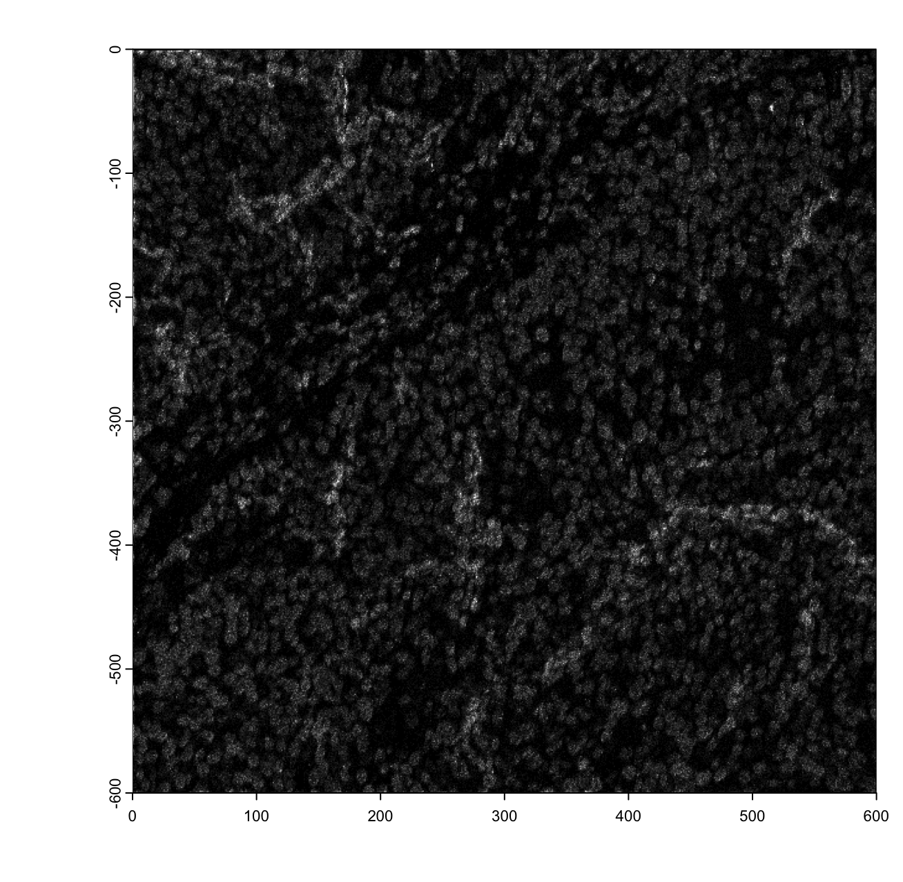
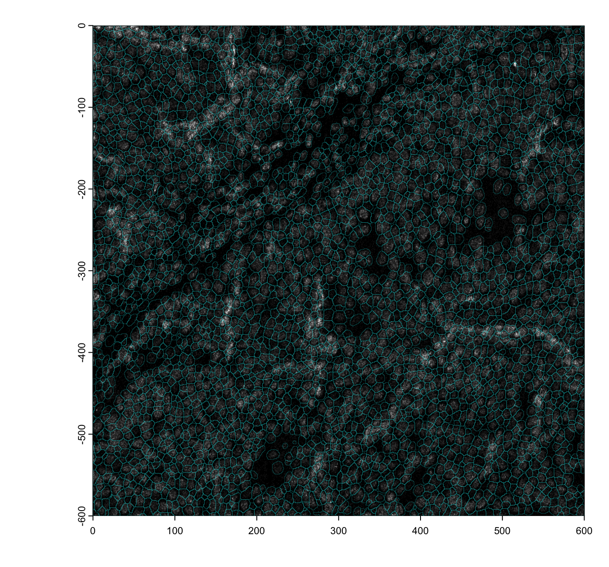
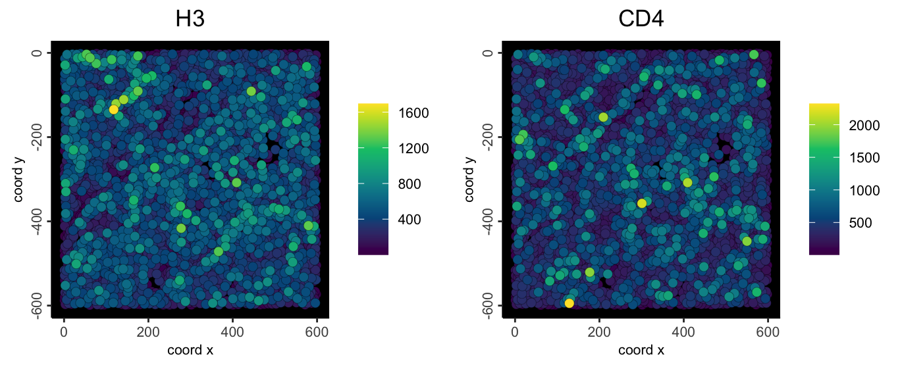

# Ensure Giotto and GiottoData are installed

```{r, eval=FALSE}
# Ensure Giotto Suite is installed.
if(!"Giotto" %in% installed.packages()) {
  pak::pkg_install("drieslab/Giotto")
}
# Ensure the Python environment for Giotto has been installed.
genv_exists <- Giotto::checkGiottoEnvironment()
if(!genv_exists){
  # The following command need only be run once to install the Giotto environment.
  Giotto::installGiottoEnvironment()
}

# Ensure Giotto Suite is installed.
if(!"GiottoData" %in% installed.packages()) {
  pak::pkg_install("drieslab/GiottoData")
}

library(Giotto)
```

# Minimum requirements for a functional Giotto object

With Giotto, the minimal requirements for a spatial dataset are either: 

* an **expression matrix** and matching **spatial locations**
* a set of **features** (either point detections or staining images) and a set of **polygon annotations** to extract those features as individual units of study. 

Single cell datasets (shown at the bottom) can also be worked using Giotto, and only need a matrix without the need for paired spatial locations.

# Create from matrix + locations

This example will be shown using an osmFISH dataset.
To download this data, please ensure that [wget](https://www.gnu.org/software/wget/?) is installed locally.

## Download data to use
```{r, eval=FALSE}
# Specify path from which data may be retrieved/stored
data_path <- "/path/to/data/"

# Specify path to which results may be saved
results_folder <- "/path/to/results/"

# Download osmFISH dataset to data_path
GiottoData::getSpatialDataset(
    dataset = "osmfish_SS_cortex",
    directory = data_path, 
    method = "wget"
)
```


## Read data into Giotto Suite

Aggregate data (matrix and spatial locations -based data) can be read in using `createGiottoObject()`.
There are two examples. Data formatting guidelines are shown below this code block.
```{r, eval=FALSE}
# Example 1.
# Create a giotto object using data directly from file paths 
osm_exprs <- file.path(data_path, "osmFISH_prep_expression.txt")
osm_locs <- file.path(data_path, "osmFISH_prep_cell_coordinates.txt")

minimum_gobject1 <- createGiottoObject(
    expression = osm_exprs,
    spatial_locs = osm_locs
)
force(minimum_gobject1)
```
```
An object of class giotto 
>Active spat_unit:  cell 
>Active feat_type:  rna 
dimensions    : 33, 5328 (features, cells)
[SUBCELLULAR INFO]
[AGGREGATE INFO]
expression -----------------------
  [cell][rna] raw
spatial locations ----------------
  [cell] raw


Use objHistory() to see steps and params used
```

```{r, eval=FALSE}
# Example 2.
# Create a giotto object using objects already loaded into workspace
# readExprMatrix will load matrix formats into memory as a Matrix format
expression_matrix <- readExprMatrix(path = osm_exprs) # fast method to read expression matrix
cell_locations <- data.table::fread(file = osm_locs)

minimum_gobject2 <- createGiottoObject(
    expression = expression_matrix,
    spatial_locs = cell_locations
)
force(minimum_gobject2)
```
```
An object of class giotto 
>Active spat_unit:  cell 
>Active feat_type:  rna 
dimensions    : 33, 5328 (features, cells)
[SUBCELLULAR INFO]
[AGGREGATE INFO]
expression -----------------------
  [cell][rna] raw
spatial locations ----------------
  [cell] raw


Use objHistory() to see steps and params used
```

## Example plot 
```{r, eval=FALSE}
spatFeatPlot2D(minimum_gobject1,
    feats = c("Sox10", "Gfap"), 
    expression_values = "raw",
    point_size = 2.5,
    gradient_style = "sequential",
    background_color = "black"
)
```

```{r, echo=FALSE, out.width="80%", fig.align="center"}

```


## Data formatting notes

**Expression file formatting**

- Expression count matrices accepted by *Giotto* should be oriented with columns 
corresponding to individual cells/observations (**cell IDs**) and rows to 
individual features (**feature IDs**). It is also preferred for the rows and
cols to be named by the features and cells they describe.

- **matrix** and **DelayedMatrix** objects should have the **feature IDs**
already incorporated as the rownames.

- **data.table** objects and text-based files ie: (**.csv, .tsv, .txt**) to be
read in should have column 1 be **feature IDs**.


**Locations file formatting**

- Numerical columns will be interpreted in order of x, y, and (optionally) z
coordinate. The first non-numerical column will be taken as **cell IDs**

**\*Note:** 

multiple expression files during can be given at once during Giotto object 
creation by using a named list.


```{r, eval=FALSE}
# Arbitrary modifications
scaled_matrix <- expression_matrix * 1.2
custom_matrix <- expression_matrix * 0.5

# Provide multiple expression matrices at once to the Giotto Object
# If these matrices are stored in files rather than in the workspace,
# file paths may be provided instead of variables
multi_expr_gobject <- createGiottoObject(
    expression = list( # named list of multiple expression matrices
        raw = expression_matrix,
        scaled = scaled_matrix,
        custom = custom_matrix
    ),
    spatial_locs = cell_locations
)
force(multi_expr_gobject)
```
```
An object of class giotto 
>Active spat_unit:  cell 
>Active feat_type:  rna 
dimensions    : 33, 5328 (features, cells)
[SUBCELLULAR INFO]
[AGGREGATE INFO]
expression -----------------------
  [cell][rna] raw scaled custom
spatial locations ----------------
  [cell] raw


Use objHistory() to see steps and params used
```


# Create from feature detection (points) and cell annotations (polygons)

You can also make giotto objects starting from raw spatial feature information and annotations that give them spatial context. This will be shown using the vizgen MERSCOPE mini object's raw data available from GiottoData

## Get filepaths from GiottoData

```{r, eval=FALSE}
# function to get a filepath from GiottoData
mini_viz_raw <- function(x) {
  system.file(
    package = "GiottoData",
    file.path("Mini_datasets", "Vizgen", "Raw", x)
  )
}

mini_viz_poly_path <- mini_viz_raw(file.path("cell_boundaries", "z0_polygons.gz"))
mini_viz_tx_path <- mini_viz_raw("vizgen_transcripts.gz")
```


## Read into Giotto subobjects and assemble into giotto object

Polygons can be read into Giotto Suite in multiple ways. If a `character` input is
provided, it is assumed to be a filepath to a .GeoJSON or mask image file.
Which it is is determined based on file extension. If a `data.frame` is provided,
then it is expected to be a `data.frame` with vertex X, Y, and poly_ID
information. The columns can be guessed, but naming them specifically `x`, `y`, 
and `poly_ID` will ensure that the correct ones are picked.

You can also be more explicit about the type of input provided by calling any
of the following directly, instead of having `createGiottoPolygon()` guess.

* `createGiottoPolygonsFromMask()`
* `createGiottoPolygonsFromGeoJSON()`
* `createGiottoPolygonsFromDfr()`

See also `?GiottoClass::createGiottoPolygon`

For this example, a `data.frame` input will be used.

```{r, eval=FALSE}
poly_dt <- data.table::fread(mini_viz_poly_path)
force(poly_dt)
```

```
              x         y                                poly_ID
          <num>     <num>                                 <char>
    1: 6407.193 -4781.580 40951783403982682273285375368232495429
    2: 6407.193 -4781.283 40951783403982682273285375368232495429
    3: 6407.193 -4780.974 40951783403982682273285375368232495429
    4: 6407.197 -4780.703 40951783403982682273285375368232495429
    5: 6407.087 -4780.464 40951783403982682273285375368232495429
   ---                                                          
29100: 6847.581 -4717.656  9677424102111816817518421117250891895
29101: 6847.693 -4717.162  9677424102111816817518421117250891895
29102: 6847.906 -4716.574  9677424102111816817518421117250891895
29103: 6848.029 -4716.075  9677424102111816817518421117250891895
29104: 6848.138 -4715.476  9677424102111816817518421117250891895
```

```{r, eval=FALSE}
viz_gpoly <- createGiottoPolygon(poly_dt)
force(viz_gpoly)
```

```
An object of class giottoPolygon
spat_unit : "cell"
Spatial Information:
 class       : SpatVector 
 geometry    : polygons 
 dimensions  : 498, 1  (geometries, attributes)
 extent      : 6399.244, 6903.243, -5152.39, -4694.868  (xmin, xmax, ymin, ymax)
 coord. ref. :  
 names       :                                 poly_ID
 type        :                                   <chr>
 values      :  40951783403982682273285375368232495429
               240649020551054330404932383065726870513
               274176126496863898679934791272921588227
 centroids   : NULL
 overlaps    : NULL
```

```{r, eval=FALSE}
plot(viz_gpoly)
```

```{r, echo=FALSE, out.width="80%", fig.align="center"}

```


Points information can be read into GiottoSuite from any `data.frame`-like object
with points coordinates information (x, y, feat_ID). For most surety, the
input `data.frame` should be named with the previous colnames, however `createGiottoPoints()`
will attempt to guess which columns are which.

See also `?GiottoClass::createGiottoPoints`

For this example, the following `data.table` will be used.

```{r, eval=FALSE}
tx_dt <- data.table::fread(mini_viz_tx_path)
tx_dt[, global_y := -global_y] # flip values to match polys 
# (this can also be done after `giottoPoints` creation using flip())
force(tx_dt)
```

```
       global_x  global_y      gene global_z
          <num>     <num>    <char>    <int>
    1: 6400.037 -4966.651      Mlc1        0
    2: 6400.041 -4965.377    Gprc5b        0
    3: 6400.078 -5081.453      Gfap        0
    4: 6400.084 -5038.288      Gfap        0
    5: 6400.172 -4816.516     Ednrb        0
   ---                                      
80339: 6900.010 -4773.595    Adgra1        1
80340: 6900.023 -4772.980     Cspg5        1
80341: 6900.024 -5007.432 Adcyap1r1        1
80342: 6900.026 -4924.840   Slc17a7        1
80343: 6900.030 -4746.916     Cldn5        1
```

```{r, eval=FALSE}
viz_gpoints <- createGiottoPoints(tx_dt)

force(viz_gpoints)
```

```
An object of class giottoPoints
feat_type : "rna"
Feature Information:
 class       : SpatVector 
 geometry    : points 
 dimensions  : 80343, 3  (geometries, attributes)
 extent      : 6400.037, 6900.032, -5149.983, -4699.979  (xmin, xmax, ymin, ymax)
 coord. ref. :  
 names       : feat_ID global_z feat_ID_uniq
 type        :   <chr>    <int>        <int>
 values      :    Mlc1        0            1
                Gprc5b        0            2
                  Gfap        0            3
```

```{r, eval=FALSE}
plot(viz_gpoints)
```

```{r, echo=FALSE, out.width="80%", fig.align="center"}

```


## Checking spatial alignment

Care should always be taken when assembling a spatial dataset to make sure that 
the spatial information is spatially aligned. We can check this by plotting the subobjects.
When the data is not properly aligned, the polygons will extract the incorrect
features or even find no values.

```{r, eval=FALSE}
plot(viz_gpoints, raster = FALSE)
# raster = TRUE is default and faster, but does not work with additive plotting
plot(viz_gpoly, add = TRUE, border = "cyan", lwd = 0.7)
```

```{r, echo=FALSE, out.width="80%", fig.align="center"}

```

These plots can take a long time depending on how large the dataset is. For very large
dataset, it is a good idea to designate a smaller ROI using `ext()` then plotting just that ROI.

```{r, eval=FALSE}
# example plot with ROI. This is a good idea for large datasets.
ROI <- ext(c(6500, 6700, -5000, -4800)) # xmin, xmax, ymin, ymax
plot(viz_gpoints, raster = FALSE, ext = ROI)
# raster = TRUE is default and faster, but does not work with additive plotting
plot(viz_gpoly, add = TRUE, border = "cyan", lwd = 0.7, ext = ROI)
```

```{r, echo=FALSE, out.width="80%", fig.align="center"}

```


## Creating the subcellular Giotto object

Datasets with raw spatial features and polygon information are created using `createGiottoObjectSubcellular()`.

```{r, eval=FALSE}
mini_viz <- createGiottoObjectSubcellular(
  gpolygons = mini_viz_poly,
  gpoints = viz_gpoints
)

force(mini_viz)
```

```
An object of class giotto 
[SUBCELLULAR INFO]
polygons      : cell 
features      : rna 
[AGGREGATE INFO]


Use objHistory() to see steps and params used
```

## Spatially aggregate values

```{r, eval=FALSE}
# calculate centroids
mini_viz <- addSpatialCentroidLocations(mini_viz)
# create aggregated information
mini_viz <- calculateOverlap(mini_viz)
mini_viz <- overlapToMatrix(mini_viz)
```

## Example plot

```{r, eval=FALSE}
spatFeatPlot2D(
  mini_viz, 
  feats = c("Grm4", "Gfap"),
  expression_values = "raw",
  point_size = 2.5,
  gradient_style = "sequential",
  background_color = "black"
)
```

```{r, echo=FALSE, out.width="80%", fig.align="center"}

```

# Create from staining images and polygons

The IMC data to run this tutorial can be found in the *imcdatasets* package. We will be using one of the smaller example datasets. These IMC outputs provide multilayer images in the format of *cytomapper* `CytoImageList` collections of *EBImage* `Image` objects, which can be easily coerced to simple matrices.

## Download data to use

```{r, eval=FALSE}
# Ensure imcdatasets and EBImage are installed.
if(!"imcdatasets" %in% installed.packages()) {
  pak::pkg_install("imcdatasets")
}
# load dataset
imc_masks <- imcdatasets::IMMUcan_2022_CancerExample("masks")
imc_imgs <- imcdatasets::IMMUcan_2022_CancerExample("images")

# coerce to matrix
mask_mat <- imc_masks$Patient1_001[]
img_mat <- lapply(
    seq_len(dim(imc_imgs$Patient1_001)[3]), 
    function(lyr) imc_imgs$Patient1_001[][,,lyr]
)
channels <- cytomapper::channelNames(imc_imgs)
```

## Read data into Giotto Suite

```{r, eval=FALSE}
# create the mask polys
mask_poly <- createGiottoPolygonsFromMask(mask_mat, 
    shift_vertical_step = -1,
    flip_vertical = FALSE,
    flip_horizontal = FALSE,
    shift_horizontal_step = FALSE,
    remove_background_polygon = TRUE
    # remove polygons that cover most of the spatial extent of the dataset 
    # (these are usually artefact background polys)
)
force(mask_poly)
```

```
An object of class giottoPolygon
spat_unit : "cell"
Spatial Information:
 class       : SpatVector 
 geometry    : polygons 
 dimensions  : 3567, 1  (geometries, attributes)
 extent      : 0, 600, -600, 0  (xmin, xmax, ymin, ymax)
 coord. ref. :  
 names       : poly_ID
 type        :   <chr>
 values      :  cell_1
                cell_2
                cell_3
 centroids   : NULL
 overlaps    : NULL
```

```{r, eval=FALSE}
plot(mask_poly)
```

```{r, echo=FALSE, out.width="80%", fig.align="center"}

```


```{r, eval=FALSE}
# load the image matrices in as a list of `giottoLargeImages`
imglist <- lapply(seq_along(img_mat), function(img_i) {
    createGiottoLargeImage(img_mat[[img_i]], name = channels[[img_i]])
})
names(imglist) <- channels
force(imglist[["H3"]])
```

```
An object of class giottoLargeImage : "H3"
Image extent            : 0, 600, -600, 0 (xmin, xmax, ymin, ymax)
Original image extent   : 0, 600, -600, 0 (xmin, xmax, ymin, ymax)
Scale factor            : 1, 1 (x, y)
Resolution              : 1, 1 (x, y)
Layers                  : 1 
Estimated max intensity : 60.95492 
Estimated min intensity : 0 
Values                  : floating point
File path               : ''
```

```{r, eval=FALSE}
plot(imglist[["H3"]], max_intensity = 30)
```

```{r, echo=FALSE, out.width="80%", fig.align="center"}

```

## Checking spatial alignment

```{r, eval=FALSE}
plot(imglist[["H3"]], max_intensity = 30)
plot(mask_poly, add = TRUE, border = "cyan", lwd = 0.15)
```

```{r, echo=FALSE, out.width="80%", fig.align="center"}

```

## Creating the giotto object

```{r, eval=FALSE}
imc <- createGiottoObjectSubcellular(
    gpolygons = mask_poly,
    images = imglist
)
force(imc)
```

```
An object of class giotto 
>Active spat_unit:  cell 
dimensions    : NA, 3567 (features, cells)
[SUBCELLULAR INFO]
polygons      : cell 
[AGGREGATE INFO]
attached images ------------------
images      : 40 items...


Use objHistory() to see steps and params used
```

## Spatially aggregate values

```{r, eval=FALSE}
# calculate centroids
imc <- addSpatialCentroidLocations(imc)
# create aggregated information
imc <- calculateOverlap(imc, image_names = channels, name_overlap = "protein")
imc <- overlapToMatrix(imc, type = "intensity", feat_info = "protein")
```

## Example plot

```{r, eval=FALSE}
spatFeatPlot2D(
  imc, 
  feats = c("H3", "CD4"),
  expression_values = "raw",
  point_size = 2.5,
  gradient_style = "sequential",
  background_color = "black"
)
```

```{r, echo=FALSE, out.width="80%", fig.align="center"}

```

**Note:** If you notice a single extremely bright center spot, then there was likely a background polygon that was not removed.


# Create piecewise

Giotto objects can also be created in a piecewise manner as long as all inputs
are converted to Giotto subobject formats first. `giottoPoints` and `giottoPolygon`
are two examples of subobjects.

```{r,eval=FALSE}
g <- giotto() # initialize empty gobject
g <- setGiotto(g, mini_viz_poly)
g <- setGiotto(g, viz_gpoints)
force(g)
```

```
An object of class giotto 
>Active spat_unit:  cell 
>Active feat_type:  rna 
dimensions    : 559, 498 (features, cells)
[SUBCELLULAR INFO]
polygons      : cell 
features      : rna 
[AGGREGATE INFO]


Use objHistory() to see steps and params used
```

This is essentially the same object as the one created through `createGiottoObjectSubcellular()` with the vizgen MERSCOPE data earlier.


# Create a single cell analysis Giotto object

## Download data to use

The example dataset used here is from 10X [link](https://www.10xgenomics.com/datasets/Human_PBMCs_Next_GEM_Flex_GEM-X_Flex_Comparison)

```{r, eval=FALSE}
link <- "https://cf.10xgenomics.com/samples/cell-exp/8.0.1/Human_PBMCs_Next_GEM_Flex_GEM-X_Flex_Comparison/Human_PBMCs_Next_GEM_Flex_GEM-X_Flex_Comparison_count_filtered_feature_bc_matrix.h5"

# Specify path from which data may be retrieved/stored
data_path <- "/path/to/data/"
save_path <- file.path(data_path, "pbmc_matrix.h5")

utils::download.file(link, destfile = save_path, method = "wget")
```

## Read the data

```{r, eval=FALSE}
pbmc_mat <- get10Xmatrix_h5(save_path)
```

## Load into Giotto as a single cell analysis

```{r, eval=FALSE}
pbmc <- createGiottoObject(expression = pbmc_mat)
force(pbmc)
```

```
An object of class giotto 
>Active spat_unit:  cell 
>Active feat_type:  rna 
dimensions    : 15146, 8703 (features, cells)
[SUBCELLULAR INFO]
[AGGREGATE INFO]
expression -----------------------
  [cell][rna] Gene Expression
spatial locations ----------------
  [cell] raw


Use objHistory() to see steps and params used
```


# Customizing the Giotto Object

By providing values to other `createGiottoObject()` or `createGiottoObjectSubcellular()` parameters, it is possible to add:

- **Cell** or **feature (gene) metadata**: see
    [addCellMetadata](../reference/addCellMetadata.html) and
    [addFeatMetadata](../reference/addFeatMetadata.html)
- **Spatial networks** or **grids**: see
    [Visualizations](./Visualizations.html)
- **Dimension reduction**: see
    [Clustering](./dimension_reduction.html)
- **Images**: see [Imaging](./getting_started_images.html)
- **giottoInstructions**: see
    [createGiottoInstructions](../docs/reference/createGiottoInstructions.html) 
For a more in-depth look at the `giotto` object structure, take a look at the [introduction to giotto classes](./classes_intro.html)

## Session Info

```{r, eval=FALSE}
sessionInfo()
```

```{r, eval=FALSE}
R version 4.4.1 (2024-06-14)
Platform: aarch64-apple-darwin20
Running under: macOS Sonoma 14.4

Matrix products: default
BLAS:   /System/Library/Frameworks/Accelerate.framework/Versions/A/Frameworks/vecLib.framework/Versions/A/libBLAS.dylib 
LAPACK: /Library/Frameworks/R.framework/Versions/4.4-arm64/Resources/lib/libRlapack.dylib;  LAPACK version 3.12.0

locale:
[1] en_US.UTF-8/en_US.UTF-8/en_US.UTF-8/C/en_US.UTF-8/en_US.UTF-8

time zone: America/New_York
tzcode source: internal

attached base packages:
[1] stats4    stats     graphics  grDevices utils     datasets  methods   base     

other attached packages:
 [1] imcdatasets_1.12.0          cytomapper_1.16.0           EBImage_4.46.0             
 [4] SpatialExperiment_1.14.0    SingleCellExperiment_1.26.0 SummarizedExperiment_1.34.0
 [7] Biobase_2.64.0              GenomicRanges_1.56.0        GenomeInfoDb_1.40.0        
[10] IRanges_2.38.0              S4Vectors_0.42.0            BiocGenerics_0.50.0        
[13] MatrixGenerics_1.16.0       matrixStats_1.4.1           Giotto_4.1.3               
[16] GiottoClass_0.4.0          

loaded via a namespace (and not attached):
  [1] RColorBrewer_1.1-3      rstudioapi_0.16.0       jsonlite_1.8.9         
  [4] magrittr_2.0.3          ggbeeswarm_0.7.2        magick_2.8.4           
  [7] farver_2.1.2            rmarkdown_2.28          zlibbioc_1.50.0        
 [10] vctrs_0.6.5             memoise_2.0.1           GiottoUtils_0.2.0      
 [13] RCurl_1.98-1.16         terra_1.7-78            svgPanZoom_0.3.4       
 [16] htmltools_0.5.8.1       S4Arrays_1.4.0          curl_5.2.3             
 [19] AnnotationHub_3.12.0    raster_3.6-26           Rhdf5lib_1.26.0        
 [22] SparseArray_1.4.1       rhdf5_2.48.0            KernSmooth_2.23-24     
 [25] htmlwidgets_1.6.4       plotly_4.10.4           cachem_1.1.0           
 [28] igraph_2.0.3            mime_0.12               lifecycle_1.0.4        
 [31] pkgconfig_2.0.3         Matrix_1.7-0            R6_2.5.1               
 [34] fastmap_1.2.0           GenomeInfoDbData_1.2.12 shiny_1.9.1            
 [37] digest_0.6.37           colorspace_2.1-1        AnnotationDbi_1.66.0   
 [40] pkgload_1.3.4           ExperimentHub_2.12.0    RSQLite_2.3.6          
 [43] labeling_0.4.3          filelock_1.0.3          fansi_1.0.6            
 [46] nnls_1.5                httr_1.4.7              abind_1.4-8            
 [49] compiler_4.4.1          proxy_0.4-27            withr_3.0.1            
 [52] bit64_4.5.2             backports_1.5.0         tiff_0.1-12            
 [55] BiocParallel_1.38.0     viridis_0.6.5           DBI_1.2.3              
 [58] HDF5Array_1.32.0        R.utils_2.12.3          rappdirs_0.3.3         
 [61] DelayedArray_0.30.0     classInt_0.4-10         rjson_0.2.21           
 [64] gtools_3.9.5            units_0.8-5             GiottoVisuals_0.2.5    
 [67] tools_4.4.1             vipor_0.4.7             beeswarm_0.4.0         
 [70] httpuv_1.6.15           R.oo_1.26.0             glue_1.8.0             
 [73] rhdf5filters_1.16.0     promises_1.3.0          sf_1.0-16              
 [76] grid_4.4.1              checkmate_2.3.2         generics_0.1.3         
 [79] gtable_0.3.5            class_7.3-22            R.methodsS3_1.8.2      
 [82] tidyr_1.3.1             data.table_1.16.0       sp_2.1-4               
 [85] utf8_1.2.4              XVector_0.44.0          ggrepel_0.9.6          
 [88] BiocVersion_3.19.1      pillar_1.9.0            later_1.3.2            
 [91] dplyr_1.1.4             BiocFileCache_2.12.0    lattice_0.22-6         
 [94] bit_4.5.0               tidyselect_1.2.1        locfit_1.5-9.9         
 [97] Biostrings_2.72.0       knitr_1.48              gridExtra_2.3          
[100] svglite_2.1.3           scattermore_1.2         xfun_0.47              
[103] shinydashboard_0.7.2    UCSC.utils_1.0.0        fftwtools_0.9-11       
[106] yaml_2.3.10             lazyeval_0.2.2          evaluate_1.0.0         
[109] codetools_0.2-20        GiottoData_0.2.15       tibble_3.2.1           
[112] BiocManager_1.30.23     colorRamp2_0.1.0        cli_3.6.3              
[115] reticulate_1.39.0       xtable_1.8-4            systemfonts_1.1.0      
[118] munsell_0.5.1           Rcpp_1.0.13             dbplyr_2.5.0           
[121] png_0.1-8               parallel_4.4.1          ggplot2_3.5.1          
[124] blob_1.2.4              exactextractr_0.10.0    jpeg_0.1-10            
[127] bitops_1.0-8            viridisLite_0.4.2       e1071_1.7-14           
[130] scales_1.3.0            purrr_1.0.2             crayon_1.5.3           
[133] rlang_1.1.4             KEGGREST_1.44.0         cowplot_1.1.3  
```

