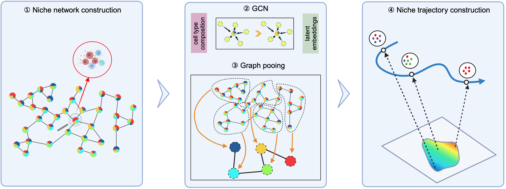
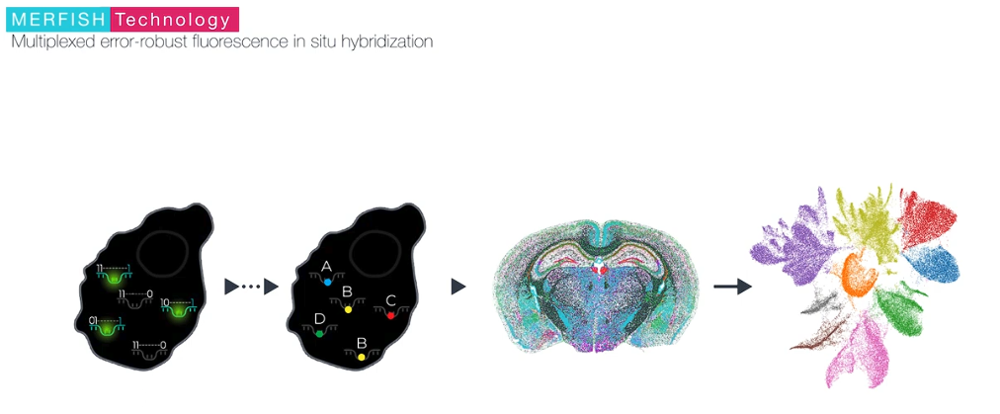
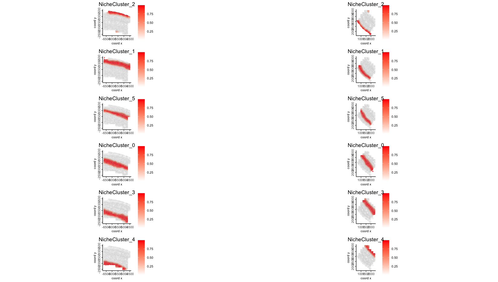
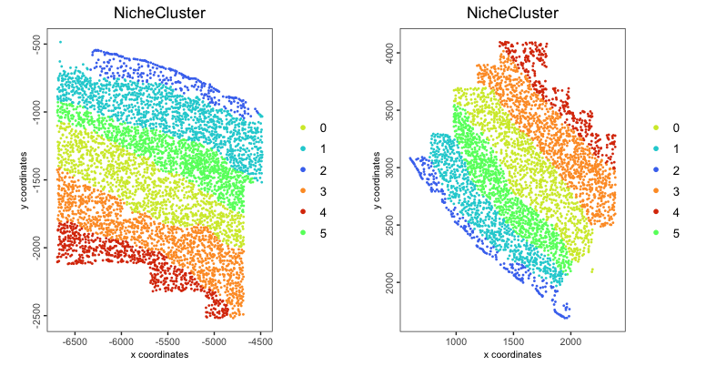
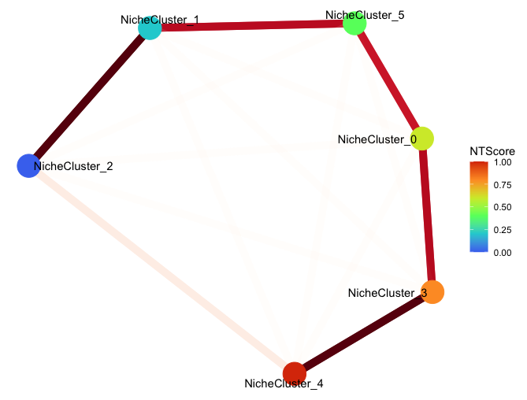
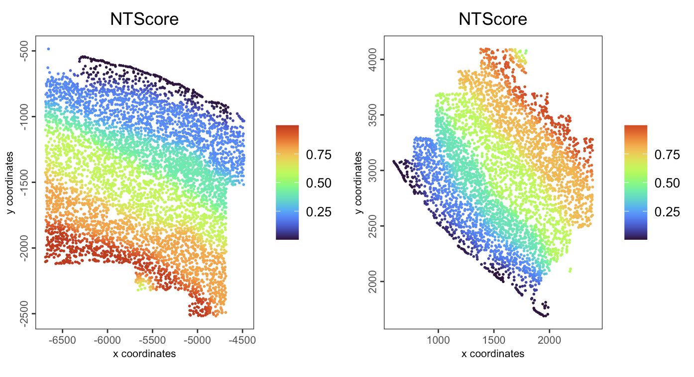
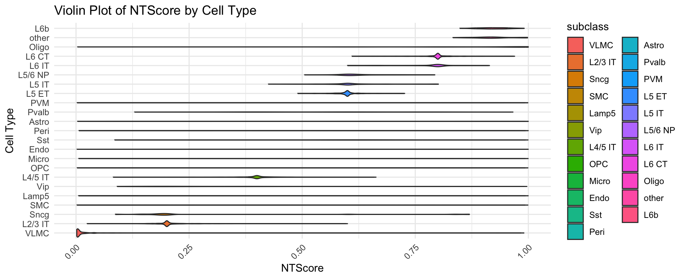
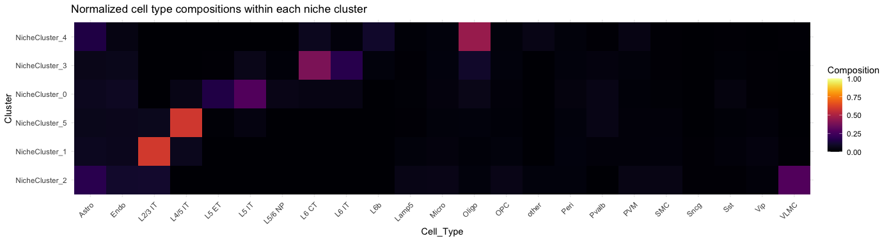

# Overview of ONTraC

ONTraC (Ordered Niche Trajectory Construction) is a niche-centered, machine learning
method for constructing spatially continuous trajectories. ONTraC differs from existing tools in that it treats a niche, rather than an individual cell, as the basic unit for spatial trajectory analysis. In this context, we define niche as a multicellular, spatially localized region where different cell types may coexist and interact with each other.  ONTraC seamlessly integrates cell-type composition and spatial information by using the graph neural network modeling framework. Its output, which is called the niche trajectory, can be viewed as a one dimensional representation of the tissue microenvironment continuum. By disentangling cell-level and niche-level properties, niche trajectory analysis provides a coherent framework to study coordinated responses from all the cells in association with continuous tissue microenvironment variations.

```{r, echo=FALSE, out.width="80%", fig.align="center"}

```

[ONTraC paper](https://www.biorxiv.org/content/10.1101/2024.04.23.590827v1)

[ONTraC GitHub repository](https://github.com/gyuanlab/ONTraC)

# Dataset Description

In this tutorial, we ues a MERFISH mouse motor cortex dataset comprising 61 tissue sections and containing approximately 280,000 cells characterised by a 258-gene panel. The study identified 3 classes of cells, glutamatergic, GABAergic and non-neuronal cell groups, and further clustered into 23 annotated plus 1 other subclass-level cell types.

```{r, echo=FALSE, out.width="100%", fig.align="center"}
knitr::include_graphics("images/ontrac/0-Dataset.png")
```

MERFISH is a massively multiplexed single-molecule imaging technology for spatially resolved transcriptomics capable of simultaneously measuring the copy number and spatial distribution of hundreds to tens of thousands of RNA species in individual cells. For further information, please visit the official [website](https://vizgen.com/technology/#merfish).

```{r, echo=FALSE, out.width="100%", fig.align="center"}

```

# Pre-settings

```{r, eval=FALSE}
python_path <- "giotto_ontrac_env"
env_name <- "giotto_ontrac_env"
```

## Giotto Installation

We need `R>=4.4` for this tutorial.

- Install Giotto

Please following the [Giotto Installation Tutorial](installation.html).

## ONTraC Installation

Since ONTraC is a GNN algorithm that relies on [pytorch-geometric](https://pytorch-geometric.readthedocs.io/en/latest/), we create a new environment here in order not to interfere with other software using `installGiottoONTraCEnvironment()`.

```{r, eval=FALSE}
library(Giotto)
installGiottoONTraCEnvironment(envname = env_name)
```

You can also update/re-install ONTraC in a specific env.

```{r, eval=FALSE}
reticulate::conda_install(envname = env_name,
                          packages = 'ontrac',
                          pip = TRUE)
```

## Configuring Data and Results Paths

```{r, eval=FALSE}
options(timeout=Inf) # In case of network interrupt

data_path <- "/path/to/data"
dir.create(data_path, recursive=T)

results_folder <- "/path/to/results"
dir.create(results_folder, recursive=T)
```

# Downloading Dataset

The MERFISH mouse motor cortex data to run this tutorial can be found [here](https://doi.brainimagelibrary.org/doi/10.35077/g.21)

You need to download the processed expression, metadata, and cell segmentation information by running these commands:

Note 1: there are 61 slices here, we run on two of them to save the time.
Note 2: due to the instability of network, download processing may be interrupt.

We recommend to download these data in advance or download the processing giotto object from [Zenodo](https://zenodo.org/records/13713948).

```{r, eval = FALSE}
download.file(url = "https://download.brainimagelibrary.org/cf/1c/cf1c1a431ef8d021/processed_data/counts.h5ad",
              destfile = file.path(data_path,"counts.h5ad"))

download.file(url = "https://download.brainimagelibrary.org/cf/1c/cf1c1a431ef8d021/processed_data/cell_labels.csv",
              destfile = file.path(data_path,"cell_labels.csv"))

download.file(url = "https://download.brainimagelibrary.org/cf/1c/cf1c1a431ef8d021/processed_data/segmented_cells_mouse2sample1.csv",
              destfile = file.path(data_path,"segmented_cells_mouse2sample1.csv"))

download.file(url = "https://download.brainimagelibrary.org/cf/1c/cf1c1a431ef8d021/processed_data/segmented_cells_mouse2sample6.csv",
              destfile = file.path(data_path,"segmented_cells_mouse2sample6.csv"))
```

# Data Analysis

## Creating the Giotto Object

There are two options for creating the giotto object.
Option 1 is create the giotto object step by step.
Option 2 is load the pre-constructed giotto object from [Zenodo](https://zenodo.org/records/13713948).

### Option 1

```{r, eval=FALSE}
library(Giotto)
set_giotto_python_path(python_path = python_path)

## Install the anndata and scanpy package since the counts matrix was stored in h5ad format. We need it to convert an anndata object to giotto object.
reticulate::conda_install(envname = env_name, packages = c('scanpy'), pip = TRUE)

## Create Giotto object from expression counts. This file contains 61 slices here.
giotto_all_slices_obj <- anndataToGiotto(file.path(data_path, "counts.h5ad"), python_path = python_path)

## Load meta_data
meta_df <- read.csv(file.path(data_path, "cell_labels.csv"),
                    colClasses = "character") # as the cell IDs are 30 digit numbers, set the type as character to avoid the limitation of R in handling larger integers
colnames(meta_df)[[1]] <- "cell_ID"

### We use two slices here to speed up
slice1_cells <- meta_df[meta_df$slice_id == "mouse2_slice229",]$cell_ID
slice2_cells <- meta_df[meta_df$slice_id == "mouse2_slice300",]$cell_ID
selected_cells <- c(slice1_cells, slice2_cells)

## Subset giotto obj by cell ID
giotto_slice1_obj <- subsetGiotto(gobject = giotto_all_slices_obj,
                                  cell_ids = slice1_cells)

giotto_slice2_obj <- subsetGiotto(gobject = giotto_all_slices_obj,
                                  cell_ids = slice2_cells)

## Add cell metadata
giotto_slice1_obj <- addCellMetadata(gobject = giotto_slice1_obj,
                                     new_metadata = meta_df,
                                     by_column = TRUE,
                                     column_cell_ID = 'cell_ID')

giotto_slice2_obj <- addCellMetadata(gobject = giotto_slice2_obj,
                                     new_metadata = meta_df,
                                     by_column = TRUE,
                                     column_cell_ID = 'cell_ID')

## Cell segmentation. Calculate center (median of vertices) of each cell.
segments_1_df <- read.csv(file.path(data_path, "segmented_cells_mouse2sample1.csv"), 
                          row.names=1, colClasses = "character") # as the cell IDs are 30 digit numbers, set the type as character to avoid the limitation of R in handling larger integers

segments_2_df <- read.csv(file.path(data_path, "segmented_cells_mouse2sample6.csv"), 
                          row.names=1, colClasses = "character") # as the cell IDs are 30 digit numbers, set the type as character to avoid the limitation of R in handling larger integers

segments_df <- rbind(segments_1_df, segments_2_df)

loc.use <- segments_df[selected_cells,]
loc.x <- grep("boundaryX_",colnames(loc.use),value = T)
loc.y <- grep("boundaryY_",colnames(loc.use),value = T)

centr.x <- apply(loc.use[,loc.x],1,function(x){
  temp <- lapply(x,function(y){
    as.numeric(unlist(strsplit(y,", ")))
  })
  return (median(unname(unlist(temp))))
})

centr.y <- apply(loc.use[,loc.y],1,function(x){
  temp <- lapply(x,function(y){
    as.numeric(unlist(strsplit(y,", ")))
  })
  return (median(unname(unlist(temp))))
})

## create spatial locations object
spatial_locs_df <- data.frame(cell_ID = selected_cells,
                              sdimx = centr.x,
                              sdimy = centr.y)

spatial_locs_slice1_df <- spatial_locs_df[slice1_cells,]
spatial_locs_slice2_df <- spatial_locs_df[slice2_cells,]

spat_locs_slice1_obj <- readSpatLocsData(data_list = spatial_locs_slice1_df)
spat_locs_slice2_obj <- readSpatLocsData(data_list = spatial_locs_slice2_df)

## add spatial location info
giotto_slice1_obj <- setSpatialLocations(gobject = giotto_slice1_obj,
                                         x = spat_locs_slice1_obj)

giotto_slice2_obj <- setSpatialLocations(gobject = giotto_slice2_obj,
                                         x = spat_locs_slice2_obj)

## merge two giotto objects together
giotto_obj <- joinGiottoObjects(gobject_list = list(giotto_slice1_obj,
                                                    giotto_slice2_obj),
                               gobject_names = c("mouse2_slice229",
                                                 "mouse2_slice300"),  # name for each samples
                               join_method = "z_stack")

## save giotto obj
# saveGiotto
saveGiotto(gobject = giotto_obj, foldername = "gobject", dir=results_folder)
```

### Option 2

If you facing network issue when downloading the raw dataset. Please download the processing giotto obj from [Zenodo](https://zenodo.org/records/13713948), unzip and move it to `results` folder.

```{r, eval=FALSE}
library(Giotto)

set_giotto_python_path(python_path = python_path)
giotto_obj <- loadGiotto(path_to_folder = file.path(results_folder, "gobject"), python_path = python_path)
```

## Spatial distribution of cell type

```{r, eval=FALSE}
spatPlot2D(giotto_obj,
           group_by = "slice_id",
           cell_color = "subclass",
           point_size = 1,
           point_border_stroke = NA,
           legend_text = 6)
```

```{r, echo=FALSE, out.width="100%", fig.align="center"}
knitr::include_graphics("images/ontrac/1-spatialCellTypeDis.png")
```

## Generate input file for ONTraC

```{r, eval = FALSE}
# We skip the processing process here to save time and use the given cell type
# annotation directly
ONTraC_input <- getONTraCv1Input(gobject = giotto_obj,
                                 cell_type = "subclass",
                                 output_path = results_folder,
                                 spat_unit = "cell",
                                 feat_type = "rna",
                                 verbose = TRUE)
```

```{r, eval = FALSE}
head(ONTraC_input)
```

```{r, eval = FALSE}
#   Cell_ID                                                     Sample          x           y           Cell_Type          
#   <chr>                                                       <chr>           <dbl>       <dbl>       <chr>
#   mouse2_slice229-100101435705986292663283283043431511315     mouse2_slice229	-4828.728	-2203.4502	L6 CT
#   mouse2_slice229-100104370212612969023746137269354247741     mouse2_slice229	-5405.400	-995.6467	OPC
#   mouse2_slice229-100128078183217482733448056590230529739     mouse2_slice229	-5731.403	-1071.1735	L2/3 IT
#   mouse2_slice229-100209662400867003194056898065587980841     mouse2_slice229	-5468.113	-1286.2465	Oligo
#   mouse2_slice229-100218038012295593766653119076639444055     mouse2_slice229	-6399.986	-959.7440	L2/3 IT
#   mouse2_slice229-100252992997994275968450436343196667192     mouse2_slice229	-6637.847	-1659.6237	Astro

```

## Perform spatial niche trajectory analysis using ONTraC

### Option 1: run ONTraC through Giotto

```{r, eval = FALSE}
runONTraCV1(ONTraC_input = ONTraC_input,
       dataset = file.path(results_folder, "ONTraC_dataset_input.csv"),
       preprocessing_dir = file.path(results_folder, "preprocessing_dir"),
       GNN_dir = file.path(results_folder, "GNN_dir"),
       NTScore_dir = file.path(results_folder, "NTScore_dir"),
       n_neighbors = 50L,
       n_local = 20L,
       device = "cpu",
       seed = 42L,
       k = 6L,
       modularity_loss_weight = 0.3,
       purity_loss_weight = 300.0,
       regularization_loss_weight = 0.3,
       beta = 0.03,
       python_path = python_path)
```

### Option 2: run ONTraC in a separate machine

You can run ONTraC on an HPC with an NVIDIA GPU node, which would save a lot of time when applying it on larger datasets.

- Install ONTraC.

```{bash, eval = FALSE}
source ~/.bash_profile

conda create -y -n ONTraC python=3.11

conda activate ONTraC

pip install ONTraC
```

- Copy the input file to that machine and running ONTraC.

```{bash, eval = FALSE}
source ~/.bash_profile

conda activate ONTraC

ONTraC -d /path/to/results/ONTraC_dataset_input.csv --preprocessing-dir /path/to/results/preprocessing_dir --GNN-dir /path/to/results/GNN_dir --NTScore-dir /path/to/results/NTScore_dir --device cuda --epochs 1000 -s 42 --patience 100 --min-delta 0.001 --min-epochs 50 --lr 0.03 --hidden-feats 4 -k 6 --modularity-loss-weight 0.3 --purity-loss-weight 300 --regularization-loss-weight 0.3 --beta 0.03 2>&1 | tee /path/to/results/merfish_subset.log
```

- Copy the output directories (`/path/to/results/preprocessing_dir`, `/path/to/results/GNN_dir`, and `/path/to/results/NTScore_dir`) back to the machine running Giotto.

- For details, please refer [ONTraC's website](https://github.com/gyuanlab/ONTraC).

# Visualization

## Load ONTraC results

```{r, eval = FALSE}
giotto_obj <- loadOntraCResults(gobject = giotto_obj,
                                ontrac_results_dir = results_folder,
                                NTScore_reverse = TRUE # whether to reverse the NTScore (direction of the trajectory)
                                )
```

This function will look for the `preprocessing_dir`, `GNN_dir`, and `NTScore_dir` under the `results_folder` automatically.

The NTScore and binarized niche cluster info were stored in cell metadata as below:

```{r, eval = FALSE}
head(pDataDT(giotto_obj, spat_unit = "cell", feat_type = "rna"))
```

```{r, eval = FALSE}
#                                                       cell_ID      sample_id        slice_id    class_label subclass   label           list_ID  NTScore   niche cluster
#                                                        <char>         <char>          <char>         <char>   <char>  <char>            <char>  <dbl>     <fctr>
#   1:  mouse2_slice229-100101435705986292663283283043431511315	mouse2_sample6	mouse2_slice229	Glutamatergic	L6 CT    L6_CT_5   mouse2_slice229  0.2002081 NicheCluster_3
#   2:  mouse2_slice229-100104370212612969023746137269354247741	mouse2_sample6	mouse2_slice229	Other	        OPC      OPC       mouse2_slice229  0.7999791 NicheCluster_1
#   3:  mouse2_slice229-100128078183217482733448056590230529739	mouse2_sample6	mouse2_slice229	Glutamatergic	L2/3 IT	 L23_IT_4  mouse2_slice229  0.7662198 NicheCluster_1
#   4:  mouse2_slice229-100209662400867003194056898065587980841	mouse2_sample6	mouse2_slice229	Other	        Oligo    Oligo_1   mouse2_slice229  0.6010420 NicheCluster_5
#   5:  mouse2_slice229-100218038012295593766653119076639444055	mouse2_sample6	mouse2_slice229	Glutamatergic	L2/3 IT	 L23_IT_4  mouse2_slice229  0.7132024 NicheCluster_1
#   6:  mouse2_slice229-100252992997994275968450436343196667192	mouse2_sample6	mouse2_slice229	Other	        Astro    Astro_2   mouse2_slice229  0.1980136 NicheCluster_3
```

The 1) probability matrix of each cell assigned to each niche cluster and
2) connectivity between niche cluster were stored as additional matrix here:

```{r, eval=FALSE}
GiottoClass::list_expression(giotto_obj)
```

```{r, eval = FALSE}
#        spat_unit     feat_type       name
#           <char>        <char>     <char>
# 1:          cell           rna        raw
# 2:          cell niche cluster       prob
# 3: niche cluster  connectivity normalized
```

## Niche cluster probability distribution

```{r, eval = FALSE}
plotSpatNicheClusterProb(gobject = giotto_obj,
                         group_by = "list_ID",
                         gradient_limits = c(0, 1),
                         point_border_col = "gray",
                         show_plot = T)
```

```{r, echo=FALSE, out.width="60%", fig.align="center"}

```

## Binarized niche cluster for each cell

```{r, eval = FALSE}
plotSpatNicheClusterBin(gobject = giotto_obj,
                        group_by = "list_ID",
                        point_size = 1,
                        point_border_stroke = NA,
                        show_plot = TRUE)
```

```{r, echo=FALSE, out.width="80%", fig.align="center"}

```

## Niche cluster spatial connectivity

```{r, eval=FALSE}
set.seed(42)  # fix the node positions

plotNicheClusterConnectivity(gobject = giotto_obj,
                             show_plot = TRUE)
```

```{r, echo=FALSE, out.width="60%", fig.align="center"}

```

## NT (niche trajectory) score

```{r, eval=FALSE}
spatPlot2D(gobject = giotto_obj, 
           spat_unit = "cell",
           feat_type = "rna",
           group_by = "list_ID",
           cell_color = "NTScore",
           color_as_factor = FALSE,
           cell_color_gradient = "turbo",
           point_size = 1,
           point_border_stroke = NA,
           show_plot = TRUE
)
```

```{r, echo=FALSE, out.width="80%", fig.align="center"}

```

```{r, eval=FALSE}
plotCellTypeNTScore(gobject = giotto_obj,
                    cell_type = "subclass",
                    values = "NTScore",
                    spat_unit = "cell",
                    feat_type = "rna",
                    show_plot = TRUE)
```

```{r, echo=FALSE, out.width="80%", fig.align="center"}

```

## Cell type composition within niche cluster

```{r, eval=FALSE}
plotCTCompositionInNicheCluster(gobject = giotto_obj,
                                cell_type = "subclass",
                                normalization = "by_niche_cluster",
                                show_plot = TRUE
                                )
```

```{r, echo=FALSE, out.width="80%", fig.align="center"}

```

We can also normalized by cell type.

```{r, eval=FALSE}
plotCTCompositionInNicheCluster(gobject = giotto_obj,
                                cell_type = "subclass",
                                normalization = "by_cell_type",
                                show_plot = TRUE
                                )
```

```{r, echo=FALSE, out.width="80%", fig.align="center"}

```

# Session info

```{r, eval=FALSE}
sessionInfo()
```

```{r, eval=FALSE}
# R version 4.4.0 (2024-04-24)
# Platform: aarch64-apple-darwin20
# Running under: macOS Ventura 13.6.6
# 
# Matrix products: default
# BLAS:   /System/Library/Frameworks/Accelerate.framework/Versions/A/Frameworks/vecLib.framework/Versions/A/libBLAS.dylib 
# LAPACK: /Library/Frameworks/R.framework/Versions/4.4-arm64/Resources/lib/libRlapack.dylib;  LAPACK version 3.12.0
# 
# locale:
# [1] en_US.UTF-8/en_US.UTF-8/en_US.UTF-8/C/en_US.UTF-8/en_US.UTF-8
# 
# time zone: America/New_York
# tzcode source: internal
# 
# attached base packages:
# [1] stats     graphics  grDevices utils     datasets  methods   base     
# 
# other attached packages:
# [1] ggraph_2.2.1.9000 ggplot2_3.5.1     Giotto_4.1.3      GiottoClass_0.4.0
# 
# loaded via a namespace (and not attached):
#  [1] gtable_0.3.5        xfun_0.44           htmlwidgets_1.6.4   ggrepel_0.9.5      
#  [5] lattice_0.22-6      vctrs_0.6.5         tools_4.4.0         generics_0.1.3     
#  [9] parallel_4.4.0      tibble_3.2.1        fansi_1.0.6         colorRamp2_0.1.0   
# [13] pkgconfig_2.0.3     R.oo_1.26.0         Matrix_1.7-0        data.table_1.15.4  
# [17] checkmate_2.3.2     RColorBrewer_1.1-3  lifecycle_1.0.4     compiler_4.4.0     
# [21] farver_2.1.2        deldir_2.0-4        GiottoUtils_0.1.12  munsell_0.5.1      
# [25] ggforce_0.4.2       terra_1.7-78        graphlayouts_1.1.1  codetools_0.2-20   
# [29] scattermore_1.2     htmltools_0.5.8.1   yaml_2.3.8          lazyeval_0.2.2     
# [33] plotly_4.10.4       pillar_1.9.0        tidyr_1.3.1         MASS_7.3-60.2      
# [37] R.utils_2.12.3      cachem_1.1.0        dbscan_1.2-0        viridis_0.6.5      
# [41] magick_2.8.4        gtools_3.9.5        tidyselect_1.2.1    digest_0.6.35      
# [45] dplyr_1.1.4         purrr_1.0.2         labeling_0.4.3      polyclip_1.10-6    
# [49] cowplot_1.1.3       fastmap_1.2.0       grid_4.4.0          colorspace_2.1-0   
# [53] cli_3.6.3           magrittr_2.0.3      tidygraph_1.3.1     utf8_1.2.4         
# [57] withr_3.0.1         scales_1.3.0        backports_1.5.0     sp_2.1-4           
# [61] rmarkdown_2.27      httr_1.4.7          matrixStats_1.3.0   igraph_2.0.3       
# [65] gridExtra_2.3       reticulate_1.38.0   GiottoVisuals_0.2.5 png_0.1-8          
# [69] R.methodsS3_1.8.2   memoise_2.0.1       evaluate_0.24.0     knitr_1.47         
# [73] viridisLite_0.4.2   rlang_1.1.4         Rcpp_1.0.13         glue_1.7.0         
# [77] tweenr_2.0.3        rstudioapi_0.16.0   jsonlite_1.8.8      R6_2.5.1    
```
