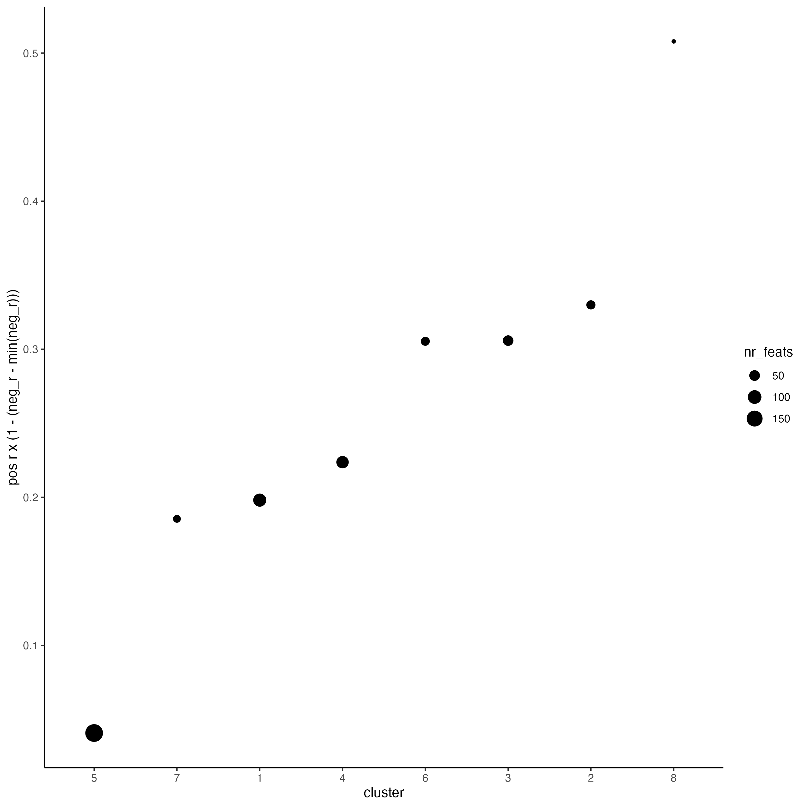

# Start Giotto

```{r, eval=FALSE}
# Ensure Giotto Suite is installed.
if (!"Giotto" %in% installed.packages()) {
    pak::pkg_install("drieslab/Giotto")
}

# Ensure GiottoData, a small, helper module for tutorials, is installed.
if (!"GiottoData" %in% installed.packages()) {
    pak::pkg_install("drieslab/GiottoData")
}

# Ensure the Python environment for Giotto has been installed.
genv_exists <- Giotto::checkGiottoEnvironment()
if (!genv_exists) {
    # The following command need only be run once to install the Giotto environment.
    Giotto::installGiottoEnvironment()
}
```


# Dataset Explanation

Several fields - containing 100's of cells - in the mouse cortex and subventricular zone were imaged for seqFISH+. The coordinates of the cells within each field are independent of each other, so in order to visualize and process all cells together imaging fields will be stitched together by providing x and y-offset values specific to each field.

These offset values are known or estimates based on the original raw
image:


# Download Data

```{r, eval=FALSE}
library(Giotto)

data_path <- "/path/to/data/"

GiottoData::getSpatialDataset(dataset = "seqfish_SS_cortex", 
                              directory = data_path, 
                              method = "wget")
```

# Giotto Instructions and Preparation

```{r, eval=FALSE}
#  set Giotto instructions
results_folder <- "/path/to/results/"

instructions <- createGiottoInstructions(
    save_plot = TRUE,
    show_plot = FALSE,
    return_plot = FALSE,
    save_dir = results_folder,
    python_path = NULL
)

# create giotto object from provided paths ####
expr_path <- paste0(data_path, "cortex_svz_expression.txt")
loc_path <- paste0(data_path, "cortex_svz_centroids_coord.txt")
meta_path <- paste0(data_path, "cortex_svz_centroids_annot.txt")

# This dataset contains multiple field of views which need to be stitched together
# first merge location and additional metadata
SS_locations <- data.table::fread(loc_path)
cortex_fields <- data.table::fread(meta_path)
SS_loc_annot <- data.table::merge.data.table(SS_locations, 
                                             cortex_fields, 
                                             by = "ID")
SS_loc_annot[, ID := factor(ID, levels = paste0("cell_", 1:913))]
data.table::setorder(SS_loc_annot, ID)

# create file with offset information
my_offset_file <- data.table::data.table(
    field = c(0, 1, 2, 3, 4, 5, 6),
    x_offset = c(0, 1654.97, 1750.75, 1674.35, 675.5, 2048, 675),
    y_offset = c(0, 0, 0, 0, -1438.02, -1438.02, 0)
)

# create a stitch file
stitch_file <- stitchFieldCoordinates(
    location_file = SS_loc_annot,
    offset_file = my_offset_file,
    cumulate_offset_x = TRUE,
    cumulate_offset_y = FALSE,
    field_col = "FOV",
    reverse_final_x = FALSE,
    reverse_final_y = TRUE
)

stitch_file <- stitch_file[, .(ID, X_final, Y_final)]
stitch_file$ID <- as.character(stitch_file$ID)
my_offset_file <- my_offset_file[, .(field, x_offset_final, y_offset_final)]
```

# Create Giotto object & process data

```{r, eval=FALSE}
# create Giotto object
SS_seqfish <- createGiottoObject(expression = expr_path,
                                 spatial_locs = stitch_file,
                                 offset_file = my_offset_file,
                                 instructions = instructions
)

# add additional annotation if wanted
SS_seqfish <- addCellMetadata(SS_seqfish,
                              new_metadata = cortex_fields,
                              by_column = TRUE,
                              column_cell_ID = "ID"
)

# subset data to the cortex field of views
cell_metadata <- pDataDT(SS_seqfish)
cortex_cell_ids <- cell_metadata[FOV %in% 0:4]$cell_ID
SS_seqfish <- subsetGiotto(SS_seqfish, cell_ids = cortex_cell_ids)

# filter
SS_seqfish <- filterGiotto(gobject = SS_seqfish,
                           expression_threshold = 1,
                           feat_det_in_min_cells = 10,
                           min_det_feats_per_cell = 10,
                           expression_values = "raw",
                           verbose = TRUE
)

# normalize
SS_seqfish <- normalizeGiotto(gobject = SS_seqfish, 
                              scalefactor = 6000, 
                              verbose = TRUE)

# add gene & cell statistics
SS_seqfish <- addStatistics(gobject = SS_seqfish)

# adjust expression matrix for technical or known variables
SS_seqfish <- adjustGiottoMatrix(gobject = SS_seqfish, 
                                 expression_values = "normalized",
                                 covariate_columns = c("nr_feats", "total_expr"),
                                 return_gobject = TRUE,
                                 update_slot = "custom"
)

# visualize
spatPlot(gobject = SS_seqfish)
```


# Dimension Reduction

```{r, eval=FALSE}
## highly variable features (HVF)
SS_seqfish <- calculateHVF(gobject = SS_seqfish,
                           save_plot = TRUE)
```


```{r, eval=FALSE}
## select genes based on highly variable features and gene statistics, both found in feature (gene) metadata
gene_metadata <- fDataDT(SS_seqfish)
featgenes <- gene_metadata[hvf == "yes" & perc_cells > 4 & mean_expr_det > 0.5]$feat_ID

## run PCA on expression values (default)
SS_seqfish <- runPCA(gobject = SS_seqfish, 
                     genes_to_use = featgenes, 
                     scale_unit = FALSE, 
                     center = FALSE)

screePlot(SS_seqfish)
```


```{r, eval=FALSE}
plotPCA(gobject = SS_seqfish)
```


```{r, eval=FALSE}
SS_seqfish <- runUMAP(SS_seqfish, 
                      dimensions_to_use = 1:15, 
                      n_threads = 10)

plotUMAP(gobject = SS_seqfish)
```


```{r, eval=FALSE}
SS_seqfish <- runtSNE(SS_seqfish, 
                      dimensions_to_use = 1:15)

plotTSNE(gobject = SS_seqfish)
```


# Cluster

```{r, eval=FALSE}
## sNN network (default)
SS_seqfish <- createNearestNetwork(gobject = SS_seqfish,
                                   dimensions_to_use = 1:15,
                                   k = 15
)

## Leiden clustering
SS_seqfish <- doLeidenCluster(gobject = SS_seqfish,
                              resolution = 0.4,
                              n_iterations = 1000
)

plotUMAP(gobject = SS_seqfish,
         cell_color = "leiden_clus",
         show_NN_network = TRUE,
         point_size = 2.5
)
```


```{r, eval=FALSE}
## Leiden subclustering for specified clusters
SS_seqfish <- doLeidenSubCluster(gobject = SS_seqfish,
                                 cluster_column = "leiden_clus",
                                 resolution = 0.2, 
                                 k_neighbors = 10,
                                 pca_param = list(expression_values = "normalized", 
                                                  scale_unit = FALSE),
                                 nn_param = list(dimensions_to_use = 1:5),
                                 selected_clusters = c(5, 6, 7),
                                 name = "sub_leiden_clus_select"
)

## set colors for clusters
subleiden_order <- c(
    1.1, 2.1, 3.1, 4.1, 5.1, 5.2,
    6.1, 6.2, 7.1, 7.2, 8.1, 9.1
)

giotto_colors <- getDistinctColors(length(subleiden_order))
names(giotto_colors) <- subleiden_order

plotUMAP(gobject = SS_seqfish,
         cell_color = "sub_leiden_clus_select", 
         cell_color_code = giotto_colors,
         show_NN_network = TRUE, 
         point_size = 2.5, 
         show_center_label = FALSE,
         legend_text = 12, 
         legend_symbol_size = 3
)
```


```{r, eval=FALSE}
## show cluster relationships
showClusterHeatmap(gobject = SS_seqfish, 
                   cluster_column = "sub_leiden_clus_select",
                   row_names_gp = grid::gpar(fontsize = 9), 
                   column_names_gp = grid::gpar(fontsize = 9)
)
```


The following step requires the installation of {ggdendro}.

```{r, eval=FALSE}
# install.packages('ggdendro')
library(ggdendro)
showClusterDendrogram(SS_seqfish, 
                      h = 0.5, 
                      rotate = TRUE, 
                      cluster_column = "sub_leiden_clus_select")
```


# Visualize Spatial and Expression Space

```{r, eval=FALSE}
# expression and spatial
spatDimPlot(gobject = SS_seqfish, 
            cell_color = "sub_leiden_clus_select",
            cell_color_code = giotto_colors,
            dim_point_size = 2, 
            spat_point_size = 2
)
```


```{r, eval=FALSE}
# selected groups and provide new colors
groups_of_interest <- c(6.1, 6.2, 7.1, 7.2)
group_colors <- c("red", "green", "blue", "purple")
names(group_colors) <- groups_of_interest

spatDimPlot(gobject = SS_seqfish, 
            cell_color = "sub_leiden_clus_select",
            dim_point_size = 2, 
            spat_point_size = 2,
            select_cell_groups = groups_of_interest, 
            cell_color_code = group_colors
)
```


# Cell Type Marker Gene Detection

```{r, eval=FALSE}
## gini
markers_gini <- findMarkers_one_vs_all(gobject = SS_seqfish,
                                       method = "gini",
                                       expression_values = "normalized",
                                       cluster_column = "sub_leiden_clus_select",
                                       min_feats = 20,
                                       min_expr_gini_score = 0.5,
                                       min_det_gini_score = 0.5
)

topgenes_gini <- markers_gini[, head(.SD, 2), by = "cluster"]

## violin plot
violinPlot(SS_seqfish,
           feats = unique(topgenes_gini$feats), 
           cluster_column = "sub_leiden_clus_select",
           strip_text = 8, 
           strip_position = "right", 
           cluster_custom_order = unique(topgenes_gini$cluster)
)
```


```{r, eval=FALSE}
# cluster heatmap
topgenes_gini <- markers_gini[, head(.SD, 6), by = "cluster"]

plotMetaDataHeatmap(SS_seqfish,
                    selected_feats = unique(topgenes_gini$feats),
                    custom_feat_order = unique(topgenes_gini$feats),
                    custom_cluster_order = unique(topgenes_gini$cluster),
                    metadata_cols = "sub_leiden_clus_select", 
                    x_text_size = 10, y_text_size = 10
)
```


# Cell Type Annotation

```{r, eval=FALSE}
## general cell types
## create vector with names
clusters_cell_types <- c("1.1" = "L4 eNeuron",
                         "2.1" = "L6 eNeuron",
                         "3.1" = "L5 eNeuron", 
                         "4.1" = "endothelial",
                         "5.1" = "Lhx6 iNeuron", 
                         "5.2" = "Adarb2 iNeuron",
                         "6.1" = "Olig",
                         "6.2" = "OPC",
                         "7.1" = "astrocytes",
                         "8.1" = "microglia"
)

SS_seqfish <- annotateGiotto(gobject = SS_seqfish, 
                             annotation_vector = clusters_cell_types,
                             cluster_column = "sub_leiden_clus_select",
                             name = "cell_types"
)

# cell type order and colors
cell_type_order <- c(
    "L4 eNeuron", "L5 eNeuron", "L6 eNeuron",
    "astrocytes", "Olig", "OPC", "Adarb2 iNeuron", "Lhx6 iNeuron",
    "endothelial", "microglia"
)

cell_type_colors <- giotto_colors
names(cell_type_colors) <- clusters_cell_types[names(giotto_colors)]
cell_type_colors <- cell_type_colors[cell_type_order]

## violin plot
violinPlot(gobject = SS_seqfish, 
           feats = unique(topgenes_gini$feats),
           strip_text = 7, 
           strip_position = "right",
           cluster_custom_order = cell_type_order,
           cluster_column = "cell_types", 
           color_violin = "cluster"
)
```


```{r, eval=FALSE}
# co-visualization
spatDimPlot(gobject = SS_seqfish, 
            cell_color = "cell_types",
            dim_point_size = 2, 
            spat_point_size = 2, 
            dim_show_cluster_center = FALSE,
            dim_show_center_label = TRUE
)
```


```{r, eval=FALSE}
## heatmap genes vs cells
markers_gini[, cell_types := clusters_cell_types[cluster]]
markers_gini[, cell_types := factor(cell_types, cell_type_order)]
data.table::setorder(markers_gini, cell_types)

plotHeatmap(gobject = SS_seqfish,
            feats = markers_gini[, head(.SD, 3), by = "cell_types"]$feats,
            feat_order = "custom",
            feat_custom_order = unique(markers_gini[, head(.SD, 3), by = "cluster"]$feats),
            cluster_column = "cell_types", cluster_order = "custom",
            cluster_custom_order = unique(markers_gini[, head(.SD, 3), by = "cell_types"]$cell_types),
            legend_nrows = 2
)
```


```{r, eval=FALSE}
plotHeatmap(gobject = SS_seqfish,
            feats = markers_gini[, head(.SD, 6), by = "cell_types"]$feats,
            feat_order = "custom",
            feat_label_selection = markers_gini[, head(.SD, 2), by = "cluster"]$feats,
            feat_custom_order = unique(markers_gini[, head(.SD, 6), by = "cluster"]$feats),
            cluster_column = "cell_types", cluster_order = "custom",
            cluster_custom_order = unique(markers_gini[, head(.SD, 3), by = "cell_types"]$cell_types),
            legend_nrows = 2
)
```


# Spatial Grid

```{r, eval=FALSE}
SS_seqfish <- createSpatialGrid(gobject = SS_seqfish,
                                sdimx_stepsize = 500,
                                sdimy_stepsize = 500,
                                minimum_padding = 50
)

spatPlot(gobject = SS_seqfish, 
         show_grid = TRUE, 
         point_size = 1.5)
```


# Spatial Network

```{r, eval=FALSE}
## delaunay network: stats + creation
plotStatDelaunayNetwork(gobject = SS_seqfish, 
                        maximum_distance = 400)
```


```{r, eval=FALSE}
SS_seqfish <- createSpatialNetwork(gobject = SS_seqfish,
                                   minimum_k = 2, 
                                   maximum_distance_delaunay = 400)

## create spatial networks based on k and/or distance from centroid
SS_seqfish <- createSpatialNetwork(gobject = SS_seqfish, 
                                   method = "kNN", 
                                   k = 5, 
                                   name = "spatial_network")

SS_seqfish <- createSpatialNetwork(gobject = SS_seqfish, 
                                   method = "kNN", 
                                   k = 10, 
                                   name = "large_network")

SS_seqfish <- createSpatialNetwork(gobject = SS_seqfish, 
                                   method = "kNN", 
                                   k = 100,
                                   maximum_distance_knn = 200, 
                                   minimum_k = 2, 
                                   name = "distance_network"
)

## visualize different spatial networks on first field (~ layer 1)
cell_metadata <- pDataDT(SS_seqfish)
field1_ids <- cell_metadata[FOV == 0]$cell_ID

subSS_seqfish <- subsetGiotto(SS_seqfish, 
                              cell_ids = field1_ids)

spatPlot(gobject = subSS_seqfish, 
         show_network = TRUE,
         network_color = "blue", 
         spatial_network_name = "Delaunay_network",
         point_size = 2.5, 
         cell_color = "cell_types"
)
```


```{r, eval=FALSE}
spatPlot(gobject = subSS_seqfish, 
         show_network = TRUE,
         network_color = "blue", 
         spatial_network_name = "spatial_network",
         point_size = 2.5, 
         cell_color = "cell_types"
)
```


```{r, eval=FALSE}
spatPlot(gobject = subSS_seqfish, 
         show_network = TRUE,
         network_color = "blue", 
         spatial_network_name = "large_network",
         point_size = 2.5, 
         cell_color = "cell_types"
)
```


```{r, eval=FALSE}
spatPlot(gobject = subSS_seqfish, 
         show_network = TRUE,
         network_color = "blue", 
         spatial_network_name = "distance_network",
         point_size = 2.5, 
         cell_color = "cell_types"
)
```


# Spatial Genes

## Individual spatial genes


```{r, eval=FALSE}
## identify spatial genes
km_spatialfeats <- binSpect(SS_seqfish)

spatFeatPlot2D(SS_seqfish,
               expression_values = "scaled", 
               feats = km_spatialfeats[1:4]$feats,
               point_shape = "border", 
               point_border_stroke = 0.1,
               show_network = FALSE, 
               network_color = "lightgrey", 
               point_size = 2.5,
               cow_n_col = 2
)
```


## Spatial Genes Co-Expression Modules

```{r, eval=FALSE}
## spatial co-expression patterns ##
ext_spatial_genes <- km_spatialfeats[1:500]$feats

## 1. calculate gene spatial correlation and single-cell correlation
## create spatial correlation object
spat_cor_netw_DT <- detectSpatialCorFeats(SS_seqfish,
                                          method = "network",
                                          spatial_network_name = "Delaunay_network",
                                          subset_feats = ext_spatial_genes
)

## 2. cluster correlated genes & visualize
spat_cor_netw_DT <- clusterSpatialCorFeats(spat_cor_netw_DT,
                                           name = "spat_netw_clus",
                                           k = 8
)

heatmSpatialCorFeats(SS_seqfish,
                     spatCorObject = spat_cor_netw_DT, 
                     use_clus_name = "spat_netw_clus",
                     heatmap_legend_param = list(title = NULL)
)
```


```{r, eval=FALSE}
# 3. rank spatial correlated clusters and show genes for selected clusters
netw_ranks <- rankSpatialCorGroups(SS_seqfish,
                                   spatCorObject = spat_cor_netw_DT,
                                   use_clus_name = "spat_netw_clus"
)

top_netw_spat_cluster <- showSpatialCorFeats(spat_cor_netw_DT,
                                             use_clus_name = "spat_netw_clus",
                                             selected_clusters = 6,
                                             show_top_feats = 1
)
```



```{r, eval=FALSE}
# 4. create metagene enrichment score for clusters
cluster_genes_DT <- showSpatialCorFeats(spat_cor_netw_DT,
                                        use_clus_name = "spat_netw_clus",
                                        show_top_feats = 1
)

cluster_genes <- cluster_genes_DT$clus
names(cluster_genes) <- cluster_genes_DT$feat_ID

SS_seqfish <- createMetafeats(SS_seqfish,
                              feat_clusters = cluster_genes,
                              name = "cluster_metagene"
)

spatCellPlot(SS_seqfish,
             spat_enr_names = "cluster_metagene",
             cell_annotation_values = netw_ranks$clusters,
             point_size = 1.5, 
             cow_n_col = 3
)
```


# HMRF Spatial Domains

```{r, eval=FALSE}
hmrf_folder <- paste0(results_folder, "/11_HMRF/")

if (!file.exists(hmrf_folder)) dir.create(hmrf_folder, recursive = TRUE)

my_spatial_genes <- km_spatialfeats[1:100]$feats

# do HMRF with different betas
HMRF_spatial_genes <- doHMRF(
    gobject = SS_seqfish,
    expression_values = "scaled",
    spatial_genes = my_spatial_genes,
    spatial_network_name = "Delaunay_network",
    k = 9,
    betas = c(28, 2, 3),
    output_folder = paste0(hmrf_folder, "/Spatial_genes/SG_top100_k9_scaled")
)

## view results of HMRF
for (i in seq(28, 32, by = 2)) {
    viewHMRFresults2D(
        gobject = SS_seqfish,
        HMRFoutput = HMRF_spatial_genes,
        k = 9, 
        betas_to_view = i,
        point_size = 2
    )
}

## add HMRF of interest to giotto object
SS_seqfish <- addHMRF(
    gobject = SS_seqfish,
    HMRFoutput = HMRF_spatial_genes,
    k = 9, 
    betas_to_add = c(28),
    hmrf_name = "HMRF_2"
)

## visualize
spatPlot(
    gobject = SS_seqfish,
    cell_color = "HMRF_2_k9_b.28",
    point_size = 3,
    coord_fix_ratio = 1
)
```


# Cell Neighborhood: Cell-Type/Cell-Type Interactions

```{r, eval=FALSE}
cell_proximities <- cellProximityEnrichment(gobject = SS_seqfish,
                                            cluster_column = "cell_types",
                                            spatial_network_name = "Delaunay_network",
                                            adjust_method = "fdr",
                                            number_of_simulations = 2000
)

## barplot
cellProximityBarplot(gobject = SS_seqfish,
                     CPscore = cell_proximities,
                     min_orig_ints = 5, 
                     min_sim_ints = 5
)
```


```{r, eval=FALSE}
## heatmap
cellProximityHeatmap(gobject = SS_seqfish,
                     CPscore = cell_proximities,
                     order_cell_types = TRUE, 
                     scale = TRUE,
                     color_breaks = c(-1.5, 0, 1.5),
                     color_names = c("blue", "white", "red")
)
```


```{r, eval=FALSE}
## network
cellProximityNetwork(gobject = SS_seqfish,
                     CPscore = cell_proximities, 
                     remove_self_edges = TRUE,
                     only_show_enrichment_edges = TRUE
)
```


```{r, eval=FALSE}
## network with self-edges
cellProximityNetwork(gobject = SS_seqfish, 
                     CPscore = cell_proximities,
                     remove_self_edges = FALSE, 
                     self_loop_strength = 0.3,
                     only_show_enrichment_edges = FALSE,
                     rescale_edge_weights = TRUE,
                     node_size = 8,
                     edge_weight_range_depletion = c(1, 2),
                     edge_weight_range_enrichment = c(2, 5)
)
```


```{r, eval=FALSE}
## visualization of specific cell types
# Option 1
spec_interaction <- "astrocytes--Olig"

cellProximitySpatPlot2D(gobject = SS_seqfish,
                        interaction_name = spec_interaction,
                        show_network = TRUE,
                        cluster_column = "cell_types",
                        cell_color = "cell_types",
                        cell_color_code = c(astrocytes = "lightblue", Olig = "red"),
                        point_size_select = 4, 
                        point_size_other = 2
)
```


```{r, eval=FALSE}
# Option 2: create additional metadata
SS_seqfish <- addCellIntMetadata(SS_seqfish,
                                 spatial_network = "spatial_network",
                                 cluster_column = "cell_types",
                                 cell_interaction = spec_interaction,
                                 name = "astro_olig_ints"
)

spatPlot(SS_seqfish,
         cell_color = "astro_olig_ints",
         select_cell_groups = c("other_astrocytes", "other_Olig", "select_astrocytes", "select_Olig"),
         legend_symbol_size = 3
)
```


# Cell Neighborhood: Interaction Changed Features

```{r, eval=FALSE}
library(future)

## select top 25th highest expressing genes
gene_metadata <- fDataDT(SS_seqfish)

plot(gene_metadata$nr_cells, gene_metadata$mean_expr)

plot(gene_metadata$nr_cells, gene_metadata$mean_expr_det)

quantile(gene_metadata$mean_expr_det)

high_expressed_genes <- gene_metadata[mean_expr_det > 3.5]$feat_ID

## identify genes that are associated with proximity to other cell types
plan("multisession", workers = 6)

ICFsForesHighGenes <- findInteractionChangedFeats(
    gobject = SS_seqfish,
    selected_feats = high_expressed_genes,
    spatial_network_name = "Delaunay_network",
    cluster_column = "cell_types"
    diff_test = "permutation",
    adjust_method = "fdr",
    nr_permutations = 2000,
    do_parallel = TRUE
)

## visualize all genes
plotCellProximityFeats(SS_seqfish,
                       icfObject = ICFsForesHighGenes,
                       method = "dotplot")
```


```{r, eval=FALSE}
## filter genes
ICFscoresFilt <- filterICF(ICFsForesHighGenes)

## visualize subset of interaction changed genes (ICFs)
ICF_genes <- c("Jakmip1", "Golgb1", "Dact2", "Ddx27", "Abl1", "Zswim8")
ICF_genes_types <- c("Lhx6 iNeuron", "Lhx6 iNeuron", "L4 eNeuron", "L4 eNeuron", "astrocytes", "astrocytes")
names(ICF_genes) <- ICF_genes_types

plotICF(gobject = SS_seqfish,
        icfObject = ICFsForesHighGenes,
        source_type = "endothelial",
        source_markers = c("Pltp", "Cldn5", "Apcdd1"),
        ICF_feats = ICF_genes
)
```


# Cell Neighborhood: Ligand-Receptor Cell-Cell Communication

```{r, eval=FALSE}
## LR expression
## LR activity changes
LR_data <- data.table::fread(system.file("extdata", "mouse_ligand_receptors.txt", package = "GiottoData"))

LR_data[, ligand_det := ifelse(LR_data$mouseLigand %in% SS_seqfish@feat_ID$rna, TRUE, FALSE)]

LR_data[, receptor_det := ifelse(LR_data$mouseReceptor %in% SS_seqfish@feat_ID$rna, TRUE, FALSE)]

LR_data_det <- LR_data[ligand_det == TRUE & receptor_det == TRUE]

select_ligands <- LR_data_det$mouseLigand

select_receptors <- LR_data_det$mouseReceptor

## get statistical significance of gene pair expression changes based on expression
expr_only_scores <- exprCellCellcom(gobject = SS_seqfish,
                                    cluster_column = "cell_types",
                                    random_iter = 1000,
                                    feat_set_1 = select_ligands,
                                    feat_set_2 = select_receptors,
                                    verbose = FALSE
)

## get statistical significance of gene pair expression changes upon cell-cell interaction
spatial_all_scores <- spatCellCellcom(SS_seqfish,
                                      spatial_network_name = "spatial_network",
                                      cluster_column = "cell_types",
                                      random_iter = 1000,
                                      feat_set_1 = select_ligands,
                                      feat_set_2 = select_receptors,
                                      adjust_method = "fdr",
                                      do_parallel = TRUE,
                                      cores = 4,
                                      verbose = "a little"
)

## select top LR ##
selected_spat <- spatial_all_scores[p.adj <= 0.01 & abs(log2fc) > 0.25 & lig_nr >= 4 & rec_nr >= 4]

data.table::setorder(selected_spat, -PI)

top_LR_ints <- unique(selected_spat[order(-abs(PI))]$LR_comb)[1:33]

top_LR_cell_ints <- unique(selected_spat[order(-abs(PI))]$LR_cell_comb)[1:33]

plotCCcomDotplot(gobject = SS_seqfish,
                 comScores = spatial_all_scores,
                 selected_LR = top_LR_ints,
                 selected_cell_LR = top_LR_cell_ints,
                 cluster_on = "PI"
)
```


```{r, eval=FALSE}
## spatial vs rank ####
comb_comm <- combCCcom(
    spatialCC = spatial_all_scores,
    exprCC = expr_only_scores
)

## highest levels of ligand and receptor prediction
## top differential activity levels for ligand receptor pairs
plotRankSpatvsExpr(gobject = SS_seqfish,
                   comb_comm,
                   expr_rnk_column = "LR_expr_rnk",
                   spat_rnk_column = "LR_spat_rnk",
                   gradient_midpoint = 10
)
```


```{r, eval=FALSE}
## recovery
plotRecovery(gobject = SS_seqfish,
             comb_comm,
             expr_rnk_column = "LR_expr_rnk",
             spat_rnk_column = "LR_spat_rnk",
             ground_truth = "spatial"
)
```


# Session info

```{r, eval=FALSE}
sessionInfo()
```

```{r, eval=FALSE}
R version 4.4.1 (2024-06-14)
Platform: x86_64-apple-darwin20
Running under: macOS Sonoma 14.6.1

Matrix products: default
BLAS:   /System/Library/Frameworks/Accelerate.framework/Versions/A/Frameworks/vecLib.framework/Versions/A/libBLAS.dylib 
LAPACK: /Library/Frameworks/R.framework/Versions/4.4-x86_64/Resources/lib/libRlapack.dylib;  LAPACK version 3.12.0

locale:
[1] en_US.UTF-8/en_US.UTF-8/en_US.UTF-8/C/en_US.UTF-8/en_US.UTF-8

time zone: America/New_York
tzcode source: internal

attached base packages:
[1] stats     graphics  grDevices utils     datasets  methods   base     

other attached packages:
[1] future_1.34.0     ggdendro_0.2.0    Giotto_4.1.3      GiottoClass_0.4.0

loaded via a namespace (and not attached):
  [1] RColorBrewer_1.1-3          rstudioapi_0.16.0          
  [3] jsonlite_1.8.8              shape_1.4.6.1              
  [5] magrittr_2.0.3              magick_2.8.4               
  [7] farver_2.1.2                rmarkdown_2.28             
  [9] GlobalOptions_0.1.2         zlibbioc_1.50.0            
 [11] ragg_1.3.2                  vctrs_0.6.5                
 [13] memoise_2.0.1               Cairo_1.6-2                
 [15] GiottoUtils_0.1.12          terra_1.7-78               
 [17] htmltools_0.5.8.1           S4Arrays_1.4.1             
 [19] SparseArray_1.4.8           parallelly_1.38.0          
 [21] htmlwidgets_1.6.4           cachem_1.1.0               
 [23] plotly_4.10.4               igraph_2.0.3               
 [25] lifecycle_1.0.4             iterators_1.0.14           
 [27] pkgconfig_2.0.3             rsvd_1.0.5                 
 [29] Matrix_1.7-0                R6_2.5.1                   
 [31] fastmap_1.2.0               GenomeInfoDbData_1.2.12    
 [33] MatrixGenerics_1.16.0       clue_0.3-65                
 [35] digest_0.6.37               colorspace_2.1-1           
 [37] S4Vectors_0.42.1            irlba_2.3.5.1              
 [39] textshaping_0.4.0           GenomicRanges_1.56.1       
 [41] beachmat_2.20.0             labeling_0.4.3             
 [43] progressr_0.14.0            fansi_1.0.6                
 [45] polyclip_1.10-7             httr_1.4.7                 
 [47] abind_1.4-5                 compiler_4.4.1             
 [49] withr_3.0.1                 doParallel_1.0.17          
 [51] backports_1.5.0             BiocParallel_1.38.0        
 [53] viridis_0.6.5               ggforce_0.4.2              
 [55] R.utils_2.12.3              MASS_7.3-60.2              
 [57] DelayedArray_0.30.1         rjson_0.2.22               
 [59] gtools_3.9.5                GiottoVisuals_0.2.5        
 [61] tools_4.4.1                 future.apply_1.11.2        
 [63] R.oo_1.26.0                 glue_1.7.0                 
 [65] dbscan_1.2-0                grid_4.4.1                 
 [67] checkmate_2.3.2             Rtsne_0.17                 
 [69] cluster_2.1.6               generics_0.1.3             
 [71] gtable_0.3.5                R.methodsS3_1.8.2          
 [73] tidyr_1.3.1                 data.table_1.16.0          
 [75] tidygraph_1.3.1             BiocSingular_1.20.0        
 [77] ScaledMatrix_1.12.0         sp_2.1-4                   
 [79] utf8_1.2.4                  XVector_0.44.0             
 [81] BiocGenerics_0.50.0         ggrepel_0.9.6              
 [83] foreach_1.5.2               pillar_1.9.0               
 [85] limma_3.60.4                circlize_0.4.16            
 [87] tweenr_2.0.3                dplyr_1.1.4                
 [89] lattice_0.22-6              FNN_1.1.4                  
 [91] deldir_2.0-4                tidyselect_1.2.1           
 [93] ComplexHeatmap_2.20.0       SingleCellExperiment_1.26.0
 [95] knitr_1.48                  gridExtra_2.3              
 [97] IRanges_2.38.1              SummarizedExperiment_1.34.0
 [99] scattermore_1.2             stats4_4.4.1               
[101] xfun_0.47                   graphlayouts_1.1.1         
[103] Biobase_2.64.0              statmod_1.5.0              
[105] matrixStats_1.4.1           UCSC.utils_1.0.0           
[107] lazyeval_0.2.2              yaml_2.3.10                
[109] evaluate_0.24.0             codetools_0.2-20           
[111] ggraph_2.2.1                GiottoData_0.2.13          
[113] tibble_3.2.1                colorRamp2_0.1.0           
[115] cli_3.6.3                   uwot_0.2.2                 
[117] reticulate_1.39.0           systemfonts_1.1.0          
[119] munsell_0.5.1               Rcpp_1.0.13                
[121] GenomeInfoDb_1.40.1         globals_0.16.3             
[123] png_0.1-8                   parallel_4.4.1             
[125] ggplot2_3.5.1               listenv_0.9.1              
[127] SpatialExperiment_1.14.0    viridisLite_0.4.2          
[129] scales_1.3.0                purrr_1.0.2                
[131] crayon_1.5.3                GetoptLong_1.0.5           
[133] rlang_1.1.4                 cowplot_1.1.3 
```


