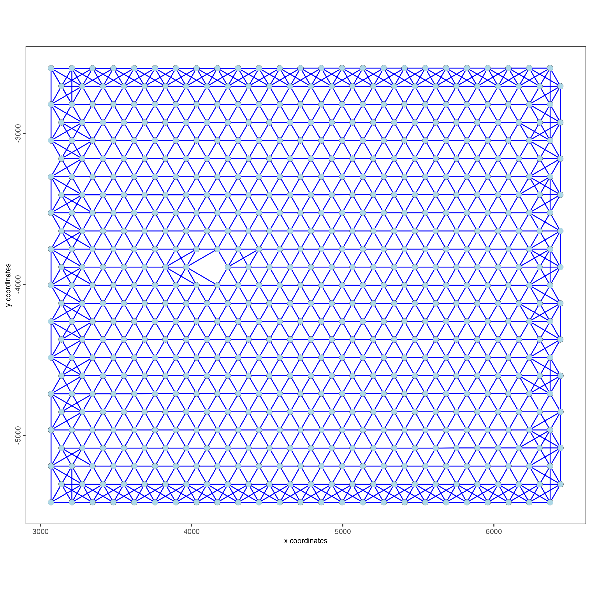
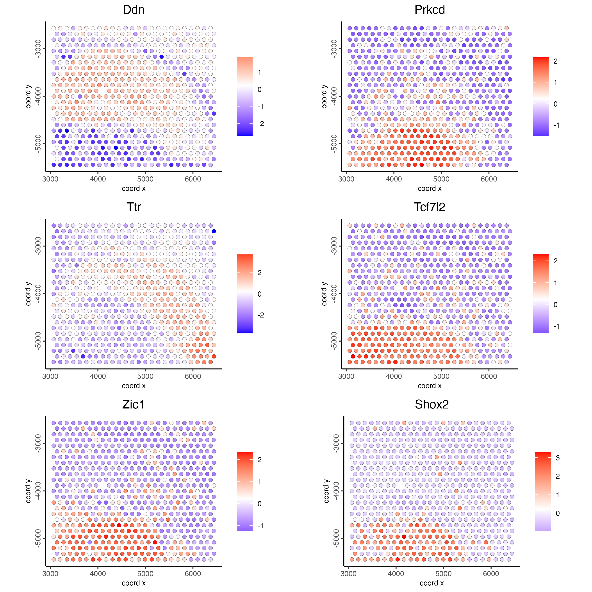
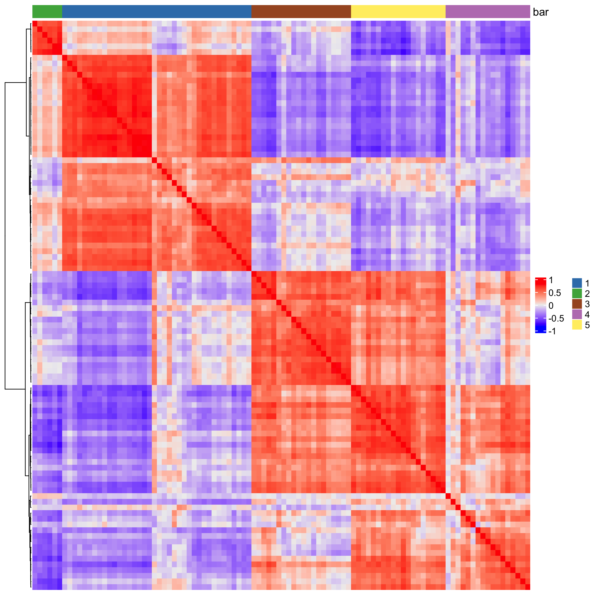
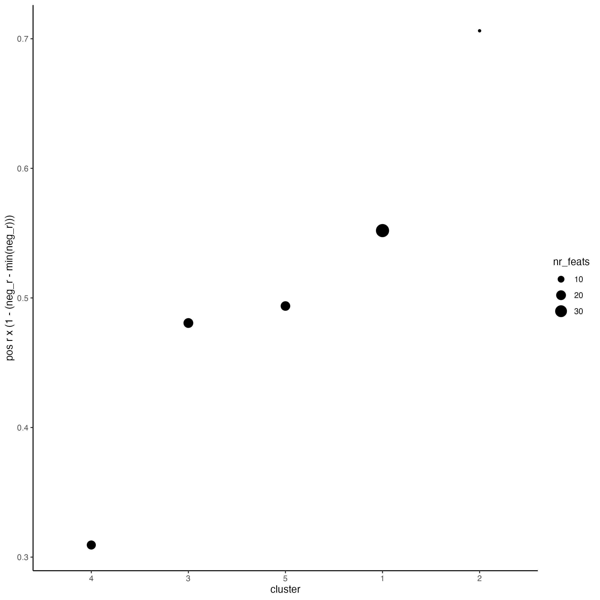
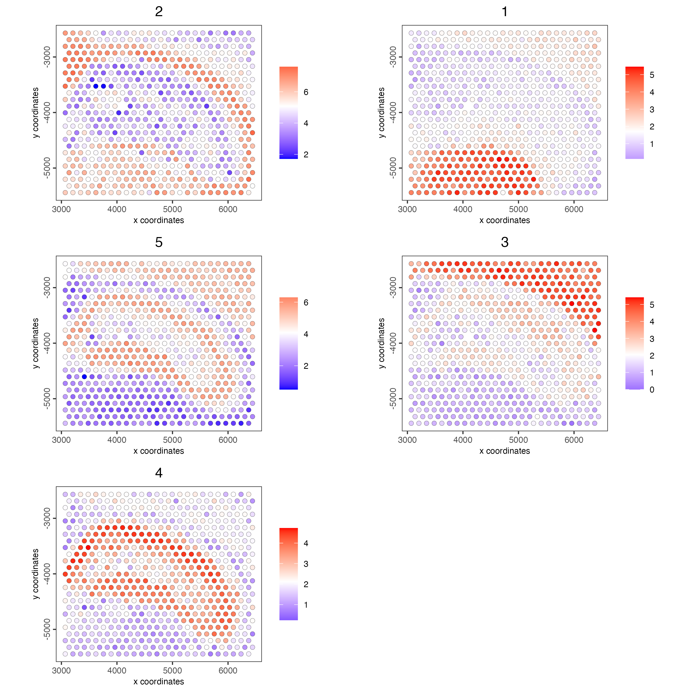

Finding genes or features that follow spatial patterns in their expression can help to better understand the spatial microenvironment of the sample.

# Setup and load example dataset

```{r, eval=FALSE}
# Ensure Giotto Suite is installed
if(!"Giotto" %in% installed.packages()) {
  pak::pkg_install("drieslab/Giotto")
}

# Ensure Giotto Data is installed
if(!"GiottoData" %in% installed.packages()) {
  pak::pkg_install("drieslab/GiottoData")
}

library(Giotto)

# Ensure the Python environment for Giotto has been installed
genv_exists <- checkGiottoEnvironment()

if(!genv_exists){
  # The following command need only be run once to install the Giotto environment
  installGiottoEnvironment()
}
```

```{r, eval=FALSE}
# load the object
g <- GiottoData::loadGiottoMini("visium")
```

# Create a spatial network

```{r, eval=FALSE}
g <- createSpatialNetwork(gobject = g,
                          method = "kNN", 
                          k = 6,
                          maximum_distance_knn = 400,
                          name = "spatial_network")

spatPlot2D(gobject = g,  
           show_network= TRUE,
           network_color = "blue", 
           spatial_network_name = "spatial_network")
```

```{r, echo=FALSE, out.width="60%", fig.align='center'}

```

## Rank binarization

Rank the genes on the spatial dataset depending on whether they exhibit a spatial pattern location or not.

This step may take a few minutes to run.

```{r, eval=FALSE}
ranktest <- binSpect(g, 
                     bin_method = "rank",
                     calc_hub = TRUE, 
                     hub_min_int = 5,
                     spatial_network_name = "spatial_network")
```

## Visualize top results

Plot the scaled expression of genes with the highest probability of being spatial genes.

```{r, eval=FALSE}
spatFeatPlot2D(g, 
               expression_values = "scaled",
               feats = ranktest$feats[1:6], 
               cow_n_col = 2, 
               point_size = 2)
```

```{r, echo=FALSE, out.width="80%", fig.align='center'}

```

# Spatial co-expression modules

## Select the top spatial genes

```{r, eval=FALSE}
ext_spatial_genes <- ranktest[1:100,]$feats
```

## Calculate pairwise distances between genes.

```{r, eval=FALSE}
spat_cor_netw_DT <- detectSpatialCorFeats(
    g,
    method = "network",
    spatial_network_name = "spatial_network",
    subset_feats = ext_spatial_genes)
```

## Cluster the top spatial genes into 5 clusters

```{r, eval=FALSE}
spat_cor_netw_DT <- clusterSpatialCorFeats(spat_cor_netw_DT, 
                                           name = "spat_netw_clus", 
                                           k = 5)
```

## Plot the correlation of the top spatial genes with their assigned cluster.

```{r, eval=FALSE}
heatmSpatialCorFeats(g,
                     spatCorObject = spat_cor_netw_DT,
                     use_clus_name = "spat_netw_clus",
                     heatmap_legend_param = list(title = NULL))
```

```{r, echo=FALSE, out.width="80%", fig.align='center'}

```

## Rank spatial correlated clusters and show genes for selected clusters

```{r, eval=FALSE}
netw_ranks <- rankSpatialCorGroups(g,
                                   spatCorObject = spat_cor_netw_DT, 
                                   use_clus_name = "spat_netw_clus")
```

```{r, echo=FALSE, out.width="70%", fig.align='center'}

```

## Create the metagene enrichment score per co-expression cluster

```{r, eval=FALSE}
cluster_genes_DT <- showSpatialCorFeats(spat_cor_netw_DT, 
                                        use_clus_name = "spat_netw_clus", 
                                        show_top_feats = 1)

cluster_genes <- cluster_genes_DT$clus 
names(cluster_genes) <- cluster_genes_DT$feat_ID

g <- createMetafeats(g, 
                     feat_clusters = cluster_genes, 
                     name = "cluster_metagene")
```

Plot the spatial distribution of the metagene enrichment scores of each spatial co-expression cluster.

```{r, eval=FALSE}
spatCellPlot(g,
             spat_enr_names = "cluster_metagene",
             cell_annotation_values = netw_ranks$clusters,
             point_size = 2, 
             cow_n_col = 2)
```

```{r, echo=FALSE, out.width="100%", fig.align='center'}

```

# Session Info

```{r, eval=FALSE}
sessionInfo()
```

```{r, eval=FALSE}
R version 4.4.1 (2024-06-14)
Platform: x86_64-apple-darwin20
Running under: macOS 15.0

Matrix products: default
BLAS:   /System/Library/Frameworks/Accelerate.framework/Versions/A/Frameworks/vecLib.framework/Versions/A/libBLAS.dylib 
LAPACK: /Library/Frameworks/R.framework/Versions/4.4-x86_64/Resources/lib/libRlapack.dylib;  LAPACK version 3.12.0

locale:
[1] en_US.UTF-8/en_US.UTF-8/en_US.UTF-8/C/en_US.UTF-8/en_US.UTF-8

time zone: America/New_York
tzcode source: internal

attached base packages:
[1] stats     graphics  grDevices utils     datasets  methods   base     

other attached packages:
[1] Giotto_4.1.3      GiottoClass_0.4.0

loaded via a namespace (and not attached):
  [1] colorRamp2_0.1.0            rlang_1.1.4                
  [3] magrittr_2.0.3              clue_0.3-65                
  [5] GetoptLong_1.0.5            GiottoUtils_0.2.0          
  [7] matrixStats_1.4.1           compiler_4.4.1             
  [9] png_0.1-8                   systemfonts_1.1.0          
 [11] vctrs_0.6.5                 shape_1.4.6.1              
 [13] pkgconfig_2.0.3             SpatialExperiment_1.14.0   
 [15] crayon_1.5.3                fastmap_1.2.0              
 [17] backports_1.5.0             magick_2.8.5               
 [19] XVector_0.44.0              labeling_0.4.3             
 [21] utf8_1.2.4                  rmarkdown_2.28             
 [23] UCSC.utils_1.0.0            ragg_1.3.3                 
 [25] purrr_1.0.2                 xfun_0.47                  
 [27] zlibbioc_1.50.0             GenomeInfoDb_1.40.1        
 [29] jsonlite_1.8.9              DelayedArray_0.30.1        
 [31] terra_1.7-78                cluster_2.1.6              
 [33] parallel_4.4.1              R6_2.5.1                   
 [35] RColorBrewer_1.1-3          reticulate_1.39.0          
 [37] GenomicRanges_1.56.1        scattermore_1.2            
 [39] Rcpp_1.0.13                 SummarizedExperiment_1.34.0
 [41] iterators_1.0.14            knitr_1.48                 
 [43] R.utils_2.12.3              IRanges_2.38.1             
 [45] Matrix_1.7-0                igraph_2.0.3               
 [47] tidyselect_1.2.1            rstudioapi_0.16.0          
 [49] abind_1.4-8                 yaml_2.3.10                
 [51] doParallel_1.0.17           codetools_0.2-20           
 [53] lattice_0.22-6              tibble_3.2.1               
 [55] Biobase_2.64.0              withr_3.0.1                
 [57] evaluate_1.0.0              circlize_0.4.16            
 [59] pillar_1.9.0                MatrixGenerics_1.16.0      
 [61] checkmate_2.3.2             foreach_1.5.2              
 [63] stats4_4.4.1                plotly_4.10.4              
 [65] generics_0.1.3              dbscan_1.2-0               
 [67] S4Vectors_0.42.1            ggplot2_3.5.1              
 [69] munsell_0.5.1               scales_1.3.0               
 [71] GiottoData_0.2.15           gtools_3.9.5               
 [73] glue_1.8.0                  lazyeval_0.2.2             
 [75] tools_4.4.1                 GiottoVisuals_0.2.5        
 [77] data.table_1.16.0           Cairo_1.6-2                
 [79] cowplot_1.1.3               grid_4.4.1                 
 [81] tidyr_1.3.1                 colorspace_2.1-1           
 [83] SingleCellExperiment_1.26.0 GenomeInfoDbData_1.2.12    
 [85] cli_3.6.3                   textshaping_0.4.0          
 [87] fansi_1.0.6                 S4Arrays_1.4.1             
 [89] viridisLite_0.4.2           ComplexHeatmap_2.20.0      
 [91] dplyr_1.1.4                 gtable_0.3.5               
 [93] R.methodsS3_1.8.2           digest_0.6.37              
 [95] BiocGenerics_0.50.0         SparseArray_1.4.8          
 [97] ggrepel_0.9.6               rjson_0.2.23               
 [99] htmlwidgets_1.6.4           farver_2.1.2               
[101] htmltools_0.5.8.1           R.oo_1.26.0                
[103] lifecycle_1.0.4             httr_1.4.7                 
[105] GlobalOptions_0.1.2
```
