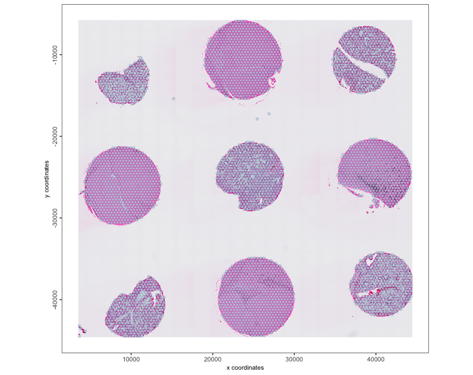
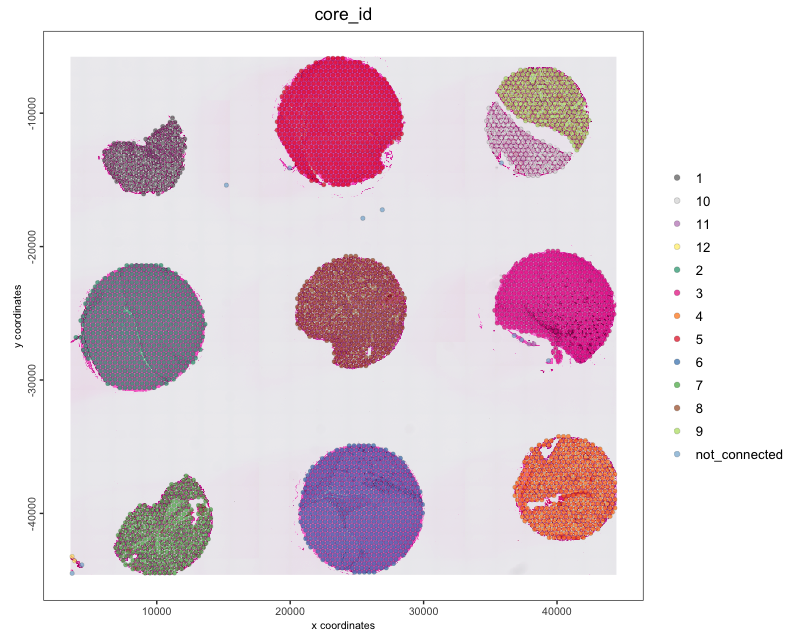
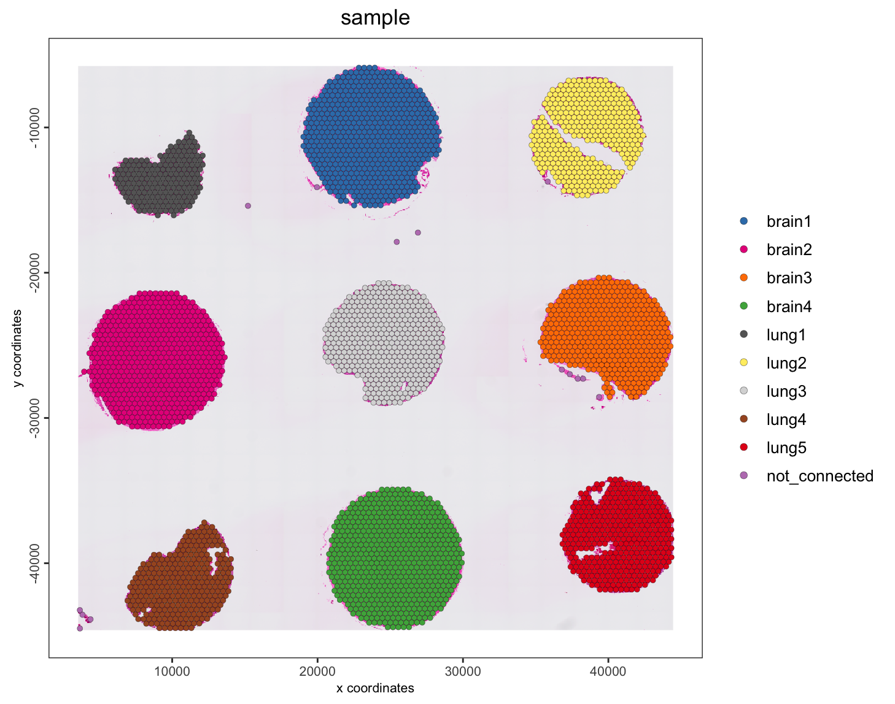
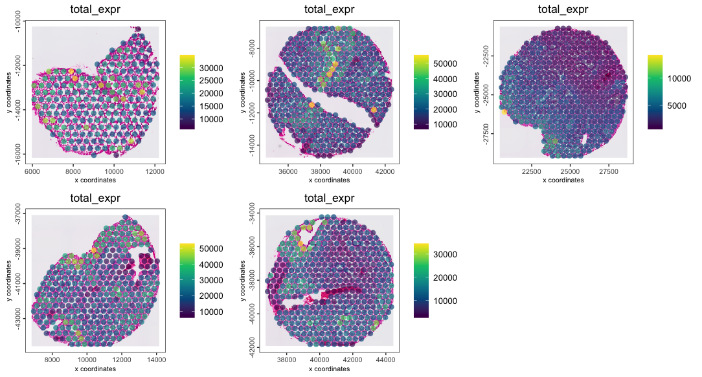
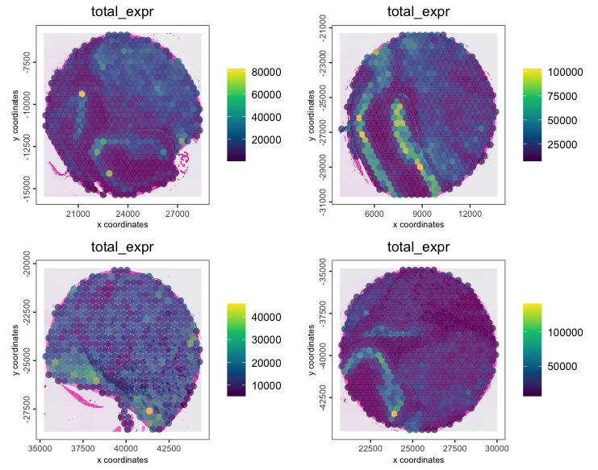

`splitGiotto()` and `joinGiottoObjects()` are how Giotto works with multiple samples.

- `splitGiotto()` - separate a single `giotto` object into a list of several based on a cell metadata column
- `joinGiottoObjects()` - combine a list of multiple `giotto` objects into a single `giotto` object.

This example shows working with a 10x Visium 
[mouse TMA](https://www.10xgenomics.com/datasets/mouse-tissue-microarray-in-3x3-layout-with-2-mm-edge-to-edge-spacing-ffpe-2-standard) 
dataset.

# Setup
```{r, eval=FALSE}
# Ensure Giotto Suite is installed.
if(!"Giotto" %in% installed.packages()) {
  pak::pkg_install("drieslab/Giotto")
}

# Ensure the Python environment for Giotto has been installed.
genv_exists <- Giotto::checkGiottoEnvironment()
if(!genv_exists){
  # The following command need only be run once to install the Giotto environment.
  Giotto::installGiottoEnvironment()
}
```


# Download the Data

```{r, eval=FALSE}
## provide path to a folder to save the example data to
data_path <- "/path/to/data/"

mat_link <- "https://cf.10xgenomics.com/samples/spatial-exp/2.0.1/CytAssist_11mm_FFPE_Mouse_TMA_3x3_2mm/CytAssist_11mm_FFPE_Mouse_TMA_3x3_2mm_filtered_feature_bc_matrix.h5"
spat_link <- "https://cf.10xgenomics.com/samples/spatial-exp/2.0.1/CytAssist_11mm_FFPE_Mouse_TMA_3x3_2mm/CytAssist_11mm_FFPE_Mouse_TMA_3x3_2mm_spatial.tar.gz"

mat_path <- file.path(data_path, "filtered_matrix.h5")
spat_path <- file.path(data_path, "spatial.tar.gz")

download.file(mat_link, destfile = mat_path)
download.file(spat_link, destfile = spat_path)

# untar the spatial folder
untar(spat_path, exdir = file.path(data_path))
spat_dir <- file.path(data_path, "spatial")
```


# Create Giotto Object

```{r, eval=FALSE}
library(Giotto)

# 1. set working directory
results_folder <- "path/to/results"

# Optional: Specify a path to a Python executable within a conda or miniconda 
# environment. If set to NULL (default), the Python executable within the previously
# installed Giotto environment will be used.
python_path <- NULL # alternatively, "/local/python/path/python" if desired.

instrs <- instructions(python_path = python_path, save_dir = results_folder)

tma <- createGiottoVisiumObject(
    h5_visium_path = mat_path, 
    h5_tissue_positions_path = file.path(spat_dir, "tissue_positions.csv"),
    h5_image_png_path = file.path(spat_dir, "tissue_hires_image.png"),
    h5_json_scalefactors_path = file.path(spat_dir, "scalefactors_json.json"),
    instructions = instrs
)
```

```{r, eval=FALSE}
# plot the data
spatPlot2D(tma, show_image = TRUE, point_size = 1.5, point_alpha = 0.7)
```

```{r, echo=FALSE, out.width="100%", fig.align="center"}

```

# Detect individual cores

By building a spatial network, we can find out which data points are spatially
contiguous by looking checking spatial distance, breaking ones that are too
far away, and then checking for graph membership. 

This functionality is implemented as `identifyTMAcores()`.

```{r, eval=FALSE}
# create a default delaunay spatial network
tma <- createSpatialNetwork(tma)
tma <- identifyTMAcores(tma)
spatPlot2D(tma,
    show_image = TRUE, 
    cell_color = "core_id", 
    point_size = 1.5, 
    point_alpha = 0.7
)
```

```{r, echo=FALSE, out.width="100%", fig.align="center"}

```

The cores have been assigned numerical IDs. There is also a "not_connected"
group which are too small to be considered a spatial region and not connected to
a larger group of data points.

The identification also split one cores it did not need to, so let's manually repair it

```{r, eval=FALSE}
# fix the core id annotation
tma <- annotateGiotto(tma, 
    name = "core_id_fixed", 
    cluster_column = "core_id", 
    annotation_vector = c(
        "1" = "1",
        "2" = "2",
        "3" = "3",
        "4" = "4",
        "5" = "5",
        "6" = "6",
        "7" = "7",
        "8" = "8",
        "9" = "9",
        "10" = "9",
        "11" = "not_connected",
        "12" = "not_connected",
        "not_connected" = "not_connected"
    )
)

# also add the core annotations from the 10x dataset description
tma <- annotateGiotto(tma, 
    name = "sample", 
    cluster_column = "core_id_fixed", 
    annotation_vector = c(
        "1" = "lung1",
        "2" = "brain2",
        "3" = "brain3",
        "4" = "lung5",
        "5" = "brain1",
        "6" = "brain4",
        "7" = "lung4",
        "8" = "lung3",
        "9" = "lung2",
        "not_connected" = "not_connected"
    )
)

spatPlot2D(tma,
    show_image = TRUE,
    cell_color = "sample", 
    point_size = 1.5, 
    point_alpha = 1
)
```

```{r, echo=FALSE, out.width="100%", fig.align="center"}

```


# Split Giotto Object

A split operation will split a single `giotto` object into a list of several based on a cell metadata column defined by the `by` param.

```{r, eval=FALSE}
object_list <- splitGiotto(tma, by = "sample")
length(object_list)
```

```
[1] 10
```

```{r, eval=FALSE}
names(object_list)
```

```
 [1] "lung1"         "brain2"        "brain3"        "lung5"         "brain1"       
 [6] "brain4"        "lung4"         "lung3"         "not_connected" "lung2"   
```

# Join Giotto Objects

`giotto` objects can be joined together into a single one. This requires both the list of `giotto` objects and a list of names to assign those objects in the joined object. This involves updating the cell IDs used throughout the object so that they are disambiguated from possibly similar cell IDs in other objects. A new column (called "list_ID" by default) is also added to the cell metadata to help differentiate between samples. Additionally, a spatial x shift is performed by default, so that spatial data does not accidentally overlap each other and become hard to tell apart between samples. In this case, we do not need any additional shifting of values to avoid overlaps, and we can use `join_method = "no_change`.

`joinGiottoObjects()` is used to join together any sets of `giotto` objects for joint analysis, and it is not needed for the objects to have been from the same source object or to have first been split with `splitGiotto()`.

```{r, eval=FALSE}
lung_reps <- object_list[c("lung1", "lung2", "lung3", "lung4", "lung5")]
brain_reps <- object_list[c("brain1", "brain2", "brain3", "brain4")]

lung <- joinGiottoObjects(
    gobject_list = lung_reps, 
    gobject_names = names(lung_reps), 
    join_method = "no_change"
)
lung <- addStatistics(lung, expression_values = "raw")
spatPlot2D(lung,
    cell_color = "total_expr", 
    color_as_factor = FALSE, 
    gradient_style = "sequential",
    group_by = "sample",
    point_size = 3,
    point_border_stroke = 0,
    point_alpha = 0.7,
    show_image = TRUE
)
```


```{r, echo=FALSE, out.width="100%", fig.align="center"}

```

```{r, eval=FALSE}
brain <- joinGiottoObjects(
    gobject_list = brain_reps, 
    gobject_names = names(brain_reps), 
    join_method = "no_change"
)
brain <- addStatistics(brain, expression_values = "raw")
spatPlot2D(brain,
    cell_color = "total_expr", 
    color_as_factor = FALSE, 
    gradient_style = "sequential",
    group_by = "sample",
    point_size = 3,
    point_border_stroke = 0,
    point_alpha = 0.7,
    show_image = TRUE
)
```

```{r, echo=FALSE, out.width="80%", fig.align="center"}

```


# Session Info
```{r, eval=FALSE}
sessionInfo()
```

```
R version 4.4.1 (2024-06-14)
Platform: aarch64-apple-darwin20
Running under: macOS Sonoma 14.4

Matrix products: default
BLAS:   /System/Library/Frameworks/Accelerate.framework/Versions/A/Frameworks/vecLib.framework/Versions/A/libBLAS.dylib 
LAPACK: /Library/Frameworks/R.framework/Versions/4.4-arm64/Resources/lib/libRlapack.dylib;  LAPACK version 3.12.0

locale:
[1] en_US.UTF-8/en_US.UTF-8/en_US.UTF-8/C/en_US.UTF-8/en_US.UTF-8

time zone: America/New_York
tzcode source: internal

attached base packages:
[1] stats     graphics  grDevices utils     datasets  methods   base     

other attached packages:
[1] Giotto_4.1.3      GiottoClass_0.4.0

loaded via a namespace (and not attached):
 [1] tidyselect_1.2.1            viridisLite_0.4.2           farver_2.1.2               
 [4] dplyr_1.1.4                 GiottoVisuals_0.2.5         R.utils_2.12.3             
 [7] fastmap_1.2.0               SingleCellExperiment_1.26.0 lazyeval_0.2.2             
[10] digest_0.6.37               lifecycle_1.0.4             terra_1.7-78               
[13] magrittr_2.0.3              compiler_4.4.1              rlang_1.1.4                
[16] tools_4.4.1                 igraph_2.0.3                utf8_1.2.4                 
[19] data.table_1.16.0           knitr_1.48                  labeling_0.4.3             
[22] S4Arrays_1.4.0              htmlwidgets_1.6.4           bit_4.5.0                  
[25] sp_2.1-4                    reticulate_1.39.0           DelayedArray_0.30.0        
[28] RColorBrewer_1.1-3          abind_1.4-8                 withr_3.0.1                
[31] purrr_1.0.2                 BiocGenerics_0.50.0         R.oo_1.26.0                
[34] grid_4.4.1                  stats4_4.4.1                fansi_1.0.6                
[37] colorspace_2.1-1            ggplot2_3.5.1               scales_1.3.0               
[40] gtools_3.9.5                SummarizedExperiment_1.34.0 cli_3.6.3                  
[43] rmarkdown_2.28              crayon_1.5.3                generics_0.1.3             
[46] rstudioapi_0.16.0           httr_1.4.7                  rjson_0.2.21               
[49] zlibbioc_1.50.0             parallel_4.4.1              XVector_0.44.0             
[52] matrixStats_1.4.1           vctrs_0.6.5                 Matrix_1.7-0               
[55] jsonlite_1.8.9              IRanges_2.38.0              S4Vectors_0.42.0           
[58] bit64_4.5.2                 ggrepel_0.9.6               scattermore_1.2            
[61] hdf5r_1.3.10                magick_2.8.4                GiottoUtils_0.2.0          
[64] plotly_4.10.4               tidyr_1.3.1                 glue_1.8.0                 
[67] codetools_0.2-20            cowplot_1.1.3               gtable_0.3.5               
[70] deldir_2.0-4                GenomeInfoDb_1.40.0         GenomicRanges_1.56.0       
[73] UCSC.utils_1.0.0            munsell_0.5.1               tibble_3.2.1               
[76] pillar_1.9.0                htmltools_0.5.8.1           GenomeInfoDbData_1.2.12    
[79] R6_2.5.1                    evaluate_1.0.0              lattice_0.22-6             
[82] Biobase_2.64.0              png_0.1-8                   R.methodsS3_1.8.2          
[85] backports_1.5.0             SpatialExperiment_1.14.0    Rcpp_1.0.13                
[88] SparseArray_1.4.1           checkmate_2.3.2             colorRamp2_0.1.0           
[91] xfun_0.47                   MatrixGenerics_1.16.0       pkgconfig_2.0.3  
```


